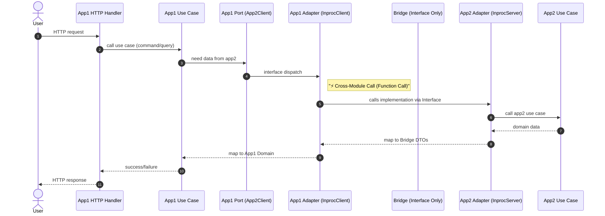

[This article is available in French](/fr/innovative-go-modular-monolith-architecture/).

The choice between a monolith and microservices is often framed as a "pick your poison" scenario. Monoliths are easy to start but often devolve into a "big ball of mud." Microservices offer isolation but introduce a massive operational tax from day one.

In this post, we’ll dive into a middle path detailed in our latest architecture white paper: **The Go Workspaces Modular Monolith with "Pure" Bridge Modules.**

## The Problem: Boundary Erosion & Dependency Hell

In traditional Go monoliths, boundaries are enforced by convention. While `internal/` packages help, nothing strictly prevents `serviceA` from creating a dependency on `serviceB` that makes future refactoring a nightmare.

But there is a more insidious problem: **Dependency Hell**.
In a standard monolith (single `go.mod`), every service must share the *exact same version* of every library.
*   If **Service A** needs `aws-sdk-go` v1...
*   And **Service B** needs `aws-sdk-go` v2...
*   **You are blocked.** The entire platform is held back by the technical debt of a single service.

## The Solution: Go Workspaces + Pure Bridge Modules

This pattern relies on three core pillars to provide **strong boundaries**, **independent dependency graphs**, and **flexible distribution**.

### 1. Go Workspaces (`go.work`)
Instead of one massive `go.mod`, we treat every service as an **independent Go module** within a single repository. The Go workspace coordinates these modules, allowing them to coexist in a monorepo while the compiler prevents unauthorized imports between them.

**Crucially, this gives you Independent Dependency Graphs.** Service A and Service B can use different versions of the same library without conflict.

### 2. The "Pure" Bridge Module Pattern
This is the "secret sauce." Instead of services calling each other directly, they communicate through a **Bridge Module**.

A Bridge module is **strictly a contract**. To prevent coupling, we enforce (via CI) that a bridge contains **ZERO logic** and **ZERO dependencies**.

*   **Defines the Public API** using Go interfaces and DTOs.
*   **Acts as a Seam** where you can later swap in a network transport (like Connect/gRPC) without changing a single line of business logic.
*   **Contains the Client Wrapper** (`InprocClient`) that consumers use.

### 3. Hexagonal Architecture (Ports and Adapters)
Within each service, we maintain a strict hierarchy. The "Implementation" of the bridge lives **inside** the service, not in the bridge itself.

*   **Domain Layer:** Pure business logic.
*   **Application Layer:** Use cases and "Ports".
*   **Adapter Layer:** Implementations. This is where the `InprocServer` lives (e.g., `services/app2/internal/adapters/inbound/bridge/`).

## Technical Flow: Request → App1 → App2 (In-Proc) → Response

The following diagram illustrates the **Runtime Request Lifecycle**. It demonstrates how a request crosses service boundaries within a single process while strictly adhering to architectural seams.



## Component Wiring & Runtime Flow

In this pattern, the "In-process" magic happens because App1 is injected with a client that points to App2's implementation, **but App1 only sees the interface**.

### App2: The Provider
App2 initializes its internal logic and creates the `InprocServer` (an adapter). This adapter implements the `bridge.AuthorService` interface.

```go
// services/app2/cmd/main.go
func main() {
    // 1. Construct internal layers (Repository, UseCase)
    useCase := application.NewUseCase(repo)

    // 2. Construct the Bridge Adapter (InprocServer)
    // This lives in INTERNAL adapters, NOT in the bridge module.
    // It implements the public Bridge Interface.
    app2Server := app2adapter.NewInprocServer(useCase)
}
```

### App1: The Consumer
App1 is constructed by injecting the client. Note that App1 only knows about the bridge package (interface), never the `app2/internal` code.

```go
// cmd/monolith/main.go (Composition Root)
func main() {
    // ... setup app2Server ...

    // 1. Wrap the Server in the Client
    // The client lives in the Bridge and accepts the Interface
    app2Client := app2bridge.NewInprocClient(app2Server)

    // 2. Inject into App1
    // App1 depends on its own Port, which app2Client implements
    app1UseCase := app1.NewUseCase(app2Client)
}
```

## Why "Bridge" instead of "Shared"?

A common trap in Go is the **Shared Kernel**, where common logic is dumped into a `pkg/` or `util/` folder. This leads to tight coupling: change a validation rule in the shared kernel, and you break 5 services.

The **Pure Bridge** pattern avoids this by enforcing strict rules:

1.  **No Logic:** Bridges contain *only* interfaces, DTOs, and Errors.
2.  **No Dependencies:** Bridges have `go.mod` files with **zero** `require` statements.
3.  **No Internal Imports:** Bridges cannot import `internal/` packages.

If you find yourself putting validation or calculations in a bridge, you’re recreating a shared-kernel monolith. Our `arch-test` tool explicitly forbids this.

## Architecture Advocacy: Why not just `services/api`?

You might ask: *"Why not just put the API inside the service repository (e.g., `services/authorsvc/api`)? Why a separate `bridge/` directory?"*

**The Answer: To escape Dependency Hell.**

If `api` is inside `authorsvc`:
*   Any consumer importing `authorsvc/api` implicitly `requires` the **entire** `authorsvc` module.
*   You inherit all of the provider's dependencies (Database drivers, AWS SDKs).
*   You create a **Shared Dependency Graph**.

By moving the API to `bridge/authorsvc` (a separate module):
*   The Bridge has **zero** dependencies.
*   Consumers import the bridge and inherit **nothing**.
*   You achieve **Independent Dependency Graphs**, allowing services to evolve libraries at their own pace.

## The Evolution Path

The beauty of this architecture is its migration path: you don’t have to decide the final deployment strategy on Day 1.

1.  **Start In-Process:** Deploy a single binary. Services talk via function calls (< 1µs latency).
2.  **Add Contracts:** Introduce Protobuf/Connect when you need formal schemas.
3.  **Distribute:** When **Service A** needs to scale independently, simply swap its adapter in `main.go`.

**Swap Mechanism (Configuration-based):**

```go
if config.UseNetwork {
    // Option A: gRPC/Connect (Distributed)
    client = connect.NewClient("http://author-service")
} else {
    // Option B: In-Process (Monolith)
    // Zero serialization, direct memory access
    client = bridge.NewInprocClient(authorServer)
}
```

## Conclusion

The **Go Workspaces Modular Monolith** is designed for teams of 5–20 developers who need to move fast but want to keep their options open.

It provides the **"monorepo experience"** with **"microservice discipline"**, guarding against both boundary erosion and dependency conflicts.

### Further Reading
*   [GitHub Repository & White Paper](https://github.com/pivaldi/go-modular-monolith-white-paper)
*   [Go Workspaces Documentation](https://go.dev/doc/tutorial/workspaces)
*   [Connect RPC for Go](https://connectrpc.com/)
