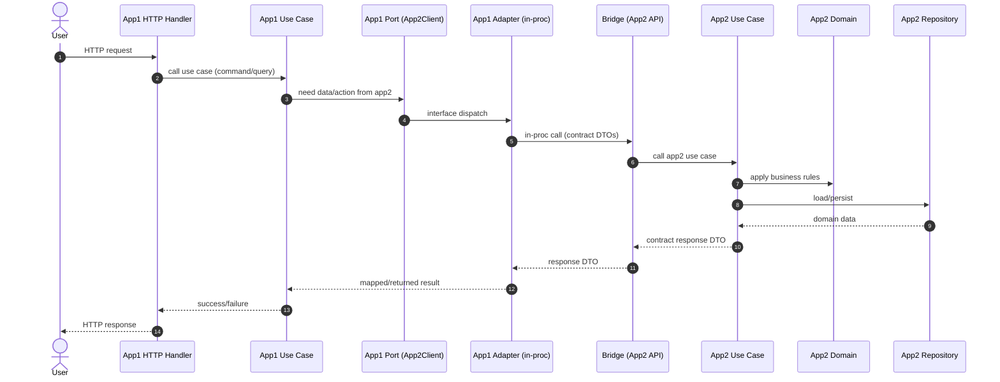
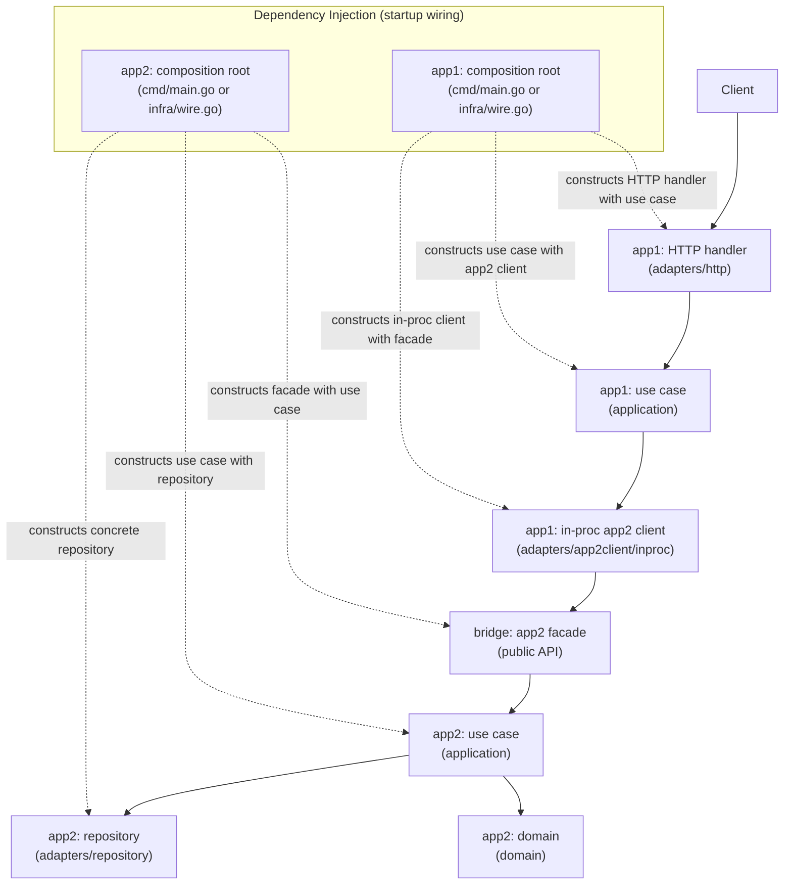

[This article is available in French](/fr/innovative-go-modular-monolith-architecture/).


The choice between a monolith and microservices is often framed as a "pick your poison" scenario. Monoliths are easy to start but often devolve into a "big ball of mud." Microservices offer isolation but introduce a massive operational tax from day one.

In this post, we’ll dive into a middle path detailed in our latest architecture white paper: **[The Go Workspaces Modular Monolith with Bridge Modules](https://github.com/pivaldi/go-modular-monolith-white-paper/blob/master/README_fr.md).**

## The Problem: Boundary Erosion

In traditional Go monoliths, boundaries are enforced by convention. While `internal/` packages help, nothing strictly prevents `serviceA` from creating a dependency on `serviceB` that makes future refactoring a nightmare.

Conversely, premature distribution—splitting into microservices before you need to—introduces network latency, distributed transaction complexity, and deployment overhead that can kill a small team's velocity.

## The Solution: Go Workspaces + Bridge Modules

This pattern relies on three core pillars to provide **strong boundaries** with **flexible distribution**.

### 1. Go Workspaces (`go.work`)
Instead of one massive `go.mod`, we treat every service as an independent Go module within a single repository. The Go workspace coordinates these modules, allowing them to coexist in a monorepo while the compiler prevents unauthorized imports between them.

### 2. The Bridge Module Pattern
This is the "secret sauce." Instead of services calling each other directly, they communicate through a **Bridge Module**.


A Bridge module:
* **Defines the Public API** using Go interfaces.
* **Provides an In-Process Client/Server** for zero-latency communication.
* **Acts as a Seam** where you can later swap in a network transport thanks to [Connect](https://connectrpc.com/) without changing a single line of business logic.

### 3. Hexagonal Architecture (Ports and Adapters)
Within each service, we maintain a strict hierarchy:
* **Domain Layer:** Pure business logic, zero dependencies.
* **Application Layer:** Use cases and "Ports" (interfaces).
* **Adapter Layer:** Implementations of those ports (DB, Mailers, or Bridge Clients).

## Technical flow: request → app1 → app2 (in-proc) → response

The following diagram illustrates the **Runtime Request Lifecycle** of the **Modular Monolith**. It demonstrates how a request crosses service boundaries within a single process while strictly adhering to architectural seams.



## Component Wiring & Runtime Flow

The following diagram illustrates the relationship between **Startup Wiring** (Dependency Injection) in dashed arrows and Runtime Calls in solid arrows. It shows how concrete components are constructed and how they interact across service boundaries without violating internal isolation.



In this pattern, the "In-process" magic happens because app1 is injected with a client that points directly to app2's bridge, all within the same memory space.  
Here is a a simplified pseudo-code of how the wiring looks for the two services.

1. **App2: The Provider**  
   App2 must first initialize its internal logic and then "export" its API through the Bridge.
   ```go
// services/app2/cmd/main.go
func main() {
    // 1. Construct concrete Repository (Adapter)
    repo := postgres.NewRepository(dbConn)

    // 2. Construct Use Case (Application) with Repository
    useCase := application.NewUseCase(repo)

    // 3. Construct the Bridge Facade (InprocServer)
    // This component is the ONLY one allowed to import app2/internal
    app2Facade := app2bridge.NewInprocServer(useCase)

    // 4. Register or provide this facade for other services
    // In a monolith, this is often stored in a registry or passed directly
    globalRegistry.RegisterApp2(app2Facade)
}
    ```

2. **App1: The Consumer (W1)**  
   App1 is constructed by injecting the app2 bridge client. Note that App1 only knows about the bridge package, never the app2/internal code.
   ```go
// services/app1/cmd/main.go
func main() {
    // 1. Retrieve the facade constructed by W2
    app2Facade := globalRegistry.GetApp2()

    // 2. Construct the In-process Client (Adapter)
    // This implements the port interface app1 expects
    app2Client := app2adapter.NewInprocClient(app2Facade)

    // 3. Construct Use Case with the injected client
    useCase := application.NewUseCase(app2Client)

    // 4. Construct HTTP Handler (Inbound Adapter)
    handler := http.NewHandler(useCase)

    // 5. Start Server
    serve(handler)
}
   ```

For a more precise example, refer to the white paper.

## Comparison at a Glance

| Feature | Single Module Monolith | **Modular Monolith (Bridge)** | Microservices |
| :--- | :--- | :--- | :--- |
| **Boundaries** | Weak (Conventions) | **Strong (Compiler-enforced)** | Strongest (Physical) |
| **Performance** | Excellent | **Excellent (In-process)** | Good (Network overhead) |
| **Complexity** | Low | **Medium** | High |
| **Scaling** | All-or-nothing | **Flexible** | Independent |

## Why "Bridge" instead of "Shared"?

A common trap in Go is the [Shared Kernel](https://ddd-practitioners.com/home/glossary/bounded-context/bounded-context-relationship/shared-kernel/), where common logic is dumped into a `pkg/` or `util/` folder. This leads to tight coupling.

The Bridge pattern avoids this by ensuring the bridge contains **only interfaces and DTOs**. No business logic is allowed. If you find yourself putting validation or calculations in a bridge, you're recreating a shared-kernel monolith.

## The Evolution Path

**The beauty of this architecture is its migration path: you don't have to decide the final deployment strategy on Day 1:**

1.  **Start In-Process:** Deploy a single binary. Services talk via function calls through the Bridge.
2.  **Add Contracts:** Introduce Protobuf/Connect when you need formal schemas.
3.  **Distribute:** When `Service A` needs to scale independently, swap its bridge implementation from `InprocClient` to `ConnectClient`. 

Here a pseudo-code of **Swap Mechanism** ((no more a migration) defined by configuration that demonstrates the simplicity of his implementation:

```go
// services/authsvc/cmd/authsvc/main.go
package main

import (
    "net/http"
    "time"

    "github.com/example/service-manager/bridge/authorsvc"
    "github.com/example/service-manager/services/authsvc/internal/adapters/outbound/authorclient/inproc"
    "github.com/example/service-manager/services/authsvc/internal/adapters/outbound/authorclient/connect"
    "github.com/example/service-manager/services/authsvc/internal/application/ports"
    "github.com/example/service-manager/services/authsvc/internal/infra"
)

func main() {
    cfg := infra.LoadConfig()

    // SWAP POINT: Choose adapter based on configuration
    var authorClient ports.AuthorClient

    if cfg.UseInProcessBridge {
        // ===== OPTION 1: In-Process =====
        // Get the AuthorService InprocServer from authorsvc
        // n practice, this is a singleton shared across services in same process
        authorServer := getAuthorServiceInprocServer()

        // Wrap in bridge client
        authorBridge := authorsvc.NewInprocClient(authorServer)

        // Wrap in port adapter
        authorClient = inproc.NewClient(authorBridge)
        // Performance: <1μs, zero serialization
    } else {
        // ===== OPTION 2: Network =====
        // Create HTTP client to remote service
        authorClient = connect.NewClient(
            cfg.AuthorServiceURL, // e.g., "https://author-service:8080"
            &http.Client{
                Timeout: 5 * time.Second,
            },
        )
    }

    // Rest of wiring is IDENTICAL - application doesn't know the difference
    deps := infra.InitializeDependencies(cfg, authorClient)

    // Start server…
}
```

## Enforcing the Rules

Architecture is only as good as its enforcement. We recommend a custom tool—`arch-test`—that runs in your CI pipeline to ensure:
* Domain layers don't import `net/http`.
* Services don't reach into each other's `internal/` folders.
* Bridge modules remain dependency-free.

For details, refer to [the white-paper](https://github.com/pivaldi/go-modular-monolith-white-paper)…

## Conclusion

The [Go Workspaces Modular Monolith](https://github.com/pivaldi/go-modular-monolith-white-paper) is designed for teams of 5–20 developers who need to move fast but want to keep their options open. **It provides the "monorepo experience" with "microservice discipline".**

### Further Reading
* [Go Workspace Documentation](https://go.dev/doc/tutorial/workspaces)
* [Connect RPC for Go](https://connectrpc.com/)
* [Domain-Driven Design by Eric Evans](https://www.amazon.com/Domain-Driven-Design-Tackling-Complexity-Software/dp/0321125215)
