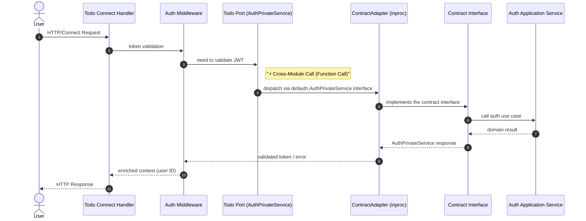

[Cet article est disponible en français](/fr/innovative-go-modular-monolith-architecture/).

The choice between monolith and microservices is often framed as a dilemma where you must "pick your poison." Monoliths are easy to start but frequently turn into a big ball of mud. Microservices offer isolation but introduce massive operational overhead from day one.

In this article, we explore a middle ground detailed in our latest architecture white paper: **The Go Modular Monolith with Workspaces and "Pure" Contract Definitions.**

## The Problem: Boundary Erosion & Dependency Hell

In traditional Go monoliths, boundaries are maintained by convention. While `internal/` packages help to some extent, nothing strictly prevents `serviceA` from taking a dependency on `serviceB`, turning any future refactoring into a nightmare.

But there is an even more insidious problem: **Dependency Hell**.
In a standard monolith (a single `go.mod`), every service must share *exactly the same version* of every library.
*   If **Service A** needs `aws-sdk-go` v1...
*   And **Service B** needs `aws-sdk-go` v2...
*   **You're stuck.** The entire platform is held back by the technical debt of a single service.

## The Solution: Go Workspaces + Pure Contract Definitions

This pattern rests on three foundational pillars to provide **strong boundaries**, **independent dependency graphs**, and **flexible distribution**.

### 1. Go Workspaces (`go.work`)
Instead of one massive `go.mod` file, each module is treated as an **independent Go module** within a single repository. The Go workspace coordinates these modules, letting them coexist in a monorepo while letting the compiler prevent unauthorized imports between them.

**Critically, this gives you Independent Dependency Graphs.** Module A and Module B can use different versions of the same library without conflict.

### 2. The "Pure Contract Definition" Pattern
This is the secret recipe. Instead of modules calling each other directly, they communicate via a **Contract Definition** — a separate module with zero dependencies.

A contract definition is **strictly a contract**. To prevent any coupling, we enforce (via CI) that a contract definition contains **ZERO logic** and is **generated automatically from `.proto` files** using the `protoc-gen-go-contracts` plugin.

Each domain automatically generates:
*   **The service interface** — the Go contract that consumers use.
*   **Event constants** — `TopicXxx` constants + `Topics []string` for subscriptions.
*   **Domain error codes** — typed constants aligned with the proto enum.
*   **The HTTP client** — `NewPrivateHTTPClient` / `NewPublicHTTPClient` for network transport.

```go
// contracts/go/application/auth/auth_private_service_contract_gen.go
// Code generated by protoc-gen-go-contracts. DO NOT EDIT.
type AuthPrivateService interface {
    ValidateToken(ctx context.Context, req *authv1.ValidateTokenRequest) (*authv1.ValidateTokenResponse, error)
}
```

### 3. Hexagonal Architecture (Ports and Adapters)
Within each module, a strict hierarchy is maintained. The concrete implementation lives **inside** the module, exposed via a `ContractAdapter` in the inbound adapters layer.

*   **Domain Layer:** Pure business logic, zero external dependencies.
*   **Application Layer:** Use cases and Ports (interfaces).
*   **Adapters Layer:** Implementations. This is where the `ContractAdapter` lives (e.g., `modules/auth/internal/adapters/inbound/inproc/`).

## Technical Flow: Request → Todo → Auth (In-Process) → Response

The following diagram illustrates the **request lifecycle at runtime**. It shows how the Todo module validates a JWT token against the Auth module within a single process, while strictly respecting the architectural seams.


```mermaid
sequenceDiagram
    autonumber
    actor User
    participant H as Todo Connect Handler
    participant M as Auth Middleware
    participant P  as Todo Port (AuthPrivateService)
    participant I  as ContractAdapter (inproc)
    participant C  as Contract Interface
    participant S  as Auth Application Service

    User->>H: HTTP/Connect Request
    H->>M: token validation
    M->>P: need to validate JWT

    note right of P: "⚡ Cross-Module Call (Function Call)"

    P->>I: dispatch via defauth.AuthPrivateService interface
    I->>C: implements the contract interface
    C->>S: call auth use case
    S-->>C: domain result
    C-->>I: AuthPrivateService response
    I-->>M: validated token / error
    M-->>H: enriched context (user ID)
    H-->>User: HTTP Response
```

## Component Wiring and Execution Flow

Each module exposes its `ContractAdapter` via an accessor on `*Module`. The consumer sees only the interface — never the concrete type.

### The Provider: Exposing a Contract

```go
// modules/auth/auth.go
func (m *Module) PrivateService() defauth.AuthPrivateService {
    return inproc.NewContractAdapter(m.service)
}
```

The in-process adapter implements the generated interface:

```go
// modules/auth/internal/adapters/inbound/inproc/contract_adapter.go
type ContractAdapter struct{ svc application.AuthService }

var _ defauth.AuthPrivateService = (*ContractAdapter)(nil)
```

### The Consumer: The Composition Root

The composition root (`cmd/mmw/main.go`) is the **only place** where modules are instantiated and wired together. Cross-module dependencies are injected via contract interfaces, never via pointers to concrete module types.

```go
// cmd/mmw/main.go
func initModules(logger *slog.Logger, dbPool *pgxpool.Pool, ...) ([]pfcore.Module, error) {
    // 1. Auth — no inter-module dependencies
    authModule, _ := auth.New(auth.Infrastructure{
        DBPool:   dbPool,
        EventBus: eventBus,
        Logger:   logger.With("module", auth.ModuleName),
    })

    // 2. Todo — depends on Auth's private service for JWT validation
    todoModule, _ := todo.New(todo.Infrastructure{
        DBPool:   dbPool,
        EventBus: eventBus,
        Logger:   logger.With("module", todo.ModuleName),
        AuthSvc:  authModule.PrivateService(), // returns defauth.AuthPrivateService
    })

    // 3. Notifications — subscribes to events from all modules
    notifModule, _ := notifications.New(notifications.Infrastructure{
        Subscriber: rawBus,
        Topics:     append(tododef.Topics, authdef.Topics...),
    })

    return []pfcore.Module{authModule, todoModule, notifModule}, nil
}
```

### The Platform Runner

Modules are not launched manually. The `mmw-platform` library orchestrates them with an `errgroup` in **shared fate** mode: if any module fails (DB loss, unrecovered panic), the shared context is cancelled and all other modules shut down cleanly.

```go
// cmd/mmw/main.go
modules, _ := initModules(logger, dbPool, rawBus, eventBus)
platform.New(logger, modules).Run(ctx)
```

Each module implements the `core.Module` interface — a constraint verified at compile time:

```go
var _ pfcore.Module = (*Module)(nil)

func (m *Module) Start(ctx context.Context) error {
    g, gCtx := errgroup.WithContext(ctx)
    g.Go(func() error { return m.server.Start(gCtx) })    // Connect RPC server
    g.Go(func() error { m.relay.Start(gCtx); return nil }) // outbox → Watermill relay
    g.Go(func() error { return m.router.Run(gCtx) })       // event router
    return g.Wait()
}
```

## mmw: The Framework That Holds It All Together

Building a modular monolith involves a recurring amount of technical plumbing: setting up an HTTP server compatible with Connect/gRPC, chaining middlewares, handling OS signals, implementing the outbox, abstracting PostgreSQL transactions... The [mmw](https://github.com/piprim/mmw) framework (`github.com/piprim/mmw`) solves this once and for all.

It is composed of two distinct parts with different lifecycles.

### The Runtime Platform (`pkg/platform`)

This is a dependency in each module's `go.mod`. It provides everything a module needs to participate in the monolith without reinventing the wheel:

| Component | What it provides |
|-----------|-----------------|
| **HTTP Server** | Pre-configured middleware chain (Logger → Recovery → CORS → BearerAuth → Mux), h2c support for Connect RPC, `/debug/monit` endpoint for health checks |
| **BearerAuth Middleware** | Token validation via a `TokenValidator` closure, injection of `userID` into the request context |
| **Outbox relay** | PostgreSQL polling every 2s, Watermill publishing, `FOR UPDATE SKIP LOCKED` for multi-replica safety |
| **Unit of Work** | Abstraction over `*pgxpool.Pool` / `pgx.Tx` behind a uniform `DBExecutor` interface |
| **Config loader** | Layered TOML loading (`default.toml` → `<APP_ENV>.toml` → environment variables) |
| **Connect interceptors** | Error logging with intact `eris` stack trace, without exposing details to the client |
| **Auth context** | `authctx.WithUserID` / `authctx.UserID` to propagate identity through handlers |

### The CLI (`mmw-cli`)

The CLI is purely a **development accelerator** — it is never embedded in the production binary.

```bash
mmw new module        # interactive scaffold: generates modules/<name>/, contracts/, go.work, mise.toml
mmw new contract      # generates only the contract definition files
mmw check arch        # validates architectural boundaries (see next section)
mmw test coverage     # prints a test coverage table by package
```

The `mmw new module` command is particularly noteworthy: it launches an interactive form that generates the complete structure of a new module (domain, application, adapters, migrations, proto, contracts) and updates `go.work` and `mise.toml` automatically. Adding a new module to the architecture takes seconds.

## Enforcing Architectural Rules

The boundaries of this architecture are guaranteed at **two distinct levels**.

### Level 1: The Go Compiler

Cross-module imports into `internal/` packages are **structurally impossible**. Each functional module has its own `go.mod`; the Go compiler physically refuses to let a module depend on another functional module's internals. This is not a convention — it is a property of the language.

```
✗ IMPOSSIBLE — guaranteed compile error:
modules/todo/go.mod does not reference modules/auth,
so modules/todo can never import modules/auth/internal/...
```

### Level 2: `mmw check arch`

What the compiler cannot verify — layer violations *within* a single module — is validated by `mmw check arch` (or `mise run arch:check`) on every CI run:

| Validator | Rule enforced |
|-----------|---------------|
| `DomainPurityValidator` | `internal/domain/` does not import `adapters/`, `infra/`, or `application/` |
| `ApplicationPurityValidator` | `internal/application/` does not import `adapters/` or `infra/` |
| `ContractPurityValidator` | `contracts/go/application/` does not import application or infra code |
| `LibDependencyValidator` | `libs/` and `mmw/` do not import functional modules |

When a violation occurs, the CI error message points directly to the offending file and import:

```
✗ Architecture validation failed

✗ todo    Validating service architecture boundaries
  modules/todo/internal/domain/todo.go
    imports modules/todo/internal/adapters/postgres (domain → adapter violation)

Fix: Move this dependency behind a port interface in the application layer.
```

## Testability as a Direct Consequence

Hexagonal architecture is not just about code organization: it directly determines the **speed and reliability of your test suite**.

```
         /\      System Tests — 1 suite at the monolith level
        /  \     (real binary, Postgres via testcontainers, full flows)
       /____\
      /      \   Integration Tests — per module, adapters only
     /________\
    /          \ Application Tests — mocked ports, orchestration logic
   /____________\
  /              \ Unit Tests — pure domain, zero infrastructure
 /________________\
```

Domain tests run in **< 1ms** with zero external dependencies:

```go
func TestTodo_Complete(t *testing.T) {
    title, _ := domain.NewTitle("Buy milk")
    todo, _ := domain.NewTodo(title, domain.EmptyDescription, nil, uuid.New())

    err := todo.Complete()

    require.NoError(t, err)
    assert.Equal(t, domain.StatusCompleted, todo.Status())
    assert.Len(t, todo.Events(), 2) // TodoCreated + TodoCompleted
}
```

Application layer tests mock **only the ports** — the architectural boundaries — never the concrete implementations:

```go
func TestCreateTodoCommand_Execute(t *testing.T) {
    // Mock the PORTS (application layer interfaces)
    // never PostgresRepository or WatermillDispatcher directly
    todoRepo         := mocks.NewTodoRepository(t)
    eventDispatcher  := mocks.NewEventDispatcher(t)
    uow              := mocks.NewUnitOfWork(t)

    // ... expectations ...

    // Test the REAL SERVICE — business logic, not wiring
    svc := application.NewTodoApplicationService(todoRepo, uow, eventDispatcher)
    resp, err := svc.CreateTodo(ctx, &todov1.CreateTodoRequest{Title: "Buy milk", UserId: uuid.NewString()})

    require.NoError(t, err)
    assert.NotEmpty(t, resp.GetTodo().GetId())
}
```

This pyramid is possible because the dependency rules are respected: if `domain/` imports nothing external, its tests cannot need anything external either. It is an emergent property of the architecture, not a discipline to maintain manually.

## Why "Contract Definition" Instead of "Shared Kernel"?

A common trap in Go is the **Shared Kernel**, where common logic is dumped into a `pkg/` or `util/` folder. This leads to tight coupling: change a validation rule in the shared kernel and you break 5 modules.

The **Pure Contract Definition** pattern avoids this by enforcing strict rules:

1.  **Generated, never hand-written:** Contract definitions are produced by `protoc-gen-go-contracts` from `.proto` files. They contain *only* interfaces, proto DTOs, error codes, and event constants.
2.  **Zero business dependencies:** The `mmw-contracts` module depends only on `connectrpc/connect` and `google.golang.org/protobuf` — never on a functional module.
3.  **Structural impossibility of cycles:** A contract module cannot import a functional module. Cycles are physically impossible.

```
✓ VALID:
modules/todo → contracts/go/application/auth → (connect + protobuf only)

✗ IMPOSSIBLE (compile error):
contracts/go/application/auth → modules/auth
```

If you find yourself putting validation logic or calculations into a contract definition, you are recreating a shared-kernel monolith.

## The Evolution Path

The beauty of this architecture lies in its migration path: you do not have to decide on the final deployment strategy on day one.

1.  **Start In-Process:** Deploy a single binary. Modules communicate via function calls (< 1µs latency), orchestrated by the platform runner.
2.  **Add Contracts:** Introduce Protobuf/Connect when you need formal schemas — contract definitions automatically generate HTTP clients alongside in-process clients.
3.  **Distribute:** When the **Auth Module** needs to scale independently, simply swap the adapter in `main.go`.

**The switchover mechanism (configuration-based):**

```go
// Before (monolith — in-process)
todoModule, _ := todo.New(todo.Infrastructure{
    AuthSvc: authModule.PrivateService(), // direct function call
})

// After (distributed — Connect over HTTP)
todoModule, _ := todo.New(todo.Infrastructure{
    AuthSvc: defauth.NewPrivateHTTPClient(
        authv1connect.NewAuthPrivateServiceClient(&http.Client{}, "https://auth.internal"),
    ),
})
```

The `defauth.AuthPrivateService` interface is identical in both cases. The Todo module has no idea which transport is being used — and **not a single line of business logic changes**.

## Conclusion

The **Go Modular Monolith with Workspaces** is designed for teams of 5 to 20 developers who need to move fast but want to keep their options open.

It delivers the **"monorepo experience"** with **"microservices discipline"**, protecting against both boundary erosion and dependency conflicts. Automatic contract generation from Protobuf ensures that inter-module interfaces remain a first-class artifact — versioned, typed, and never left to rot in a drawer.

### Further Reading
*   [GitHub Repository & White Paper](https://github.com/pivaldi/go-modular-monolith-white-paper)
*   The framework [mmw](https://github.com/piprim/mmw)
*   [Go Workspaces Documentation](https://go.dev/doc/tutorial/workspaces)
*   [Connect RPC for Go](https://connectrpc.com/)
*   [Buf — Protobuf toolchain](https://buf.build/)
