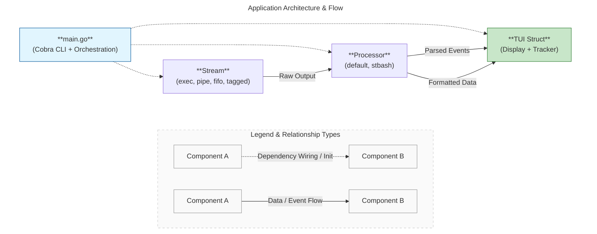

## Building a Real-Time CLI Progress Monitor in Go

[StreamStepper](https://github.com/pivaldi/stream-stepper) is a Go CLI tool that parses shell command output and renders it in a Terminal User Interface (TUI) with a dynamic progress bar. While the concept sounds simple, the implementation showcases several fundamental Go patterns that make the language excellent for building concurrent, maintainable systems.

In this article, we'll explore the key technical principles that make StreamStepper work, from interface-based design to thread-safe concurrency patterns.

### Architecture Overview

StreamStepper follows a clean layered architecture with clear separation of concerns. The application uses the **Cobra CLI framework** for professional command-line interface handling and introduces a **TUI struct** that composes the Display and Tracker components for cleaner dependency management.



Key architectural decisions:
- **Cobra framework** for professional CLI with automatic help generation and flag validation
- **TUI struct** composes Display and Tracker, simplifying function signatures across the codebase
- **Multiple processors** support (default trigger-based and stbash for [bash-stepper](https://github.com/pivaldi/bash-stepper))
- Each layer communicates through interfaces, not concrete implementations

### 1. Interface-Based Design: Decoupling Components

One of Go's most powerful features is its implicit interface satisfaction. StreamStepper leverages this throughout to create loosely coupled, testable components.

#### The Handler Interface

```go
type Handler interface {
    Start(proc processor.LineProcessor, onComplete func(exitCode int, err error)) error
}
```

This simple interface abstracts **four different input modes**:
- `ExecHandler` - runs commands as child processes
- `PipeHandler` - reads from standard pipes
- `TaggedHandler` - processes tagged output (`[OUT]`/`[ERR]`)
- `FIFOHandler` - reads from named pipes

The beauty of this design is that `main.go` doesn't care which handler it's using. With the TUI struct, handler selection becomes even cleaner:

```go
func selectHandler(tui ui.TUI, tagged bool, fifoPath string, args []string) stream.Handler {
    switch {
    case len(args) > 0:
        return stream.NewExecHandler(tui, args[0])
    case tagged:
        return stream.NewTaggedHandler(tui, os.Stdin)
    case fifoPath != "":
        return stream.NewFIFOHandler(tui, os.Stdin, fifoPath)
    default:
        return stream.NewPipeHandler(tui, os.Stdin)
    }
}
```

**Key principles**:
- Program to interfaces, not implementations (enables runtime polymorphism)
- Use composition to simplify dependencies (TUI struct reduces parameter count)
- Factory pattern for handler selection based on runtime conditions

#### The LineProcessor Interface

```go
type LineProcessor interface {
    ProcessLine(line string, isStderr bool) ProcessedLine
}

type ProcessedLine struct {
    FormattedText  string
    IsProgressStep bool
    StatusMessage  string
}
```

This interface separates **parsing logic** from **I/O handling**. The handlers read lines, the processor interprets them, and the tracker updates state. Each component has a single responsibility.

#### The Display Interface

```go
type Display interface {
    Initialize() error
    WriteLog(text string)
    UpdateStatus(spinner, progressBar, percentage, elapsed, eta, message string)
    Run() error
    Stop()
    SetTitle(title string)
    QueueUpdate(fn func())
}
```

This abstracts the entire TUI layer. In theory, we could swap `tview` for another TUI library (like Bubble Tea or termui) by implementing this interface, without touching any other code.

### 2. Thread-Safe State Management with Mutexes

Go's concurrency model is built on goroutines and channels, but sometimes you need shared mutable state. StreamStepper's `Tracker` demonstrates proper mutex usage:

```go
type Tracker struct {
    totalSteps    int32
    currentSteps  int32
    startTime     time.Time
    endTime       time.Time
    hasError      bool
    statusMessage string
    mu            sync.RWMutex  // Protects all fields above
}
```

#### Read-Write Lock Pattern

Notice the use of `sync.RWMutex` instead of `sync.Mutex`:

```go
func (t *Tracker) GetCurrentSteps() int32 {
    t.mu.RLock()           // Multiple readers can acquire this simultaneously
    defer t.mu.RUnlock()

    return t.currentSteps
}

func (t *Tracker) IncrementStep(statusMsg string) {
    t.mu.Lock()            // Exclusive write lock
    defer t.mu.Unlock()
    t.currentSteps++
    if statusMsg != "" {
        t.statusMessage = statusMsg
    }
}
```

**Why this matters**: The ticker goroutine reads state every 100ms, while the stream handler writes occasionally. `RWMutex` allows multiple concurrent reads (improving performance) while ensuring writes are exclusive.

**Key principle**: Use `defer` for unlock operations to ensure they happen even if the function panics.

### 3. Goroutines and Channels for Concurrency

StreamStepper runs three concurrent operations:

1. **Stream handler** - reads input lines
2. **Ticker** - updates UI every 100ms
3. **TUI event loop** - handles user input and rendering

#### Channel-Based Coordination

```go
func main() {
    // ...
    done := make(chan struct{})
    onComplete := createCompletionCallback(tracker, display, pbWidth, done)

    go startTicker(display, tracker, pbWidth, done)
    go startHandler(handler, proc, onComplete)

    if err := display.Run(); err != nil {
        fmt.Fprintf(os.Stderr, "UI error: %v\n", err)
        os.Exit(1)
    }
}
```

The `done` channel coordinates shutdown:

```go
func startTicker(display ui.Display, tracker *progress.Tracker, pbWidth int, done chan struct{}) {
    ticker := time.NewTicker(100 * time.Millisecond)
    defer ticker.Stop()

    for {
        select {
        case <-ticker.C:
            updateStatus(display, tracker, pbWidth, frames[idx])
            idx = (idx + 1) % len(frames)
        case <-done:
            return  // Clean shutdown when stream completes
        }
    }
}
```

**Key principle**: Use `select` to multiplex channel operations. Here, it lets the ticker respond immediately to completion instead of waiting for the next tick.

#### The Completion Callback Pattern

```go
func createCompletionCallback(
    tracker *progress.Tracker,
    display ui.Display,
    pbWidth int,
    done chan struct{},
) func(int, error) {
    return func(_ int, err error) {
        close(done)  // Signal ticker to stop
        tracker.Finish()
        elapsed := tracker.GetElapsed()
        finishDisplay(display, tracker, pbWidth, elapsed, err)
    }
}
```

This closure captures the dependencies and provides a clean callback interface for handlers to signal completion. Closing `done` broadcasts to all goroutines listening on it.

### 4. Dependency Injection and Composition

Go doesn't have constructors, but the "New" function pattern combined with struct composition achieves similar goals. StreamStepper introduces a **TUI struct** that composes Display and Tracker, simplifying dependency management throughout the codebase.

#### The TUI Composite Pattern

```go
// TUI struct composes Display and Tracker
type TUI struct {
    Display Display
    Tracker *progress.Tracker
}

func New(display Display, tracker *progress.Tracker) TUI {
    return TUI{
        Display: display,
        Tracker: tracker,
    }
}

// Initialization creates and wires components
func initializeComponents(steps int) (ui.Display, *progress.Tracker) {
    tracker := progress.NewTracker(int32(steps))
    display := ui.NewTViewDisplay()
    if err := display.Initialize(); err != nil {
        fmt.Fprintf(os.Stderr, "Failed to initialize display: %v\n", err)
        os.Exit(1)
    }

    return display, tracker
}
```

**Why this works**:
- Dependencies flow from `main()` down
- The TUI struct reduces function parameters from passing `display` and `tracker` separately
- Components don't create their own dependencies, making them testable and flexible
- Stream handlers receive a single `TUI` parameter instead of multiple dependencies

#### Cobra-based CLI Structure

StreamStepper uses the [Cobra](https://github.com/spf13/cobra) framework for professional CLI handling:

```go
var (
    steps         int
    triggerFlag   string
    processorType string
    // ... other flags

    rootCmd = &cobra.Command{
        Use:   "stream-stepper [flags] [command]",
        Short: "A CLI tool that parses shell command output...",
        Args:  cobra.MaximumNArgs(1),
        Run:   runStreamStepper,
    }
)

func initFlags() {
    rootCmd.Flags().IntVarP(&steps, "steps", "s", 0, "Total steps for 100% progress (required)")
    rootCmd.Flags().StringVarP(&triggerFlag, "flag", "f", defaultTriggerFlag, "Trigger string...")
    rootCmd.Flags().StringVarP(&processorType, "processor", "p", "", "Parsing processor (default, stbash)")

    rootCmd.MarkFlagRequired("steps")
}
```

**Benefits**:
- Automatic help generation with `--help`
- Short flag aliases (`-s`, `-f`, `-p`)
- Built-in flag validation
- Professional error messages
- Subcommand support (extensible)

#### Struct Embedding for Composition

```go
type ExecHandler struct {
    display ui.Display  // Composition over inheritance
    tracker *progress.Tracker
    cmdStr  string
}
```

Each handler composes Display and Tracker instead of inheriting from a base class. This is more explicit and avoids the diamond problem.

### 5. Reading Multiple Streams Concurrently

The `ExecHandler` demonstrates a common pattern: reading stdout and stderr simultaneously without blocking:

```go
func (h *ExecHandler) startReaders(proc processor.LineProcessor, stdout, stderr io.ReadCloser) *sync.WaitGroup {
    var wg sync.WaitGroup
    wg.Add(2)

    // Read stdout in one goroutine
    go func() {
        defer wg.Done()
        scanner := bufio.NewScanner(stdout)
        for scanner.Scan() {
            processedLine := proc.ProcessLine(scanner.Text(), false)
            h.display.WriteLog(processedLine.FormattedText)
        }
    }()

    // Read stderr in another goroutine
    go func() {
        defer wg.Done()
        scanner := bufio.NewScanner(stderr)
        for scanner.Scan() {
            processedLine := proc.ProcessLine(scanner.Text(), true)
            h.display.WriteLog(processedLine.FormattedText)
        }
    }()

    return &wg
}
```

**Key principle**: Use `sync.WaitGroup` to wait for multiple goroutines to complete. This ensures we process all output before the program exits.

#### Why This Matters

If you read stdout and stderr sequentially, a blocked stream (e.g., stderr buffer full) would deadlock the entire program. Concurrent readers prevent this issue.

### 6. Package Organization and Visibility

Go's package system enforces encapsulation through capitalization. StreamStepper uses a plugin-like architecture for processors, with each processor in its own subdirectory:

```
stream-stepper/
├── main.go              ## Entry point (Cobra CLI + orchestration)
└── internal/
    ├── ui/
    │   ├── interface.go     ## Display interface + TUI struct
    │   └── tview.go         ## TViewDisplay implementation
    ├── processor/
    │   ├── interface.go     ## LineProcessor interface
    │   ├── default/         ## Default trigger-based processor
    │   │   └── processor.go
    │   └── stbash/          ## bash-stepper processor
    │       └── processor.go
    ├── stream/
    │   ├── interface.go     ## Handler interface
    │   ├── exec.go          ## ExecHandler (runs commands)
    │   ├── pipe.go          ## PipeHandler (stdin)
    │   ├── tagged.go        ## TaggedHandler ([OUT]/[ERR])
    │   └── fifo.go          ## FIFOHandler (named pipes)
    └── progress/
        ├── tracker.go       ## Thread-safe state tracker
        ├── bar.go           ## Progress bar rendering
        └── eta.go           ## ETA calculation
```

**Capitalization rules**:
- `Tracker` (capitalized) → exported, usable outside the package
- `mu sync.RWMutex` (lowercase) → private, only accessible within the package

This prevents external code from bypassing the mutex-protected getters/setters.

#### The `internal` Directory

The `internal/` directory is a special Go convention: packages inside it **cannot be imported** by code outside the parent tree. This enforces architectural boundaries at compile time.

#### Multiple Processor Architecture

The processor package uses a plugin-like pattern where each processor type lives in its own subdirectory:

```go
// main.go - processor selection based on CLI flag
var proc processor.LineProcessor
switch processorType {
case "stbash":
    proc = stbashprocessor.New()  // Supports bash-stepper format
default:
    proc = defaultprocessor.New(triggerFlag)  // Trigger-based parsing
}
```

This makes it easy to add new processors without modifying existing code—just create a new subdirectory implementing the `LineProcessor` interface.

### 7. Error Handling Patterns

Go's explicit error handling can feel verbose, but StreamStepper shows how to do it cleanly:

```go
func (h *ExecHandler) Start(proc processor.LineProcessor, onComplete func(exitCode int, err error)) error {
    h.setTitle()

    cmd := exec.CommandContext(context.Background(), "sh", "-c", h.cmdStr)

    stdout, stderr, err := h.setupPipes(cmd)
    if err != nil {
        onComplete(1, err)  // Notify caller of failure
        return err          // Return error for caller to handle
    }

    // Continue with execution...
}
```

**Pattern**: Functions return errors immediately, and callers decide how to handle them. The `onComplete` callback ensures cleanup happens even on error.

#### Error Wrapping

```go
if err := cmd.Start(); err != nil {
    onComplete(1, err)
    return fmt.Errorf("%s failed with error: %w", h.cmdStr, err)
}
```

The `%w` verb wraps the original error, preserving the error chain for `errors.Is()` and `errors.As()` checks.

### 8. Context for Cancellation

```go
cmd := exec.CommandContext(context.Background(), "sh", "-c", h.cmdStr)
```

Using `CommandContext` instead of `Command` ensures the child process can be cancelled if needed. While StreamStepper currently uses `context.Background()`, a future enhancement could add timeout support:

```go
ctx, cancel := context.WithTimeout(context.Background(), 5*time.Minute)
defer cancel()
cmd := exec.CommandContext(ctx, "sh", "-c", h.cmdStr)
```

**Key principle**: Always use context for operations that might need cancellation, even if you're not using it yet.

### 9. Unicode Progress Bar with Fractional Characters

The progress bar rendering demonstrates Go's excellent Unicode support:

```go
func BuildProgressBar(currentSteps, totalSteps int32, status Status, barWidth int) string {
    fillChars := []string{" ", "▏", "▎", "▍", "▌", "▋", "▊", "▉", "█"}

    progress := float64(currentSteps) / float64(totalSteps)
    filledWidth := progress * float64(barWidth)

    fullBlocks := int(filledWidth)
    remainder := filledWidth - float64(fullBlocks)
    partialIdx := int(remainder * float64(len(fillChars)-1))

    // Build the bar with full blocks + partial block + empty space
    bar := strings.Repeat("█", fullBlocks)
    if fullBlocks < barWidth {
        bar += fillChars[partialIdx]
        bar += strings.Repeat(" ", barWidth-fullBlocks-1)
    }

    return bar
}
```

This creates smooth visual progress using fractional block characters (`▏▎▍▌▋▊▉█`), making the bar feel more responsive.

### 10. Ticker Pattern for Periodic Updates

```go
func startTicker(display ui.Display, tracker *progress.Tracker, pbWidth int, done chan struct{}) {
    ticker := time.NewTicker(100 * time.Millisecond)
    defer ticker.Stop()  // Always clean up resources

    frames := []string{"⠋", "⠙", "⠹", "⠸", "⠼", "⠴", "⠦", "⠧", "⠇", "⠏"}
    idx := 0

    for {
        select {
        case <-ticker.C:
            updateStatus(display, tracker, pbWidth, frames[idx])
            idx = (idx + 1) % len(frames)
        case <-done:
            return
        }
    }
}
```

**Why tickers over `time.Sleep()`**: Tickers account for processing time. If `updateStatus()` takes 10ms, the next tick happens 90ms later, not 100ms. This keeps the spinner smooth.

**Why `defer ticker.Stop()`**: Prevents ticker goroutine leaks. Tickers keep running until explicitly stopped.

### 11. Architectural Evolution and Refactoring

StreamStepper's current architecture didn't emerge fully formed. The codebase evolved through several refactoring passes:

#### From Native Flag to Cobra

**Before:**
```go
stepsPtr := flag.Int("steps", 0, "Required total steps for 100%")
flagPtr := flag.String("flag", "==>", "Trigger string")
flag.Parse()

if *stepsPtr <= 0 {
    fmt.Println("Error: --steps is required")
    os.Exit(1)
}
```

**After:**
```go
rootCmd.Flags().IntVarP(&steps, "steps", "s", 0, "Total steps (required)")
rootCmd.MarkFlagRequired("steps")
```

Benefits: Short flags, automatic help generation, professional error messages, and validation built-in.

#### From Multiple Parameters to Composite TUI

**Before:**
```go
func updateStatus(display ui.Display, tracker *progress.Tracker, pbWidth int, spinner string) {
    currentSteps := tracker.GetCurrentSteps()
    totalSteps := tracker.GetTotalSteps()
    // ... 5 parameters passed to every function
}
```

**After:**
```go
func updateStatus(tui ui.TUI, pbWidth int, spinner string) {
    currentSteps := tui.Tracker.GetCurrentSteps()
    totalSteps := tui.Tracker.GetTotalSteps()
    // ... cleaner signature with TUI composite
}
```

Benefits: Reduced parameter count, clearer ownership, easier refactoring.

#### From Single Processor to Plugin Architecture

**Before:** Processing logic hardcoded in a single file.

**After:** Multiple processors in subdirectories, selected at runtime:
```go
internal/processor/
├── interface.go
├── default/
│   └── processor.go
└── stbash/
    └── processor.go
```

Benefits: Easy to add new processors, separation of concerns, testability.

**Key lesson**: Refactoring toward better abstractions pays dividends. Start with working code, then improve structure as patterns emerge.

### Key Takeaways

Building StreamStepper taught several important Go lessons:

1. **Interfaces enable testability** - Small, focused interfaces make components easy to mock and test
2. **Composition over multiple parameters** - The TUI struct composing Display and Tracker simplifies function signatures
3. **Use established frameworks** - Cobra provides professional CLI handling with minimal code
4. **Plugin architecture through subdirectories** - Each processor type in its own package enables easy extension
5. **Channels coordinate, mutexes protect** - Use channels to communicate between goroutines, mutexes to protect shared state
6. **RWMutex for read-heavy workloads** - When reads vastly outnumber writes, read-write locks improve performance
7. **Package structure enforces architecture** - Use `internal/` and capitalization to enforce boundaries
8. **Error handling is explicit** - No hidden exceptions; every error is visible in the function signature
9. **Defer for cleanup** - Always pair resource acquisition with deferred cleanup
10. **Context for cancellation** - Even if not used immediately, context enables future timeout/cancellation support

The complete source code is available at [github.com/pivaldi/stream-stepper](https://github.com/pivaldi/stream-stepper).

### Conclusion

This article analyzes the architectural patterns in StreamStepper, a practical CLI tool for visualizing shell command progress. The evolution from native `flag` package to **Cobra**, the introduction of the **TUI composite struct**, and the **plugin-based processor architecture** demonstrate how Go applications can evolve toward cleaner, more maintainable designs.

The patterns demonstrated here—interface-based design, composition over inheritance, thread-safe concurrency, and proper dependency injection—apply to any Go application requiring concurrent processing, clean architecture, and real-time user interfaces.

StreamStepper showcases that good architecture doesn't emerge all at once. Through refactoring and composition patterns, even a working codebase can evolve toward better maintainability without breaking existing functionality.

---

*Want to learn more? Check out the [Go blog](https://go.dev/blog/) for official guidance on effective Go programming.*
