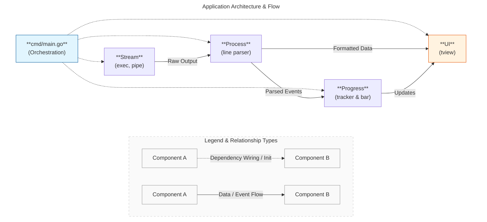

## Building a Real-Time CLI Progress Monitor in Go

[StreamStepper](https://github.com/pivaldi/stream-stepper) is a Go CLI tool that parses shell command output and renders it in a Terminal User Interface (TUI) with a dynamic progress bar. While the concept sounds simple, the implementation showcases several fundamental Go patterns that make the language excellent for building concurrent, maintainable systems.

In this article, we'll explore the key technical principles that make StreamStepper work, from interface-based design to thread-safe concurrency patterns.

### Architecture Overview

StreamStepper follows a clean layered architecture with clear separation of concerns:



Each layer has a well-defined responsibility and communicates through interfaces, not concrete implementations.

### 1. Interface-Based Design: Decoupling Components

One of Go's most powerful features is its implicit interface satisfaction. StreamStepper leverages this throughout to create loosely coupled, testable components.

#### The Handler Interface

```go
type Handler interface {
    Start(proc processor.LineProcessor, onComplete func(exitCode int, err error)) error
}
```

This simple interface abstracts **four different input modes**:
- `ExecHandler` - runs commands as child processes
- `PipeHandler` - reads from standard pipes
- `TaggedHandler` - processes tagged output (`[OUT]`/`[ERR]`)
- `FIFOHandler` - reads from named pipes

The beauty of this design is that `main.go` doesn't care which handler it's using:

```go
func selectHandler(display ui.Display, tagged bool, fifoPath string) stream.Handler {
    switch {
    case flag.NArg() > 0:
        return stream.NewExecHandler(display, flag.Arg(0))
    case tagged:
        return stream.NewTaggedHandler(display, os.Stdin)
    case fifoPath != "":
        return stream.NewFIFOHandler(display, os.Stdin, fifoPath)
    default:
        return stream.NewPipeHandler(display, os.Stdin)
    }
}
```

**Key principle**: Program to interfaces, not implementations. This enables runtime polymorphism without inheritance.

#### The LineProcessor Interface

```go
type LineProcessor interface {
    ProcessLine(line string, isStderr bool) ProcessedLine
}

type ProcessedLine struct {
    FormattedText  string
    IsProgressStep bool
    StatusMessage  string
}
```

This interface separates **parsing logic** from **I/O handling**. The handlers read lines, the processor interprets them, and the tracker updates state. Each component has a single responsibility.

#### The Display Interface

```go
type Display interface {
    Initialize() error
    WriteLog(text string)
    UpdateStatus(spinner, progressBar, percentage, elapsed, eta, message string)
    Run() error
    Stop()
    SetTitle(title string)
    QueueUpdate(fn func())
}
```

This abstracts the entire TUI layer. In theory, we could swap `tview` for another TUI library (like Bubble Tea or termui) by implementing this interface, without touching any other code.

### 2. Thread-Safe State Management with Mutexes

Go's concurrency model is built on goroutines and channels, but sometimes you need shared mutable state. StreamStepper's `Tracker` demonstrates proper mutex usage:

```go
type Tracker struct {
    totalSteps    int32
    currentSteps  int32
    startTime     time.Time
    endTime       time.Time
    hasError      bool
    statusMessage string
    mu            sync.RWMutex  // Protects all fields above
}
```

#### Read-Write Lock Pattern

Notice the use of `sync.RWMutex` instead of `sync.Mutex`:

```go
func (t *Tracker) GetCurrentSteps() int32 {
    t.mu.RLock()           // Multiple readers can acquire this simultaneously
    defer t.mu.RUnlock()

    return t.currentSteps
}

func (t *Tracker) IncrementStep(statusMsg string) {
    t.mu.Lock()            // Exclusive write lock
    defer t.mu.Unlock()
    t.currentSteps++
    if statusMsg != "" {
        t.statusMessage = statusMsg
    }
}
```

**Why this matters**: The ticker goroutine reads state every 100ms, while the stream handler writes occasionally. `RWMutex` allows multiple concurrent reads (improving performance) while ensuring writes are exclusive.

**Key principle**: Use `defer` for unlock operations to ensure they happen even if the function panics.

### 3. Goroutines and Channels for Concurrency

StreamStepper runs three concurrent operations:

1. **Stream handler** - reads input lines
2. **Ticker** - updates UI every 100ms
3. **TUI event loop** - handles user input and rendering

#### Channel-Based Coordination

```go
func main() {
    // ...
    done := make(chan struct{})
    onComplete := createCompletionCallback(tracker, display, pbWidth, done)

    go startTicker(display, tracker, pbWidth, done)
    go startHandler(handler, proc, onComplete)

    if err := display.Run(); err != nil {
        fmt.Fprintf(os.Stderr, "UI error: %v\n", err)
        os.Exit(1)
    }
}
```

The `done` channel coordinates shutdown:

```go
func startTicker(display ui.Display, tracker *progress.Tracker, pbWidth int, done chan struct{}) {
    ticker := time.NewTicker(100 * time.Millisecond)
    defer ticker.Stop()

    for {
        select {
        case <-ticker.C:
            updateStatus(display, tracker, pbWidth, frames[idx])
            idx = (idx + 1) % len(frames)
        case <-done:
            return  // Clean shutdown when stream completes
        }
    }
}
```

**Key principle**: Use `select` to multiplex channel operations. Here, it lets the ticker respond immediately to completion instead of waiting for the next tick.

#### The Completion Callback Pattern

```go
func createCompletionCallback(
    tracker *progress.Tracker,
    display ui.Display,
    pbWidth int,
    done chan struct{},
) func(int, error) {
    return func(_ int, err error) {
        close(done)  // Signal ticker to stop
        tracker.Finish()
        elapsed := tracker.GetElapsed()
        finishDisplay(display, tracker, pbWidth, elapsed, err)
    }
}
```

This closure captures the dependencies and provides a clean callback interface for handlers to signal completion. Closing `done` broadcasts to all goroutines listening on it.

### 4. Dependency Injection and Composition

Go doesn't have constructors, but the "New" function pattern combined with struct composition achieves similar goals:

```go
func initializeComponents(steps int) (*progress.Tracker, ui.Display) {
    tracker := progress.NewTracker(int32(steps))
    display := ui.NewTViewDisplay()
    if err := display.Initialize(); err != nil {
        fmt.Fprintf(os.Stderr, "Failed to initialize display: %v\n", err)
        os.Exit(1)
    }

    return tracker, display
}

// Handlers receive their dependencies explicitly
func NewExecHandler(display ui.Display, cmdStr string) *ExecHandler {
    return &ExecHandler{
        display: display,
        cmdStr:  cmdStr,
    }
}
```

**Why this works**: Dependencies flow from `main()` down. Components don't create their own dependencies, making them testable and flexible.

#### Struct Embedding for Composition

While not heavily used in StreamStepper, Go's struct embedding provides inheritance-like behavior without the complexity:

```go
type ExecHandler struct {
    display ui.Display  // Composition over inheritance
    cmdStr  string
}
```

Each handler composes a `Display` instead of inheriting from a base class. This is more explicit and avoids the diamond problem.

### 5. Reading Multiple Streams Concurrently

The `ExecHandler` demonstrates a common pattern: reading stdout and stderr simultaneously without blocking:

```go
func (h *ExecHandler) startReaders(proc processor.LineProcessor, stdout, stderr io.ReadCloser) *sync.WaitGroup {
    var wg sync.WaitGroup
    wg.Add(2)

    // Read stdout in one goroutine
    go func() {
        defer wg.Done()
        scanner := bufio.NewScanner(stdout)
        for scanner.Scan() {
            processedLine := proc.ProcessLine(scanner.Text(), false)
            h.display.WriteLog(processedLine.FormattedText)
        }
    }()

    // Read stderr in another goroutine
    go func() {
        defer wg.Done()
        scanner := bufio.NewScanner(stderr)
        for scanner.Scan() {
            processedLine := proc.ProcessLine(scanner.Text(), true)
            h.display.WriteLog(processedLine.FormattedText)
        }
    }()

    return &wg
}
```

**Key principle**: Use `sync.WaitGroup` to wait for multiple goroutines to complete. This ensures we process all output before the program exits.

#### Why This Matters

If you read stdout and stderr sequentially, a blocked stream (e.g., stderr buffer full) would deadlock the entire program. Concurrent readers prevent this issue.

### 6. Package Organization and Visibility

Go's package system enforces encapsulation through capitalization:

```
internal/
├── ui/
│   ├── interface.go     ## Public Display interface
│   └── tview.go         ## Public TViewDisplay implementation
├── processor/
│   ├── interface.go     ## Public LineProcessor interface
│   └── processor.go     ## Public implementation
├── stream/
│   ├── interface.go     ## Public Handler interface
│   └── exec.go          ## Public ExecHandler
└── progress/
    ├── tracker.go       ## Public Tracker with private fields
    └── bar.go           ## Public functions for rendering
```

**Capitalization rules**:
- `Tracker` (capitalized) → exported, usable outside the package
- `mu sync.RWMutex` (lowercase) → private, only accessible within the package

This prevents external code from bypassing the mutex-protected getters/setters.

#### The `internal` Directory

The `internal/` directory is a special Go convention: packages inside it **cannot be imported** by code outside the parent tree. This enforces architectural boundaries at compile time.

### 7. Error Handling Patterns

Go's explicit error handling can feel verbose, but StreamStepper shows how to do it cleanly:

```go
func (h *ExecHandler) Start(proc processor.LineProcessor, onComplete func(exitCode int, err error)) error {
    h.setTitle()

    cmd := exec.CommandContext(context.Background(), "sh", "-c", h.cmdStr)

    stdout, stderr, err := h.setupPipes(cmd)
    if err != nil {
        onComplete(1, err)  // Notify caller of failure
        return err          // Return error for caller to handle
    }

    // Continue with execution...
}
```

**Pattern**: Functions return errors immediately, and callers decide how to handle them. The `onComplete` callback ensures cleanup happens even on error.

#### Error Wrapping

```go
if err := cmd.Start(); err != nil {
    onComplete(1, err)
    return fmt.Errorf("%s failed with error: %w", h.cmdStr, err)
}
```

The `%w` verb wraps the original error, preserving the error chain for `errors.Is()` and `errors.As()` checks.

### 8. Context for Cancellation

```go
cmd := exec.CommandContext(context.Background(), "sh", "-c", h.cmdStr)
```

Using `CommandContext` instead of `Command` ensures the child process can be cancelled if needed. While StreamStepper currently uses `context.Background()`, a future enhancement could add timeout support:

```go
ctx, cancel := context.WithTimeout(context.Background(), 5*time.Minute)
defer cancel()
cmd := exec.CommandContext(ctx, "sh", "-c", h.cmdStr)
```

**Key principle**: Always use context for operations that might need cancellation, even if you're not using it yet.

### 9. Unicode Progress Bar with Fractional Characters

The progress bar rendering demonstrates Go's excellent Unicode support:

```go
func BuildProgressBar(currentSteps, totalSteps int32, status Status, barWidth int) string {
    fillChars := []string{" ", "▏", "▎", "▍", "▌", "▋", "▊", "▉", "█"}

    progress := float64(currentSteps) / float64(totalSteps)
    filledWidth := progress * float64(barWidth)

    fullBlocks := int(filledWidth)
    remainder := filledWidth - float64(fullBlocks)
    partialIdx := int(remainder * float64(len(fillChars)-1))

    // Build the bar with full blocks + partial block + empty space
    bar := strings.Repeat("█", fullBlocks)
    if fullBlocks < barWidth {
        bar += fillChars[partialIdx]
        bar += strings.Repeat(" ", barWidth-fullBlocks-1)
    }

    return bar
}
```

This creates smooth visual progress using fractional block characters (`▏▎▍▌▋▊▉█`), making the bar feel more responsive.

### 10. Ticker Pattern for Periodic Updates

```go
func startTicker(display ui.Display, tracker *progress.Tracker, pbWidth int, done chan struct{}) {
    ticker := time.NewTicker(100 * time.Millisecond)
    defer ticker.Stop()  // Always clean up resources

    frames := []string{"⠋", "⠙", "⠹", "⠸", "⠼", "⠴", "⠦", "⠧", "⠇", "⠏"}
    idx := 0

    for {
        select {
        case <-ticker.C:
            updateStatus(display, tracker, pbWidth, frames[idx])
            idx = (idx + 1) % len(frames)
        case <-done:
            return
        }
    }
}
```

**Why tickers over `time.Sleep()`**: Tickers account for processing time. If `updateStatus()` takes 10ms, the next tick happens 90ms later, not 100ms. This keeps the spinner smooth.

**Why `defer ticker.Stop()`**: Prevents ticker goroutine leaks. Tickers keep running until explicitly stopped.

### Key Takeaways

Building StreamStepper taught several important Go lessons:

1. **Interfaces enable testability** - Small, focused interfaces make components easy to mock and test
2. **Explicit is better than implicit** - Dependency injection through function parameters makes data flow obvious
3. **Channels coordinate, mutexes protect** - Use channels to communicate between goroutines, mutexes to protect shared state
4. **RWMutex for read-heavy workloads** - When reads vastly outnumber writes, read-write locks improve performance
5. **Package structure enforces architecture** - Use `internal/` and capitalization to enforce boundaries
6. **Error handling is explicit** - No hidden exceptions; every error is visible in the function signature
7. **Defer for cleanup** - Always pair resource acquisition with deferred cleanup
8. **Context for cancellation** - Even if not used immediately, context enables future timeout/cancellation support

The complete source code is available at [github.com/pivaldi/stream-stepper](https://github.com/pivaldi/stream-stepper).

### Conclusion

This article analyzes the architectural patterns in StreamStepper, a practical CLI tool for visualizing shell command progress. The patterns demonstrated here apply to any Go application requiring concurrent processing, clean architecture, and real-time user interfaces.

---

*Want to learn more? Check out the [Go blog](https://go.dev/blog/) for official guidance on effective Go programming.*
