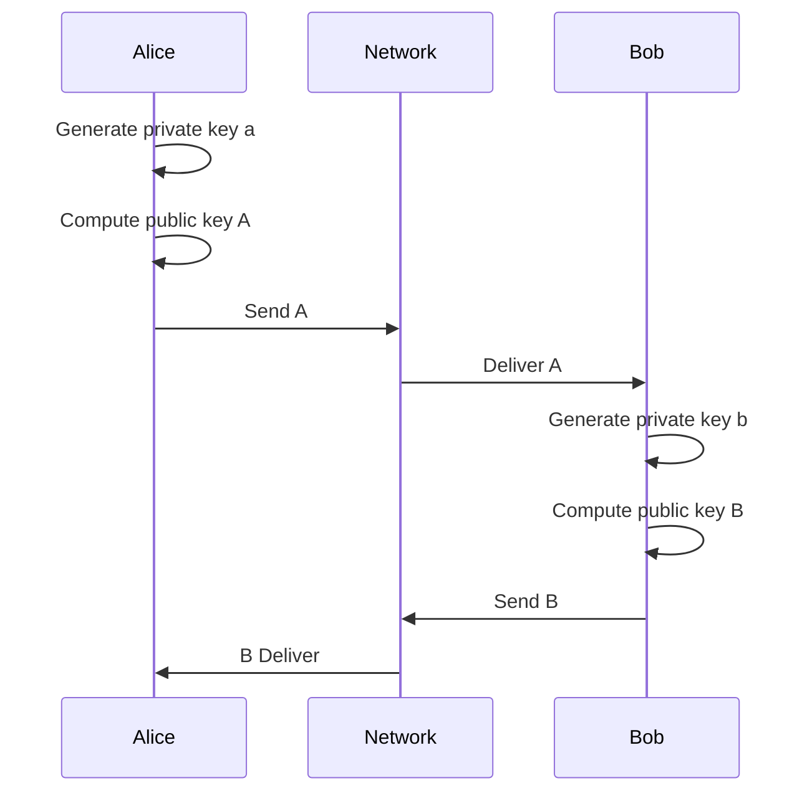
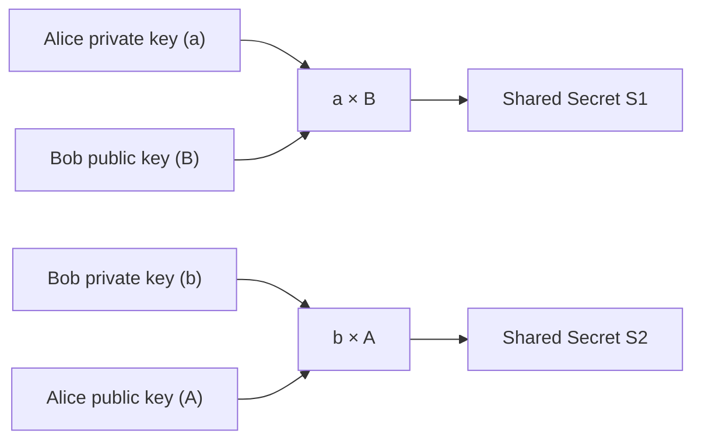
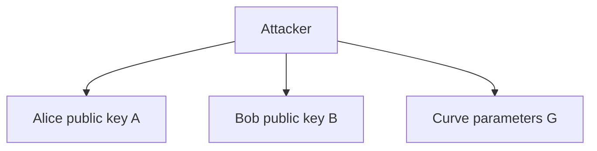
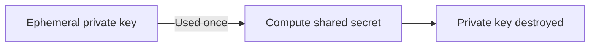
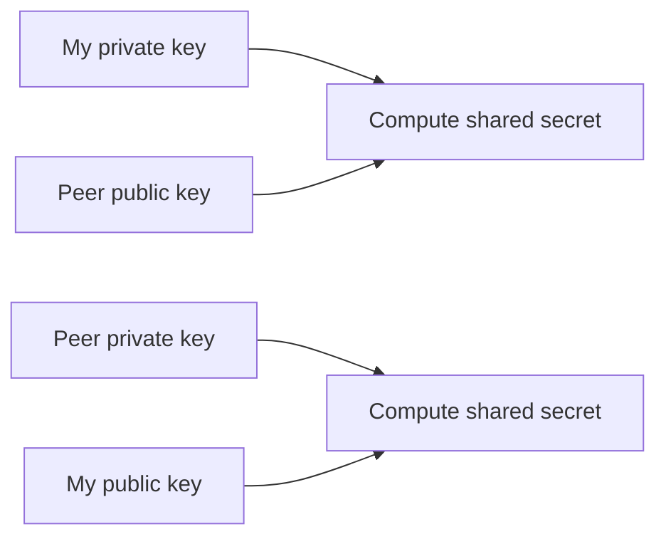
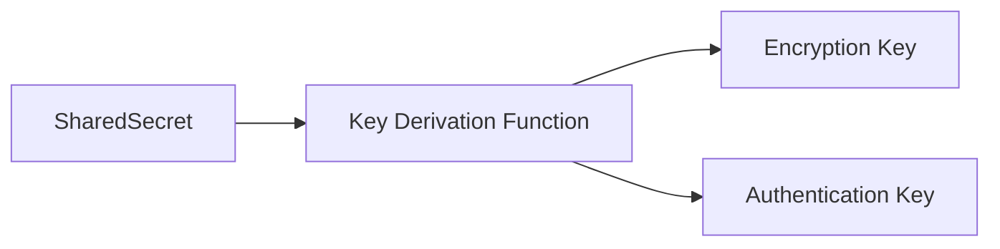
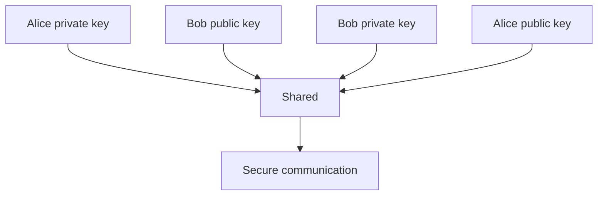

[This article is available in french](/fr/the-basis-of-diffie-hellman-key-exchange).

Modern secure communication relies on a deceptively simple idea: two parties can agree on a shared secret **without ever sending that secret**, even when all communication happens over an insecure network.

This article explains the foundation of **Diffie–Hellman key exchange**, with an emphasis on intuition rather than cryptographic formalism. It is intended for developers with a solid computational background who are new to cryptography.

## The Core Problem

Alice and Bob want to communicate securely.

They face the following constraints:

* The network is insecure
* An attacker can observe all traffic
* Alice and Bob have never met
* No shared secret exists beforehand

Yet they want to derive a **shared session key** known only to them.

## Public vs Private Information

Diffie–Hellman relies on a strict separation between:

* **Private keys** — secret, never shared
* **Public keys** — derived from private keys and safe to share

A public key is mathematically linked to its private key, but reversing that relationship is computationally infeasible.

## High-Level Flow of Diffie–Hellman

The key insight is:

> Each party combines **its own private key** with the **other party’s public key** to compute the same secret.

### Conceptual message flow



At this point:

* Alice knows $(a, B)$
* Bob knows $(b, A)$
* The network (and any attacker) knows $(A, B)$

## Deriving the Same Secret Independently

Now comes the core of Diffie–Hellman.



Mathematically, each computes the shared secret where $G$ is a public curve base point:  
* Alice computes $S_1 = a \cdot{} B = a \cdot{} (b \cdot{} G)$
* Bob computes $S_2 = b \cdot{} A = b \cdot{} (a \cdot{} G)$

Because [elliptic-curve](/en/understanding-elliptic-curves-in-cryptography/) multiplication is associative: $a \cdot{} (b \cdot{} G) = b \cdot{} (a \cdot{} G)$ so **$S_1 = S_2$**

No secret was transmitted.
The shared secret **emerges independently** on both sides.

## Why an Attacker Is Stuck

An attacker sees:



But the attacker lacks:

* Alice’s private key $a$
* Bob’s private key $b$

Without one of those, computing $a × B$ or $b × A$ is computationally infeasible.

## Ephemeral Keys and Forward Secrecy

Modern protocols use **ephemeral Diffie–Hellman** (often called ECDHE).



Properties:

* A new key pair is generated per session
* Private keys are erased after the handshake
* Past sessions remain secure even if long-term keys are later compromised

This is known as **forward secrecy**.

Below is a **complete, runnable Go example** (written to use the **modern stdlib APIs**: `crypto/ecdh` + `crypto/hkdf`) that demonstrates **ephemeral keys** and explains **forward secrecy** in code and comments.

```go
package main

import (
	"bytes"
	"crypto/ecdh"
	"crypto/hkdf"
	"crypto/rand"
	"crypto/sha256"
	"encoding/hex"
	"fmt"
)

// Demonstrates Ephemeral ECDH + HKDF-derived session keys => Forward Secrecy.
//
// Forward secrecy (FS) idea:
// - Each session uses fresh *ephemeral* ECDH private keys (not stored long-term).
// - Even if long-term keys are stolen later, past session keys can't be recomputed
//   because the ephemeral private keys are gone.
//
// This demo does NOT implement authentication (no signatures/certs). It's only the
// key-agreement/FS concept.

func main() {
	curve := ecdh.X25519()

	// Pretend these are long-term identity keys (used for authentication in real protocols).
	// They are NOT used to derive the session key in a forward-secret design.
	aliceLongTerm, _ := curve.GenerateKey(rand.Reader)
	bobLongTerm, _ := curve.GenerateKey(rand.Reader)
	_ = aliceLongTerm
	_ = bobLongTerm

	fmt.Println("=== Session #1 (ephemeral ECDH, forward-secret) ===")

	// 1) Each side generates an ephemeral keypair for this session only.
	aliceEphPriv, aliceEphPubBytes := mustGenerateEphemeral(curve)
	bobEphPriv, bobEphPubBytes := mustGenerateEphemeral(curve)

	// 2) They exchange *public* keys over the insecure network.
	fmt.Println("Alice ephemeral public:", shortHex(aliceEphPubBytes))
	fmt.Println("Bob   ephemeral public:", shortHex(bobEphPubBytes))

	// 3) Each side computes the ECDH shared secret using its ephemeral private key.
	aliceSeesBobPub := mustPublicKeyFromBytes(curve, bobEphPubBytes)
	bobSeesAlicePub := mustPublicKeyFromBytes(curve, aliceEphPubBytes)

	aliceShared := mustECDH(aliceEphPriv, aliceSeesBobPub)
	bobShared := mustECDH(bobEphPriv, bobSeesAlicePub)

	// 4) Derive a symmetric session key from the shared secret using stdlib crypto/hkdf.
	// In Go stdlib (Go 1.24+), HKDF uses:
	//    hkdf.Key(hash, secret, salt, info string, keyLength)
	//
	// In real protocols, "salt" and "info" are typically derived from or include
	// the handshake transcript (public keys, protocol version, ciphersuite, etc.)
	salt := []byte("demo salt (normally transcript-derived or random)")
	info := "session-1: X25519 + HKDF-SHA256"
	keyLen := 32 // e.g., 32 bytes for an AEAD key

	aliceSessionKey := mustHKDFKey(aliceShared, salt, info, keyLen)
	bobSessionKey := mustHKDFKey(bobShared, salt, info, keyLen)

	fmt.Println("Alice session key:", shortHex(aliceSessionKey))
	fmt.Println("Bob   session key:", shortHex(bobSessionKey))
	fmt.Println("Keys match?      ", bytes.Equal(aliceSessionKey, bobSessionKey))
	fmt.Println()

	// 5) Destroy ephemeral secrets after handshake (conceptually critical for FS).
	// We can at least zero the byte slices we directly control.
	zeroBytes(aliceShared)
	zeroBytes(bobShared)
	aliceEphPriv = nil
	bobEphPriv = nil

	fmt.Println("=== Later: long-term keys compromised ===")
	fmt.Println("Attacker has recorded the ephemeral public keys from the network,")
	fmt.Println("and later steals long-term identity keys.")
	fmt.Println("But the attacker still cannot reconstruct the Session #1 key,")
	fmt.Println("because the Session #1 ephemeral PRIVATE keys are gone.")
}

func mustGenerateEphemeral(curve ecdh.Curve) (*ecdh.PrivateKey, []byte) {
	priv, err := curve.GenerateKey(rand.Reader)
	if err != nil {
		panic(err)
	}
	return priv, priv.PublicKey().Bytes()
}

func mustPublicKeyFromBytes(curve ecdh.Curve, b []byte) *ecdh.PublicKey {
	pub, err := curve.NewPublicKey(b)
	if err != nil {
		panic(err)
	}
	return pub
}

func mustECDH(priv *ecdh.PrivateKey, pub *ecdh.PublicKey) []byte {
	secret, err := priv.ECDH(pub)
	if err != nil {
		panic(err)
	}
	return secret
}

func mustHKDFKey(secret, salt []byte, info string, keyLen int) []byte {
	key, err := hkdf.Key(sha256.New, secret, salt, info, keyLen)
	if err != nil {
		panic(err)
	}
	return key
}

func zeroBytes(b []byte) {
	for i := range b {
		b[i] = 0
	}
}

func shortHex(b []byte) string {
	s := hex.EncodeToString(b)
	if len(s) > 24 {
		return s[:24] + "…"
	}
	return s
}
```

[Run on Go Playground](https://go.dev/play/p/0kS6ELs19Jm).


What this code “proves” about forward secrecy:
* The session key depends on **ephemeral private keys** that exist only during the handshake.
* Later compromise of **long-term keys** does not help recover past session keys, because those long-term keys were **not the “recipe”** for the session key—ephemeral keys were.

## Why Public Keys Must Be Exchanged

A common beginner question is:

> “If private keys are ephemeral and destroyed, why keep or send the public keys?”

Because public keys are **required inputs** to derive the shared secret.



Without exchanging public keys:

* Neither side can compute the shared secret
* Secure communication cannot begin

Public keys are *not secrets* — they are handshake material.

## From Shared Secret to Session Keys

The Diffie–Hellman output is not usually used directly.



The byte slice returned by `priv.ECDH(pub)` **is not yet a safe encryption key and should not be fed directly into AES, ChaCha20, etc**.  
Instead, it must go through a Key Derivation Function (KDF).

### Incorrect: using ECDH output directly

```go
sharedSecret, _ := priv.ECDH(peerPub)

// WRONG: using raw ECDH output as an encryption key
block, err := aes.NewCipher(sharedSecret)
if err != nil {
	panic(err)
}
```

Why this is wrong?

* **Wrong length**
  * AES expects 16, 24, or 32 bytes
  * ECDH output length depends on the curve
* **Non-uniform entropy**
  * ECDH output is not guaranteed to be uniformly random
  * Some bits may be biased or structured
* **No context binding**
  * Same ECDH secret reused in different contexts → key reuse risks
  * No protocol separation
* **No key separation**  
  You often need multiple keys (encryption, MAC, etc.)

### Correct: ECDH → HKDF → session keys

```go
sharedSecret, _ := priv.ECDH(peerPub)

// Derive keys using HKDF
sessionKey, err := hkdf.Key(
	sha256.New,
	sharedSecret,
	nil,                 // salt (often transcript-derived)
	"handshake v1",      // info/context
	32,                  // key length
)
if err != nil {
	panic(err)
}

// Safe to use
block, err := aes.NewCipher(sessionKey)
if err != nil {
	panic(err)
}
```

Visual explanation in code:
```go
// Diffie–Hellman gives you raw cryptographic material
sharedSecret := ECDH(priv, peerPub)

// HKDF turns raw material into safe, context-bound keys
encryptionKey := HKDF(sharedSecret, "encryption")
authenticationKey := HKDF(sharedSecret, "authentication")
```

### Why KDF is mandatory (developer intuition)?
Think of Diffie–Hellman output as:
> High-entropy raw material, not a finished product

HKDF:
* extracts uniform randomness
* expands it to exact lengths
* binds it to protocol context
* enables key separation

Minimal, complete Go example:
```go
sharedSecret, _ := priv.ECDH(peerPub)

// Always derive keys
encKey, _ := hkdf.Key(sha256.New, sharedSecret, nil, "enc", 32)
macKey, _ := hkdf.Key(sha256.New, sharedSecret, nil, "mac", 32)

// Use derived keys, not sharedSecret
_ = encKey
_ = macKey
```


**The output of Diffie–Hellman is raw cryptographic material and must be passed through a [key derivation function](https://en.wikipedia.org/wiki/Key_derivation_function) (such as HKDF) to produce uniformly random, context-bound, protocol-safe session keys.**


## Summary



> Diffie–Hellman enables two parties to independently derive the same secret over an insecure network by combining their own private key with the other party’s public key, without ever transmitting the secret itself.

## Final Notes for Developers

* Public keys are **inputs**, not secrets
* Destroying ephemeral private keys provides forward secrecy
* Key derivation is mandatory — never use raw DH output directly
* This mechanism underpins TLS 1.3, SSH, Noise, and many other protocols
