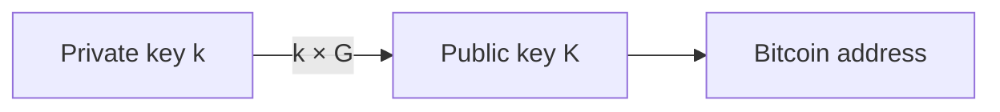

## Why Elliptic Curves Matter

Elliptic curves are the mathematical backbone of modern cryptography.  
They are used in:

- TLS 1.3 (HTTPS)
- Secure messaging
- SSH
- Bitcoin and many blockchains
- Digital signatures (ECDSA, EdDSA)
- Key exchange (ECDH)

Their power comes from a rare combination:

- Simple algebraic equations
- A rich group structure ([see further for definition](#definition-of-a-group))
- Extremely hard inverse problems

This article builds elliptic curves **from the ground up**, adds **diagrams**, **Go code**, and finishes with a **Bitcoin-specific deep dive**.

## The Elliptic Curve Equation

An elliptic curve over the real numbers is defined as:

$$
y^2 = x^3 + ax + b
$$

with constants \(a, b \in \mathbb{R}\).

To ensure smoothness:

$$
4a^3 + 27b^2 \neq 0
$$

This avoids cusps and self-intersections.

## Visual Shape (Over the Reals)

<picture>

<figcaption>
<span>Stylized elliptic curve over the reals. (<a href="https://mathworld.wolfram.com/EllipticCurve.html">Source</a>)</span>
</figcaption>
</picture>

Key properties:

- Symmetry across the x-axis
- Smooth, continuous curve
- No corners or breaks

## Elliptic Curves Form a Group

Points on an elliptic curve form an **abelian group** this is what enables cryptography.

### Definition of a group

A group is a set $G$ together with a binary operation on $G$ here denoted "$\cdot{}$" that combines
any two elements $a$ and $b$ of $G$ to form an element of $G$ denoted ⁠$a\cdot{}b$⁠, such that the
following three requirements, known as group axioms, are satisfied:

* **Associativity**  
  For all ⁠$a$⁠, $b$, $c$ in $G$ one has $(a\cdot b)\cdot c=a\cdot (b\cdot c)$.
* **Identity element**  
  There exists an **unique** element $e$ in $G$ such that, for every $a$ in $G$, one has $e\cdot a=a$ and ⁠$a\cdot e=a$.  
  A such element $e$ is unique, it is called the "identity element" or "neutral element" of the group.
* **Inverse**  
  For each $a$ in $G$ there exists an element $b$ in $G$ such that $a\cdot b=e$ and $b\cdot a=e$, where $e$ is the identity element.  
  For each $a$, the element $b$ is unique; it is called the inverse of $a$ and is commonly denoted $a^{-1}$.

It's an abelian group because:
* it is an **closed group (property of closure)**, which means that $a \cdot{} b$ is an element of $G$ for every $a$ and $b$ in $G$.
* it is commutative, which means that $a \cdot{} b = b \cdot{} a$ for every $a$ and $b$ in $G$.

## Point Addition (Geometric Intuition)


Elliptic curve “addition” has nothing to do with adding coordinates.  
**It is a definition of a binary operation on a set of points**, chosen so that:

the set of points on the curve (plus one extra point) forms an abelian group.

The word addition is a convention, not a coordinate-wise sum.

**Elliptic curve addition is a defined binary operation whose purpose is to turn the set of points on an elliptic curve into an abelian group.**


### Adding two points \(P\) and \(Q\)

1. Draw the line through two points $P$ and $Q$
2. It intersects the curve at a third point $R$
3. Reflecting \(R\) across the x-axis gives $P+Q$

<picture>

<figcaption>
<span>Points Addition in elliptic curve over the reals. (<a href="https://en.wikipedia.org/wiki/Elliptic_curve">Source</a>)</span>
</figcaption>
</picture>

Reflection is required to preserve group properties.

## Algebraic Point Addition on an Elliptic Curve

In this section, we define the addition of two points on an elliptic curve
in **short Weierstrass form**, fixing **the curve equation**, **the field**, and **the mathematical origin of the formulas**.

### Elliptic Curve Under Consideration

Let $K$ be a **field** (for example $K = \mathbb{R}$ or $K = \mathbb{F}_p$).

We consider the elliptic curve $E$ as the set of elements $(x,y)$ verifying:

$$E:\quad y^2 = x^3 + ax + b$$

with $a, b \in K$, subject to the non-singularity condition:

$$4a^3 + 27b^2 \neq 0$$

This condition guarantees that the curve is smooth (no cusps or self-intersections).


There are some interesting properties of these odd sorts of curves, one of them is that if a
(non-vertical) straight line crosses the curve at all, then it will cross it in exactly three
places.


### Points Considered

Let $P$ and $Q$ be two **distinct points** on $E(K)$:

$$P = (x_1, y_1), \qquad Q = (x_2, y_2)$$

with $x_1 \neq x_2$.

The point $R$ is defined by:
$$R= P+Q = (x_3, y_3)$$

### Line Through $P$ and $Q$

<picture>

<figcaption>
<span>Point Addition in elliptic curve over the reals. (<a href="https://github.com/pivaldi/ecc.asy">Source</a>)</span>
</figcaption>
</picture>

The line passing through $P$ and $Q$ has slope:

$$\lambda =
\begin{cases}
\dfrac{y_2 - y_1}{x_2 - x_1} & \text{if } K = \mathbb{R} \\[1em]
(y_2 - y_1)\cdot (x_2 - x_1)^{-1} \pmod p & \text{if } K = \mathbb{F}_p
\end{cases}$$


**Important remark**  
Over a finite field, there is **no division** in the usual sense, $(x_2 - x_1)^{-1}$ denotes the **multiplicative inverse in the field** $K$.



The equation of the line is:

$$y = \lambda(x - x_1) + y_1$$

### Intersection with the Curve

Substitute this expression for $y$ into the curve equation:

$$(\lambda(x - x_1) + y_1)^2 = x^3 + ax + b$$

After expansion, this yields a **cubic polynomial in $x$**.
Its three roots are exactly:

$$x_1,\quad x_2,\quad x_3$$

where $x_3$ corresponds to the **third intersection point** of the line with the curve.

### Computing $x_3$ (Viète’s formulas)

By identifying coefficients in the cubic polynomial, [Viète’s formulas](https://en.wikipedia.org/wiki/Vieta's_formulas) give:

$$x_1 + x_2 + x_3 = \lambda^2$$

Therefore:

$$\boxed{x_3 = \lambda^2 - x_1 - x_2}$$

### $y$-Coordinate of the Intersection Point

The $y$-coordinate of the intersection point $R$ is obtained by substituting $x_3$ into the line equation:

$$y_R = \lambda(x_3 - x_1) + y_1$$

### Definition of the Group Law

By definition of the group law on an elliptic curve,
the sum $P + Q$ is the **reflection of $R$ across the x-axis**:

$$\boxed{y_3 = -y_R = \lambda(x_1 - x_3) - y_1}$$

Thus:

$$\boxed{P + Q = (x_3, y_3)}$$

### Summary of the Formulas for $x_1 \neq x_2$

For the curve:

$$y^2 = x^3 + ax + b$$

we have:

$$\lambda = \frac{y_2 - y_1}{x_2 - x_1}$$

$$x_3 = \lambda^2 - x_1 - x_2$$

$$y_3 = \lambda(x_1 - x_3) - y_1$$

with all operations performed in the field $K$.

### Bitcoin Case (Concrete)

Bitcoin uses the [secp256k1 curve](https://github.com/bellaj/Blockchain/blob/6bffb47afae6a2a70903a26d215484cf8ff03859/ecdsa_bitcoin.pdf):

$$y^2 \equiv x^3 + 7 \pmod p$$

where:
- $a = 0$
- $b = 7$
- $p = 2^{256} - 2^{32} - 977$

The formulas above apply **unchanged**, with all operations carried out modulo $p$.

<picture>

<figcaption>
<span>A small-prime analogue of the Bitcoin elliptic curve with p=2503 (F2503). (<a href="https://github.com/pivaldi/ecc.asy">Source</a>)</span>
</figcaption>
</picture>

The secp256k1 curve has a very large value for $p$, so it resembles to the graph above, except there are about as many points on it as there are atoms in the universe!

## Algebraic Point Addition

Let:

$$
P = (x_1, y_1), \quad Q = (x_2, y_2)
$$

If $x_1 \neq x_2$:

$$
\lambda = \frac{y_2 - y_1}{x_2 - x_1}
$$

$$
x_3 = \lambda^2 - x_1 - x_2
$$

$$
y_3 = \lambda(x_1 - x_3) - y_1
$$

So:

$$
P + Q = (x_3, y_3)
$$

## Point Doubling

When (P = Q), we use the tangent line.

Slope:

$$
\lambda = \frac{3x_1^2 + a}{2y_1}
$$

Same formulas apply afterward.

## The Point at Infinity

Elliptic curves include a special element:

$$
\mathcal{O}
$$

Called the **point at infinity**, it acts as the identity:

$$
P + \mathcal{O} = P
$$

In diagrams, vertical lines meet the curve at (\mathcal{O}).

## Scalar Multiplication

Scalar multiplication is repeated addition:

$$
kP = P + P + \cdots + P
$$

This is **efficient** even for huge (k) using **double-and-add**.

<picture>

<figcaption>
<span>Scalar multiplication on an Elliptic Curve is repeated addition. (<a href="https://github.com/pivaldi/ecc.asy">Source</a>)</span>
</figcaption>
</picture>

## Finite Fields (Cryptography Reality)

Cryptography does **not** use real numbers.

Instead, elliptic curves are defined over finite fields:

$$
\mathbb{F}_p = {0, 1, 2, \dots, p-1}
$$

Equation:

$$
y^2 \equiv x^3 + ax + b \pmod p
$$

No smooth curve anymore — but the **group structure remains intact**.

## Discrete Logarithm Problem (ECDLP)

Given:

$$
Q = kG
$$

Find (k).

* Easy → forward direction
* Infeasible → reverse direction

This asymmetry is the foundation of elliptic-curve cryptography.

## Go Example: Scalar Multiplication

Using Go’s modern standard library:

```go
package main

import (
	"crypto/ecdh"
	"crypto/rand"
	"fmt"
)

func main() {
	curve := ecdh.X25519()

	priv, _ := curve.GenerateKey(rand.Reader)
	pub := priv.PublicKey()

	fmt.Println("Private key:", priv.Bytes())
	fmt.Println("Public key :", pub.Bytes())
}
```
[Run in the Go playground](https://go.dev/play/p/jjVNA8R-Hyl)

Conceptually $\text{Public} = k \cdot G$ where $k$ is hiden in the private key.

## Base Point (G)

Every curve defines a **public base point** (G):

* Fixed
* Known to everyone
* Large prime order (n)

Properties:

$$
nG = \mathcal{O}
$$

All keys derive from (G).

## Bitcoin and Elliptic Curves

### Curve used by Bitcoin

Bitcoin uses **secp256k1** which has for equation:

$$
y^2 \equiv x^3 + 7 \pmod p
$$

Where:

$$
p = 2^{256} - 2^{32} - 977
$$

Notable properties:

* No (a) term
* Simple structure
* High performance

## Bitcoin Private & Public Keys

### Private key

A random integer:

$$
k \in [1, n-1]
$$

### Public key

$$
K = kG
$$

Where (G) is the secp256k1 base point with $G(G_{x},G_{y})$, where ([hexadecimal base](https://en.wikipedia.org/wiki/Hexadecimal)):
$$G_{x}=79BE667EF9DCBBAC55A06295CE870B07029BFCDB2DCE28D959F2815B16F81798$$
$$G_{y}=483ADA7726A3C4655DA4FBFC0E1108A8FD17B448A68554199C47D08FFB10D4B8$$

## Bitcoin Diagram



One-way only.

## Bitcoin Signature (ECDSA)

Bitcoin uses **ECDSA**:

* Private key signs a transaction hash
* Public key verifies the signature
* No private key disclosure

Security relies entirely on ECDLP.

## Why Bitcoin Chose secp256k1

* No unexplained constants
* Faster arithmetic
* Simple equation
* Transparent design

Modern alternatives ([Schnorr / Taproot](https://bitcoinops.org/en/schnorr-taproot-workshop/)) still rely on elliptic curves.

## Go Example: Bitcoin-Style Key Generation

```go
package main

import (
	"crypto/elliptic"
	"crypto/rand"
	"fmt"
	_ "math/big"
)

func main() {
	curve := elliptic.P256() // secp256k1 uses similar API
	priv, x, y, _ := elliptic.GenerateKey(curve, rand.Reader)

	fmt.Println("Private key:", priv)
	fmt.Println("Public key X:", x)
	fmt.Println("Public key Y:", y)
}
```
[Run in the Go playground](https://go.dev/play/p/JhVJ0EikH6W)

(Bitcoin libraries use secp256k1 specifically, but the math is identical.)

## Final Intuition

Elliptic curves are:

> A mathematical system where **multiplication is easy**, **division is impossible**, and **everyone agrees on the rules**.

Bitcoin, TLS, and modern cryptography exist because of that asymmetry.

## Further Reading

Elliptic curves sit at the intersection of algebra, geometry, and cryptography.  
Depending on your background and goals, different resources will be appropriate.

Below is a curated selection, ordered from **intuitive introductions** to **rigorous mathematical treatments** and **cryptography-focused references**.

### Intuitive and Conceptual Introductions

These focus on *understanding* rather than formal proofs.

* **[Kahn Academy – Elliptic Curves](https://www.khanacademy.org/computing/computer-science/cryptography/elliptic-curve-cryptography)**  
  Clear geometric intuition and motivation.
* **“[A (Relatively Easy to Understand) Primer on Elliptic Curve Cryptography](https://andrea.corbellini.name/ecc/intro/)” – Andrea Corbellini**  
  Excellent bridge between intuition and algebra, widely respected.
* **“[Elliptic Curves and Cryptography](https://blog.cloudflare.com/a-relatively-easy-to-understand-primer-on-elliptic-curve-cryptography/)” – Cloudflare Blog**  
  A practitioner-oriented explanation of why ECC works.
* **[Elliptic Curve](https://learnmeabitcoin.com/technical/cryptography/elliptic-curve/) -  Greg Walker**  
  An other practitioner-oriented explanation of ECC.

### Cryptography-Focused References

These focus on elliptic curves as *cryptographic groups*.

* **“Guide to Elliptic Curve Cryptography” – Darrel Hankerson, Alfred Menezes, Scott Vanstone**  
  *The* reference book for ECC in practice.  
  Rigorous, but accessible with undergraduate math.
  ISBN: 978-0387952734
* **[RFC 7748 – Curve25519 and Curve448](https://datatracker.ietf.org/doc/html/rfc7748)**  
  Explains modern curve design and safe scalar multiplication.
* **“[The Cryptopals Crypto Challenges](https://cryptopals.com/)” (ECC sections)**  
  Hands-on perspective on ECC pitfalls and correct usage.

### Bitcoin-Specific Elliptic Curve Material

Focused on **secp256k1**, signatures, and Bitcoin design choices.

* **“[Bitcoin and Elliptic Curve Cryptography](https://jimmysong.medium.com/bitcoin-and-elliptic-curve-cryptography-abc-123)” – Jimmy Song**  
  Clear explanation of how ECC is used in Bitcoin.
* **SEC 2: [Recommended Elliptic Curve Domain Parameters](https://www.secg.org/sec2-v2.pdf)**  
  Formal specification of secp256k1.
* **[BIP-340: Schnorr Signatures for secp256k1](https://github.com/bitcoin/bips/blob/master/bip-0340.mediawiki)**  
  Modern Bitcoin signature scheme using elliptic curves.

### Mathematical Foundations (More Rigorous)

For readers who want proofs and formal structure.

* **Joseph H. Silverman – *The Arithmetic of Elliptic Curves***  
  The canonical mathematical reference.  
  Requires strong algebra background.
* **Washington – *Elliptic Curves: Number Theory and Cryptography***  
  A gentler mathematical approach with cryptographic motivation.
* **[MIT OpenCourseWare – Elliptic Curves](https://ocw.mit.edu/)**  
  University-level lecture notes and problem sets.

### Practical Implementations and Code

Understanding the math is only half the story.

* **[libsecp256k1 (Bitcoin Core)](https://github.com/bitcoin-core/secp256k1)**  
  Industrial-grade elliptic curve implementation.
* **Go standard library: `crypto/ecdh`, `crypto/elliptic`**  
  Reference implementations of ECC primitives in Go.
* **[Curve25519 paper](https://cr.yp.to/ecdh.html) – Daniel J. Bernstein**  
  Shows how curve design impacts security and simplicity.
