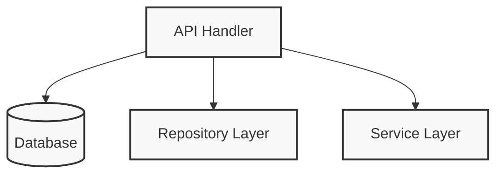
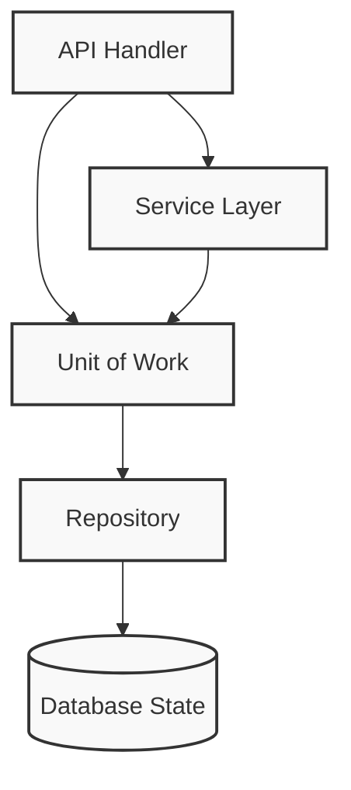

If the Repository pattern is our abstraction over persistent storage, the Unit of Work (UoW) pattern is our abstraction over the idea of **atomic operations**. Implementing this pattern allows us to finally and fully decouple our service layer from our data layer. 

In this post, we will look at how to implement the Unit of Work pattern in Go. Instead of tangled API handlers that manage database transactions directly, we will use an elegant closure-based approach combined with Go's `context.Context` to propagate transactions safely—even when dealing with nested operations and bulk database batches.

### The Problem: Communication Across Too Many Layers

Without a Unit of Work, a lot of communication occurs directly across the layers of our infrastructure. An API handler often talks directly to the database layer to start a transaction, talks to the repository layer to initialize it, and then talks to the service layer to execute business logic.

Here is what that tangled architecture looks like:



### The Solution: UoW Managing Database State via Context

With the UoW pattern, our API handler only needs to do two things: initialize a unit of work and invoke a service. The UoW acts as a single entrypoint to our persistent storage, ensuring that all operations happen together atomically. 



This architectural shift gives us highly useful benefits, such as **a stable snapshot of the database to work with**, and **a way to persist all of our changes at once**, so if something goes wrong, we don't end up in an inconsistent state.

### Designing the UoW with Context and Closures in Go

In Python, this pattern is often implemented using context managers to handle setup and teardown visually. In Go, we can achieve this same safe scoping using **closures and `context.Context`**. 

First, let's define a `DBExecutor` interface that abstracts both a database pool (like `*pgxpool.Pool`) and a transaction (`pgx.Tx`). Notice we've also included `SendBatch` to support bulk operations:

```go
package uow

import (
	"context"
	"fmt"

	"github.com/jackc/pgx/v5"
	"github.com/jackc/pgx/v5/pgconn"
	"github.com/jackc/pgx/v5/pgxpool"
)

// DBExecutor abstracts both *pgxpool.Pool and pgx.Tx
// Every service's repository will use this.
type DBExecutor interface {
	// Exec executes a query without returning rows.
	Exec(ctx context.Context, sql string, arguments ...any) (pgconn.CommandTag, error)
	// Query executes a query that returns rows.
	Query(ctx context.Context, sql string, args ...any) (pgx.Rows, error)
	// QueryRow executes a query that is expected to return at most one row.
	QueryRow(ctx context.Context, sql string, args ...any) pgx.Row

	// SendBatch to support bulk operations safely
	SendBatch(ctx context.Context, b *pgx.Batch) pgx.BatchResults
}

type txKey struct{}
```

### Routing Persistence Through the UoW

A pure Unit of Work acts as a single API for our persistence concerns. Instead of allowing repositories to access the global database pool directly, we want them to go through the UoW. 

We implement this by defining a `getExecutor` package helper fallback, but more importantly, we expose an `Executor(ctx)` method directly on the `UnitOfWork` struct:

```go
// getExecutor safely extracts the transaction from the context, or falls back to the pool.
// Repositories call this directly.
func getExecutor(ctx context.Context, pool *pgxpool.Pool) DBExecutor {
	if tx, ok := ctx.Value(txKey{}).(pgx.Tx); ok {
		return tx
	}

	return pool
}

// UnitOfWork is the generic Postgres implementation
type UnitOfWork struct {
	pool *pgxpool.Pool
}

func New(pool *pgxpool.Pool) *UnitOfWork {
	return &UnitOfWork{pool: pool}
}

// Executor returns the active transaction for ctx, or the pool if no transaction is running.
// Repositories call this instead of the package helper getExecutor.
func (u *UnitOfWork) Executor(ctx context.Context) DBExecutor {
	return getExecutor(ctx, u.pool)
}
```

By having the repositories call `u.Executor(ctx)`, we prohibit direct access to the database pool, centralizing our database session management exactly where it belongs.

### The Concrete Implementation: Safely Handling Nested Transactions

A notorious challenge with the UoW pattern is managing nested transactions. If a service function that wraps its logic in a transaction calls another function that *also* attempts to start a transaction, you risk deadlocks, parallel database connections, or breaking atomicity.

To solve this natively in Go, our `WithTransaction` implementation intelligently checks the `context.Context`. If a transaction is already running, it leverages `pgx` to create a `SAVEPOINT` instead of a brand-new connection:

```go
func (u *UnitOfWork) WithTransaction(ctx context.Context, fn func(context.Context) error) error {
	// 1. Check if we are ALREADY inside a transaction
	if existingTx, ok := ctx.Value(txKey{}).(pgx.Tx); ok {
		// We are nested! Tell pgx to create a SAVEPOINT instead of a new connection.
		nestedTx, err := existingTx.Begin(ctx)
		if err != nil {
			return fmt.Errorf("cannot start nested transaction (savepoint): %w", err)
		}

		// This will only rollback to the SAVEPOINT, leaving the outer transaction intact
		defer func() { _ = nestedTx.Rollback(ctx) }()

		// Wrap the nestedTx in the context for any deeper calls
		ctxWithNestedTx := context.WithValue(ctx, txKey{}, nestedTx)

		if err := fn(ctxWithNestedTx); err != nil {
			return err
		}

		// "Committing" a savepoint just releases it, it doesn't commit the outer transaction
		if err := nestedTx.Commit(ctx); err != nil {
			return fmt.Errorf("cannot release savepoint: %w", err)
		}

		return nil
	}

	// 2. We are NOT nested. Start a brand new root transaction from the pool.
	tx, err := u.pool.Begin(ctx)
	if err != nil {
		return fmt.Errorf("cannot start root transaction: %w", err)
	}
	defer func() { _ = tx.Rollback(ctx) }()

	ctxWithTx := context.WithValue(ctx, txKey{}, tx)

	if err := fn(ctxWithTx); err != nil {
		return err
	}

	if err := tx.Commit(ctx); err != nil {
		return fmt.Errorf("cannot commit root transaction: %w", err)
	}

	return nil
}
```

By safely rolling back only to the `SAVEPOINT` on failure, the outer transaction remains completely intact, ensuring robust, safe-by-default execution at any layer of the application.

### Making the Repository UoW-Aware

Now that the UoW dictates database access, our repository must depend on it. This enforces the rule that our data access code relies on a simple abstraction rather than complex global pool connections.

```go
type PostgresTodoRepository struct {
    uow *uow.UnitOfWork
}

func NewPostgresTodoRepository(uow *uow.UnitOfWork) *PostgresTodoRepository {
    return &PostgresTodoRepository{uow: uow}
}

// Save persists a new todo to the database.
func (r *PostgresTodoRepository) Save(ctx context.Context, todo *domain.Todo) error {
    query := `INSERT INTO todos (id, title, status) VALUES ($1, $2, $3)`

    // The repository MUST go through the UoW to get its executor!
    exec := r.uow.Executor(ctx)

    _, err := exec.Exec(ctx, query, todo.ID().String(), todo.Title().String(), todo.Status().String())
    if err != nil {
        return fmt.Errorf("saving todo: %w", err)
    }

    return nil
}
```

### Using the UoW in the Service Layer

Because we've abstracted the database connection via context, the service layer can wrap complex operations inside an atomic unit easily. 

```go
func (s *TodoApplicationService) CreateTodoWithSubtasks(ctx context.Context, req CreateTodoRequest) error {
    // 1. Visually group code into blocks that happen atomically
    return s.uow.WithTransaction(ctx, func(txCtx context.Context) error {

        // 2. Both operations will automatically use the same transaction
        if err := s.todoRepo.Save(txCtx, req.Todo); err != nil {
            return err // Returning an error triggers the rollback
        }

        if err := s.todoRepo.SaveSubtasks(txCtx, req.Subtasks); err != nil {
            return err // Returning an error triggers the rollback
        }

        // Returning nil triggers the commit
        return nil 
    })
}
```

### Implicit Commits on Success

Some traditional Unit of Work patterns advocate for requiring explicit commits in the code. However, by utilizing Go's `defer` and closure pattern, we achieve a highly idiomatic implementation: **our function commits by default if no error is returned, and safely rolls back if an error occurs**. This makes our software safe by default. Any exception or early exit leads to a safe state. 

### Trade-offs Recap

Before implementing the Unit of Work via Context, consider these trade-offs:

| Pros | Cons |
| :--- | :--- |
| **Visual Grouping:** We have a nice abstraction over atomic operations, making it easy to see what blocks of code are grouped together atomically. | **Magic Contexts:** Using `context.Context` to transport database connections can sometimes make debugging slightly more opaque. |
| **Solves Nested Transactions:** Creating savepoints dynamically protects against deadlocks and partial commits when composing multiple service functions together. | **Concurrency:** You still have to think quite carefully about multithreading and passing contexts across goroutines. |
| **Centralized API:** By forcing the repository to go through `uow.Executor(ctx)`, we ensure strict access control to our persistent storage. | The standard library or ORM might already have good enough abstractions for smaller apps. |

Ultimately, the UoW pattern aligns perfectly with the dependency inversion principle: our service layer depends on a thin abstraction, and we attach concrete implementations at the outside edge of the system. By leveraging Go's `context.Context` and `pgx` savepoints, we've built a robust, scalable, and fail-safe architecture.

You can found a complet implementation of these concepts in the [Monolith Modular Workspace Todo App](https://github.com/pivaldi/mmw-todo) using the [ogl uow lib](https://github.com/OVYA/ogl/blob/master/pg/uow/uow.go).
