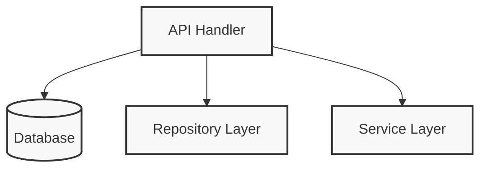
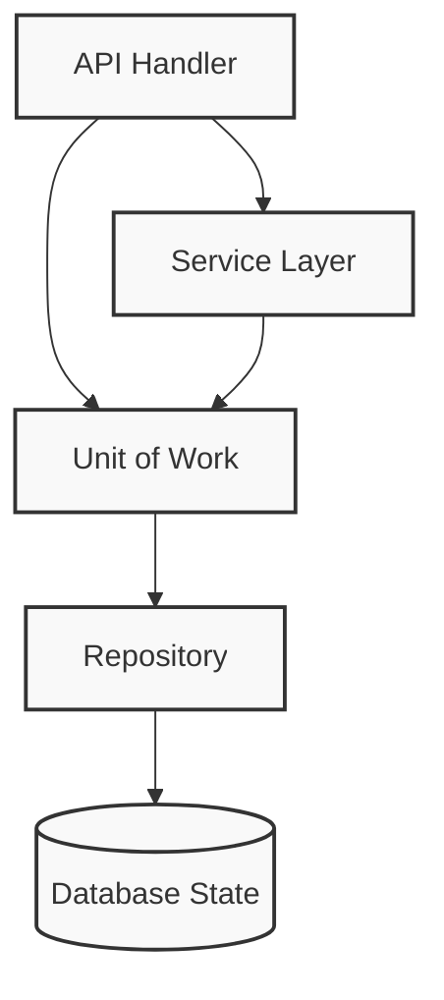

If the Repository pattern is our abstraction over persistent storage, the Unit of Work (UoW) pattern is our abstraction over the idea of **atomic operations**. Implementing this pattern allows us to finally and fully decouple our service layer from our data layer.

In this post, we will look at how to implement the Unit of Work pattern in Go. Instead of tangled API handlers that manage database transactions directly, we will use an elegant closure-based approach combined with Go's `context.Context` to propagate transactions safely—even when dealing with nested operations.

### The Problem: Communication Across Too Many Layers

Without a Unit of Work, a lot of communication occurs directly across the layers of our infrastructure. An API handler often talks directly to the database layer to start a transaction, talks to the repository layer to initialize it, and then talks to the service layer to execute business logic.

Here is what that tangled architecture looks like:



### The Solution: UoW Managing Database State via Context

With the UoW pattern, our API handler only needs to do two things: initialize a unit of work and invoke a service. The UoW acts as a single entrypoint to our persistent storage, ensuring that all operations happen together atomically.



This architectural shift gives us highly useful benefits, such as a stable snapshot of the database to work with, and a way to persist all of our changes at once, so if something goes wrong, we don't end up in an inconsistent state.

### Designing the UoW with Context and Closures in Go

In Python, this pattern is often implemented using context managers to handle setup and teardown visually. In Go, we can achieve this same safe scoping using **closures and `context.Context`**.

Instead of forcing the repository to be explicitly instantiated with a transaction, we can inject the transaction into the context. First, let's define a `DBExecutor` interface that abstracts both a database pool (like `*pgxpool.Pool`) and a transaction (`pgx.Tx`):

```go
package uow

import (
    "context"
    "fmt"
    "github.com/jackc/pgx/v5"
    "github.com/jackc/pgx/v5/pgconn"
    "github.com/jackc/pgx/v5/pgxpool"
)

// DBExecutor abstracts both *pgxpool.Pool and pgx.Tx
// Every service's repository will use this.
type DBExecutor interface {
    Exec(ctx context.Context, sql string, arguments ...any) (pgconn.CommandTag, error)
    Query(ctx context.Context, sql string, args ...any) (pgx.Rows, error)
    QueryRow(ctx context.Context, sql string, args ...any) pgx.Row

	// SendBatch to support bulk operations safely
	SendBatch(ctx context.Context, b *pgx.Batch) pgx.BatchResults
}

type txKey struct{}
```

### The Concrete Implementation: Safely Handling Nested Transactions

A notorious challenge with the UoW pattern is managing nested transactions. If a service function that wraps its logic in a transaction calls another function that *also* attempts to start a transaction, you risk deadlocks, parallel database connections, or breaking atomicity.

To solve this natively in Go, our `WithTransaction` implementation intelligently checks the `context.Context`. If a transaction is already running, it leverages `pgx` to create a `SAVEPOINT` instead of a brand-new connection:

```go
// UnitOfWork is the generic Postgres implementation
type UnitOfWork struct {
    pool *pgxpool.Pool
}

func NewUnitOfWork(pool *pgxpool.Pool) *UnitOfWork {
    return &UnitOfWork{pool: pool}
}

func (u *UnitOfWork) WithTransaction(ctx context.Context, fn func(context.Context) error) error {
	// 1. Check if we are ALREADY inside a transaction
	if existingTx, ok := ctx.Value(txKey{}).(pgx.Tx); ok {
		// We are nested! Tell pgx to create a SAVEPOINT instead of a new connection.
		nestedTx, err := existingTx.Begin(ctx)
		if err != nil {
			return fmt.Errorf("cannot start nested transaction (savepoint): %w", err)
		}

		// This will only rollback to the SAVEPOINT, leaving the outer transaction intact
		defer func() { _ = nestedTx.Rollback(ctx) }()

		// Wrap the nestedTx in the context for any deeper calls
		ctxWithNestedTx := context.WithValue(ctx, txKey{}, nestedTx)

		if err := fn(ctxWithNestedTx); err != nil {
			return err
		}

		// "Committing" a savepoint just releases it, it doesn't commit the outer transaction
		if err := nestedTx.Commit(ctx); err != nil {
			return fmt.Errorf("cannot release savepoint: %w", err)
		}

		return nil
	}

	// 2. We are NOT nested. Start a brand new root transaction from the pool.
	tx, err := u.pool.Begin(ctx)
	if err != nil {
		return fmt.Errorf("cannot start root transaction: %w", err)
	}
	defer func() { _ = tx.Rollback(ctx) }()

	ctxWithTx := context.WithValue(ctx, txKey{}, tx)

	if err := fn(ctxWithTx); err != nil {
		return err
	}

	if err := tx.Commit(ctx); err != nil {
		return fmt.Errorf("cannot commit root transaction: %w", err)
	}

	return nil
}
```

By safely rolling back only to the `SAVEPOINT` on failure, the outer transaction remains completely intact, ensuring robust, safe-by-default execution at any layer of the application.

### Making the Repository UoW-Aware

To make this work seamlessly, our repository shouldn't care if it's part of a transaction or not. We write a helper function that safely extracts the transaction from the context if it exists, or falls back to the global pool:

```go
// GetExecutor safely extracts the transaction from the context, or falls back to the pool.
// Repositories call this directly.
func GetExecutor(ctx context.Context, pool *pgxpool.Pool) DBExecutor {
    if tx, ok := ctx.Value(txKey{}).(pgx.Tx); ok {
        return tx
    }
    return pool
}
```

Now, in our `PostgresTodoRepository`, we use this helper whenever we need to talk to the database:

```go
// Save persists a new todo to the database.
func (r *PostgresTodoRepository) Save(ctx context.Context, todo *domain.Todo) error {
    query := `INSERT INTO todos (id, title, description, status)
              VALUES ($1, $2, $3, $4)`

    // GetExecutor automatically uses the Tx if it's in the ctx!
    exec := uow.GetExecutor(ctx, r.pool)

    // Execute the query using the shared transaction...
    _, err := exec.Exec(ctx, query,
        todo.ID().String(),
        todo.Title().String(),
        todo.Description(),
        todo.Status().String())

    if err != nil {
        return fmt.Errorf("saving todo: %w", err)
    }
    return nil
}
```

### Using the UoW in the Service Layer

Because we've abstracted the database connection via context, the service layer can wrap complex operations inside an atomic unit easily.

```go
func (s *TodoApplicationService) CreateTodoWithSubtasks(ctx context.Context, req CreateTodoRequest) error {
    // 1. Visually group code into blocks that happen atomically
    return s.uow.WithTransaction(ctx, func(txCtx context.Context) error {

        // 2. Both operations will automatically use the same transaction
        if err := s.todoRepo.Save(txCtx, req.Todo); err != nil {
            return err // Returning an error triggers the rollback
        }

        if err := s.todoRepo.SaveSubtasks(txCtx, req.Subtasks); err != nil {
            return err // Returning an error triggers the rollback
        }

        // Returning nil triggers the commit
        return nil
    })
}
```

## The 3 Rules of Goroutines in a UoW

### Rule 1: Never share txCtx across concurrent database calls.

```go
// 🛑 DISASTER: Do not do this!
err := s.uow.WithTransaction(ctx, func(txCtx context.Context) error {
    var wg sync.WaitGroup
    for _, item := range items {
        wg.Add(1)
        go func(i Item) {
            defer wg.Done()
            // CRASH! Multiple goroutines fighting over 1 database connection!
            s.repo.Save(txCtx, i)
        }(item)
    }
    wg.Wait()
    return nil
})
```

```go
// ✅ PERFECTLY SAFE
err := s.uow.WithTransaction(ctx, func(txCtx context.Context) error {
    // 1. Sequential database write
    s.repo.Save(txCtx, todo)

    // 2. Concurrent NON-DB work (e.g., calling an external HTTP API)
    var wg sync.WaitGroup
    wg.Add(1)
    go func() {
        defer wg.Done()
        // Pass standard ctx, NOT txCtx!
        s.emailClient.Send(ctx, "Todo Created")
    }()

    wg.Wait() // MUST wait before returning, or the UoW will commit early!
    return nil
})
```

### Rule 2: Use pgx.Batch for bulk operations

In your PostgresTodoRepository, you construct a pgx.Batch, queue up all your INSERT statements, and send them through the executor:

```go
// BatchSave persists multiple todos efficiently in a single network trip
func (r *PostgresTodoRepository) BatchSave(ctx context.Context, todos []*domain.Todo) error {
	if len(todos) == 0 {
		return nil
	}

	batch := &pgx.Batch{}
	query := `
		INSERT INTO todos (id, title, description, status, priority, due_date, created_at, updated_at)
		VALUES ($1, $2, $3, $4, $5, $6, $7, $8)
	`

	// 1. Queue all the queries into the batch locally in memory
	for _, todo := range todos {
		var dueDate *time.Time
		if todo.DueDate() != nil {
			t := todo.DueDate().Time()
			dueDate = &t
		}

		batch.Queue(query,
			todo.ID().String(),
			todo.Title().String(),
			todo.Description(),
			todo.Status().String(),
			todo.Priority().String(),
			dueDate,
			todo.CreatedAt(),
			todo.UpdatedAt(),
		)
	}

	// 2. Get the executor (magically uses the transaction if inside a UoW!)
	exec := postgres.GetExecutor(ctx, r.pool)

	// 3. Send the entire batch to Postgres at once
	br := exec.SendBatch(ctx, batch)
	
	// CRITICAL: You must close the BatchResults to release the connection back to the pool!
	defer br.Close()

	// 4. Verify that every single query succeeded
	for i := 0; i < len(todos); i++ {
		_, err := br.Exec()
		if err != nil {
			return fmt.Errorf("batch insert failed at index %d: %w", i, err)
		}
	}

	return nil
}
```

In the Application Service:

```go
func (s *TodoApplicationService) CreateMultipleTodos(ctx context.Context, reqs []CreateTodoRequest) ([]*domain.Todo, error) {
	var todos []*domain.Todo

	// ... (Convert requests to domain.Todo entities) ...

	// Save them ALL atomically.
	// If row 999 fails, the entire batch of 1,000 rolls back safely.
	err := s.uow.WithTransaction(ctx, func(txCtx context.Context) error {

		if err := s.repository.BatchSave(txCtx, todos); err != nil {
			return fmt.Errorf("failed to bulk save todos: %w", err)
		}

		// You can even batch dispatch events here if your dispatcher supports it!

		return nil
	})

	if err != nil {
		return nil, err
	}

	return todos, nil
}
```

Why this is vastly superior to Goroutines:
1. **Network Efficiency**: 1,000 goroutines doing individual inserts means 1,000 network round-trips to the database. pgx.Batch does it in 1 round-trip.
2. **Connection Pool Safety**: Goroutines would exhaust your database connection pool instantly. Batching uses exactly 1 connection, leaving the rest of the pool free for other incoming HTTP requests.
3. **Transaction Safety**: Because it uses only 1 connection, it runs perfectly inside your WithTransaction closure without panicking the pgx driver.

### Rule 3: Goroutines are fine for NON-database work

Goroutines are fine for NON-database work, but you must synchronize.
You can absolutely spawn goroutines inside the UoW closure, as long as they don't use the database and you wait for them to finish before the closure returns.

```go
// ✅ PERFECTLY SAFE
err := s.uow.WithTransaction(ctx, func(txCtx context.Context) error {
    // 1. Sequential database write
    s.repo.Save(txCtx, todo)

    // 2. Concurrent NON-DB work (e.g., calling an external HTTP API)
    var wg sync.WaitGroup
    wg.Add(1)
    go func() {
        defer wg.Done()
        // Pass standard ctx, NOT txCtx!
        s.emailClient.Send(ctx, "Todo Created")
    }()

    wg.Wait() // MUST wait before returning, or the UoW will commit early!
    return nil
})
```

### Implicit Commits on Success

Some traditional Unit of Work patterns advocate for requiring explicit commits in the code. However, by utilizing Go's `defer` and closure pattern, we achieve a highly idiomatic implementation: **our function commits by default if no error is returned, and safely rolls back if an error occurs**. This makes our application fail in a way that is safe by default, ensuring we never have to worry about partially committed operations.

### Trade-offs Recap

Before implementing the Unit of Work via Context, consider these trade-offs:

| Pros | Cons |
| :--- | :--- |
| We have a nice abstraction over atomic operations, and the closure makes it easy to visually group code that happens together atomically. | Magic context variables can sometimes make debugging slightly more opaque if a context drops its values. |
| **Solves Nested Transactions:** Creating savepoints dynamically protects against deadlocks and partial commits when composing multiple service functions together. | You still have to think quite carefully about multithreading and passing contexts across goroutines. |
| It helps to enforce the consistency of our domain model. | The standard library or ORM might already have good enough abstractions for smaller apps. |

Ultimately, the UoW pattern aligns perfectly with the dependency inversion principle: our service layer depends on a thin abstraction, and we attach concrete implementations at the outside edge of the system. By leveraging Go's `context.Context` and `pgx` savepoints, we've built a robust, scalable, and fail-safe architecture.

You can found a complet implementation of these concepts in the [Monolith Modular Workspace Todo App](https://github.com/pivaldi/mmw-todo) using the [ogl uow lib](https://github.com/OVYA/ogl/blob/master/postgres/uow/uow.go).
