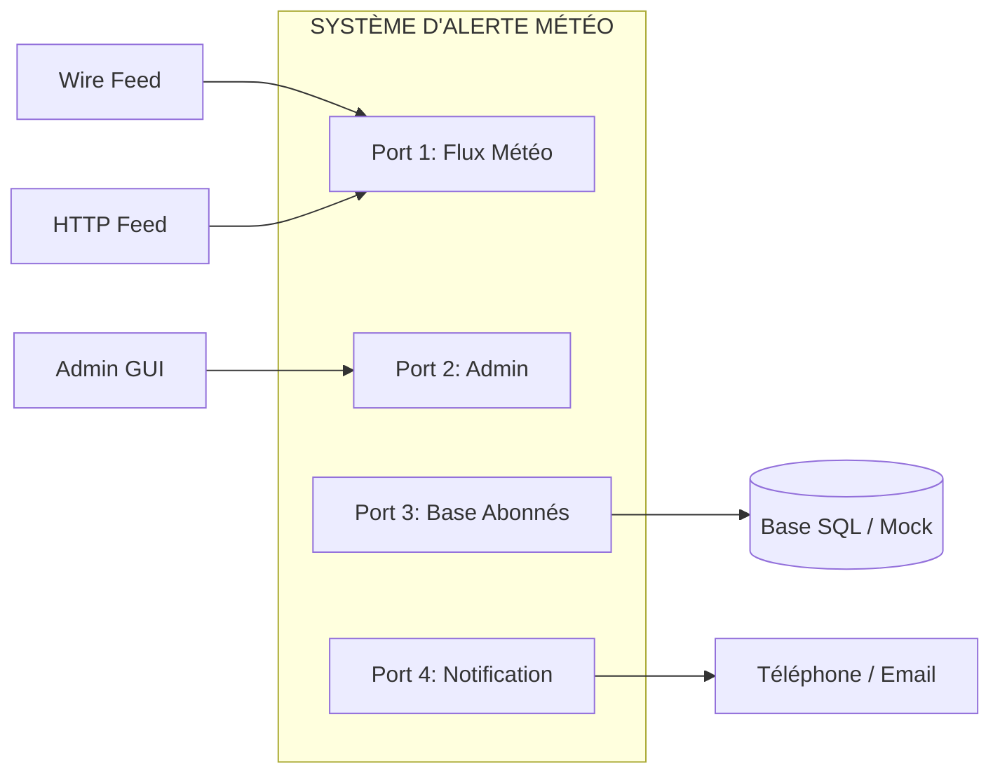

[This article is available in English](/en/implementation-of-ddd-in-hexagonal-architecture).

## Le Défi de la Complexité et du Découplage

Dans la conception de systèmes d'information d'entreprise, la dégradation progressive de la structure logicielle constitue l'un des risques majeurs pour la pérennité des projets.  
L'architecture logicielle classique est fréquemment confrontée à deux pièges majeurs que sont la contamination de la couche de présentation ou d'interface utilisateur (UI) par la logique métier et l'enchevêtrement direct entre le cœur applicatif et les mécanismes de stockage ou bases de données.  
Lorsque les règles d'entreprise s'infiltrent dans les composants graphiques ou se trouvent étroitement couplées aux schémas de données, le système perd sa clarté conceptuelle, accumule une dette technique sévère et devient extrêmement rigide face au changement.

Les conséquences de cet enchevêtrement technique sont particulièrement pénalisantes sur le plan de la testabilité, de l'extensibilité et de la réutilisabilité.  
Sur le plan de l'automatisation des tests, la présence de logique métier au sein de l'interface graphique empêche l'exécution de suites de tests automatisées efficaces car le comportement du système devient tributaire de détails visuels instables, tels que la disposition des boutons ou la taille des champs d'entrée.  
Pour cette même raison, il devient impossible d'évoluer vers une exécution automatisée par lots (batch) ou de permettre à un autre programme de piloter l'application sans intervention humaine via une interface "inter-applicative".  
Du côté de l'infrastructure, l'interdépendance directe avec la base de données paralyse le travail des équipes de développement dès que le serveur de stockage subit des indisponibilités, des migrations ou des réorganisations majeures.

Pour surmonter ces goulets d'étranglement, l'analyse architecturale démontre que la frontière fondamentale à établir n'est pas une séparation axée sur une dimension unidimensionnelle ou géographique (« gauche contre droite » ou « haut contre bas »), mais bien une frontière stricte entre l'intérieur, **la logique pure de l'application**, et l'extérieur, **les mécanismes d'interaction et d'infrastructure**.  
Ce basculement de perspective permet de concevoir le système sous la forme d'un composant autonome, accessible de manière agnostique et mène naturellement à une structure d'architecture centrée sur les ports et les adaptateurs.

## L'Architecture Hexagonale (Ports et Adaptateurs)

Proposée par [Alistair Cockburn en 2005](https://alistair.cockburn.us/hexagonal-architecture) sous le nom d'architecture « Ports et Adaptateurs » (Ports and Adapters), l'Architecture Hexagonale répond à l'exigence stratégique de préserver la logique métier de toute dépendance technologique externe.  
L'intention de ce patron est de permettre à une application d'être pilotée de manière équivalente par des utilisateurs humains, des scripts de tests automatisés, des pilotes de traitement par lots ou d'autres applications, tout en étant développée et testée en isolation totale vis-à-vis des bases de données et des dispositifs d'exécution physiques.

### Explication Détaillée des Concepts Fondamentaux

* **L'asymétrie Intérieur/Extérieur**  
  La métaphore visuelle de l'hexagone n'a pas été choisie pour imposer une contrainte arbitraire de six côtés ou de six ports, mais pour offrir un espace graphique suffisant permettant de représenter les multiples interfaces nécessaires entre le composant applicatif central et le monde extérieur.  
  Cette représentation rompt délibérément avec le schéma unidimensionnel des couches empilées pour matérialiser une frontière unique : **l'intérieur du domaine face à l'extérieur**.
* **Les Ports**
  Un port représente une conversation orientée vers un objectif applicatif précis.  
  Il prend la forme d'une API abstraite ou d'un protocole de communication spécifié par l'intention fonctionnelle de l'échange, sans présumer de la technologie qui l'exploitera.  
  La granularité des ports est flexible car un système peut définir un port unique ou un port par cas d'utilisation ; la pratique courante s'établissant généralement entre deux et quatre ports stratégiques.
* **Les Adaptateurs**
  L'adaptateur constitue la « colle » technique ou le convertisseur reliant le monde extérieur aux ports applicatifs.  
  Il traduit les signaux, requêtes ou événements d'une technologie spécifique (interface graphique GUI, protocole `HTTP`, requêtes `SQL`) vers l'`API` interne du port, et inversement.  
  Un même port peut accueillir plusieurs adaptateurs permutables selon le contexte d'exécution ; c'est ce qui en fait sa force et son intérêt principal.
* **Asymétrie Acteurs Primaires vs Secondaires**
  * **Ports / Adaptateurs Primaires (Driving / Moteurs)**
    Positionnés sur la face de contrôle (traditionnellement à gauche ou en haut de l'hexagone), ils représentent les acteurs primaires qui déclenchent les actions et sortent l'application de son état de repos.
    Les adaptateurs primaires incluent les interfaces utilisateur (GUI), les scripts de tests automatisés (comme les harnais FIT/Fitnesse), les traitements par lots ou les appels `HTTP`.
  * **Ports / Adaptateurs Secondaires (Driven / Pilotés)**  
    Positionnés sur la face de données ou de notification (à droite ou en bas de l'hexagone), ils représentent les acteurs secondaires pilotés par l'application pour obtenir des informations ou notifier des événements.  
    Les adaptateurs secondaires englobent les drivers de bases de données `SQL` ou de fichiers plats, les bases de données simulées en mémoire (Mocks) et les services d'envoi de messages ou de notifications.

Pour illustrer concrètement la gestion simultanée de multiples acteurs externes, Alistair Cockburn s'appuie sur l'exemple d'un Système d'Alerte Météorologique.  
Ce système s'articule autour de quatre ports distincts, chacun caractérisé par son intention métier.

1. Un port d'entrée des flux météo alimenté à l'origine par un flux filaire, puis étendu via un adaptateur `HTTP` sans modifier le cœur applicatif.
2. Un port d'administration exploité par des adaptateurs `GUI` pour la configuration du système par des opérateurs humains.
3. Un port de base de données abonnés permettant d'interroger la liste des destinataires à notifier.
4. Un port de canaux de notification pilotant des adaptateurs d'appels téléphoniques, de répondeurs, puis d'envoi de courriels.

Cette architecture permet un exploitation en mode headless (exécution de l'application dépourvue d'interface graphique) combinée à des adaptateurs de persistance simulés en mémoire (Mock Databases), ce qui transforme la dynamique de développement.   
Les suites de tests de régression automatisées peuvent être exécutées de manière autonome et ultra-rapide au sein d'outils d'intégration continue (CI/CD).  
L'équipe de développement s'affranchit des indisponibilités de la base de données de recette ou de production, accélérant les cycles de livraison tout en garantissant la non-régression fonctionnelle.

Ceci étant, tout choix d'architecture impose un compromis.  
Comme le souligne [Martin Fowler dans son analyse des architectures d'application d'entreprise](https://martinfowler.com/books/eaa.html), l'architecture hexagonale offre le bénéfice majeur de traiter la couche de présentation et la couche de données de manière symétrique en tant qu'interfaces entourant un cœur applicatif.  
Toutefois, cette symétrie présente un inconvénient conceptuel car elle tend à masquer l'asymétrie fonctionnelle inhérente entre un consommateur de service (l'acteur primaire/moteur) et un fournisseur de service (l'acteur secondaire/piloté) alors que les architectures en couches traditionnelles expriment naturellement cette hiérarchie consommateur/fournisseur du haut vers le bas, l'architecture hexagonale impose à l'architecte une vigilance accrue lors de la conception pour ne pas confondre le rôle de pilotage de l'application et celui de fourniture d'infrastructure.

**Si l'architecture hexagonale fournit la coquille d'isolation technologique idéale, elle doit être complétée par une méthodologie rigoureuse pour concevoir et structurer le cœur métier qu'elle protège.**

## Domain-Driven Design (DDD)

Formalisé par [Eric Evans](https://ddd.academy/eric-evans/) en 2004, le [Domain-Driven Design](https://www.domainlanguage.com/) (DDD) repose sur la conviction fondamentale que le cœur d'un logiciel réside dans la connaissance approfondie du domaine métier et dans sa traduction directe au sein d'un modèle conceptuel évolutif.  
Le DDD fournit les outils organisationnels, stratégiques et tactiques nécessaires pour modéliser des problématiques complexes sans les diluer dans des considérations techniques.

> La conception pilotée par domaine est une approche du développement logiciel qui centre le développement sur la programmation d'un modèle de domaine doté d'une riche compréhension des processus et des règles d'un métier.
> -- Martin Fowler

### Les Concepts Stratégiques du DDD

* **Ubiquitous Language (Langage Unifié)**  
  Il s'agit d'un langage commun et rigoureux structuré autour du modèle de domaine, partagé sans ambiguïté par les experts métier (clients) et les développeurs techniques.  
  L'établissement de ce vocabulaire partagé élimine le besoin de traduction entre les exigences fonctionnelles et la mise en œuvre logicielle, réduisant drastiquement les risques de mauvaise communication et ancrant la connaissance métier directement dans le code source.
* **Bounded Context (Contexte Délimité)**  
  La portée d'un modèle métier et de son langage unifié est explicitement délimitée au sein d'une frontière spécifique.  
  Un Bounded Context définit la zone d'application stricte du modèle en fonction des structures d'équipes, des sous-parties de l'application, des bases de code et des schémas de bases de données, évitant ainsi toute confusion conceptuelle avec les domaines voisins.
* **Model-Driven Design (MDD) et la Boucle de Rétroaction**  
  La conception pilotée par le modèle garantit un lien direct et permanent entre le modèle conceptuel et son implémentation logicielle.  
  L'apport fondamental du MDD réside dans la boucle de rétroaction bidirectionnelle continue qu'il instaure dans le sens où toute modification du code constitue une modification du modèle métier, et réciproquement, toute évolution de la compréhension du domaine se traduit immédiatement par une réorganisation du code source.  
  Ce cycle d'apprentissage accélère la découverte du domaine et affine continuellement la précision du logiciel.

### Les Éléments Tactiques (Building Blocks)

La modélisation interne du domaine s'articulent autour de blocs de construction clairement typés pour exprimer les règles fonctionnelles.

* **Entities (Entités)**  
  Objets définis par un fil d'identité continue qui persiste à travers le temps et au-delà de leurs différentes représentations (exemples : Customer, Cargo, Ship) ; l'identité en DDD s'appuie sur un attribut métier, une combinaison d'attributs ou un comportement.
  * **Avertissement de performance et surcoût**  
    L'instanciation et le suivi individuel de chaque objet sous forme d'Entité génèrent un surcoût système significatif.  
    Modéliser indistinctement tous les objets sous forme d'Entités entraîne une prolifération d'instances uniques à suivre, provoquant de sévères dégradations de performance lors du traitement de milliers d'objets.  
    L'architecte doit privilégier les "Objets Valeurs" par défaut, sauf si un suivi d'identité continu est explicitement exigé par le domaine.
* **Value Objects (Objets Valeurs)**  
  Objets ne possédant aucune identité conceptuelle, caractérisés exclusivement par la combinaison de leurs attributs (exemples : Date, Money, Color). Deux objets valeurs possédant des attributs identiques sont considérés comme parfaitement égaux et remplacent le test d'égalité par référence. Ils sont obligatoirement immutables : pour modifier un état, on ne mute pas l'objet existant, mais on le remplace intégralement par une nouvelle instance d'objet valeur.
  Prenons l'exemple du billet de banque…  
  La distinction entre Entité et "Objet Valeur" dépend strictement du contexte métier.  
  Lors d'un échange commercial quotidien entre individus, un billet de banque est manipulé comme un "Objet Valeur" ; seule sa valeur nominale importe, peu importe l'exemplaire physique.  
  En revanche, pour la Banque Centrale chargée de l'impression et de la traçabilité contre la fraude, chaque billet est unique et suivi par son numéro de série ; il s'agit alors d'une Entité.
* **Services (Services du Domaine)**  
  Opérations ou processus autonomes au sein du domaine qui ne s'intègrent pas naturellement sous forme de méthodes dans une entité ou un objet valeur.  
  Un service du domaine s'exprime au moyen d'un verbe et orchestre une activité métier impliquant plusieurs objets.
  * **Nuance sur l'absence d'état (Statelessness)**  
    Bien qu'Eric Evans ait initialement défini les services comme étant strictement sans état (stateless), les évolutions de la pensée architecturale notées par Fowler reconnaissent que si le caractère stateless reste hautement souhaitable pour la simplicité du système, l'exigence fondamentale d'un Service du Domaine est de représenter un concept métier authentique explicité dans le Langage Unifié.

Pour orchestrer le cycle de vie de ces objets sans polluer le cœur applicatif, le DDD introduit des mécanismes de gestion dédiés.
* **Factories (Fabriques)**  
  Composants spécialisés pris en charge pour encapsuler la création et l'assemblage des objets complexes du domaine, garantissant la cohérence interne dès leur instanciation.
* **Repositories (Dépôts)**  
  Abstractions offrant l'illusion d'une collection en mémoire pour rechercher, retrouver et restaurer les entités et agrégats du domaine sans altérer la logique métier par l'écriture d'accès de bas niveau.
  * **Risque de dégénérescence et Modèles Anémiques**  
    Tenter de contourner l'usage des Repositories ou d'associer directement les entités à des requêtes de base de données conduit inévitablement à la dégénérescence du domaine.  
    La logique métier se dilue alors dans des requêtes d'infrastructure dispersées, réduisant les Entités à de simples conteneurs de données passifs (un modèle de domaine anémique ou Anemic Domain Model). L'architecte perd alors tous les bénéfices de l'encapsulation et se voit contraint d'abandonner la couche domaine.

Un modèle DDD riche et encapsulé demeure toutefois vulnérable aux perturbations techniques s'il ne dispose pas d'une enveloppe externe étanche gérant les flux d'entrée et de sortie.  
Cette exigence amène à l'assemblage stratégique du DDD avec l'Architecture Hexagonale.

## Mise en Œuvre Conjointe de l'Hexagone et du DDD

L'Architecture Hexagonale et le Domain-Driven Design font preuve d'une complémentarité architecturale parfaite.  
L'architecture hexagonale fournit l'enveloppe externe, la frontière nette d'isolation qui préserve le logiciel des technologies d'infrastructure, tandis que le DDD fournit la structure interne et la rigueur conceptuelle nécessaires pour modéliser le cœur de l'entreprise.

### Cartographie et Implémentation Croisée

L'assemblage organisationnel des deux concepts s'effectue selon un découpage rigoureux des responsabilités.

* **Le Domaine DDD au centre de l'Hexagone**
  La couche Domaine (Entités, Objets Valeurs, Services du Domaine) réside au centre absolu de l'hexagone. Cette zone ne possède aucune dépendance vers des frameworks graphiques, des ORM ou des bibliothèques d'infrastructure.
* **La couche Application et les Ports Primaires**
  Directement enveloppante, la couche Application orchestre l'exécution des cas d'utilisation (Use Cases). Elle expose les interfaces fonctionnelles formant les ports primaires. Un adaptateur primaire (par exemple un contrôleur `HTTP` ou un composant `GUI`) appelle ces ports applicatifs sans connaître l'implémentation interne du domaine.
* **Les Repositories comme Ports et Adaptateurs Secondaires**  
  Dans le modèle DDD, les Repositories permettent la persistance du domaine.  
  L'interface déclarative d'un Repository est définie au sein du cœur applicatif/domaine, elle constitue un port secondaire.  
  L'implémentation concrète de cette interface (utilisant `SQL`, un `ORM` ou une structure en mémoire) réside à l'extérieur de l'hexagone, dans la couche Adaptateur, elle constitue l'adaptateur secondaire.

### Évaluation des Bénéfices Stratégiques

* **Pureté du Domaine**  
  En vertu du principe d'inversion de dépendance ([Dependency Inversion Principle](https://reliasoftware.com/blog/practice-of-solid-in-golang-dependency-inversion-principle)), les modules du domaine métier ne dépendent jamais des modules d'infrastructure. Aucune fuite de code technique ne vient altérer la clarté du langage unifié.
* **Testabilité Totale**  
  Le modèle de domaine peut être testé de manière isolée. Il suffit d'associer les cas d'utilisation de la couche application à des adaptateurs secondaires simulés (MockRepositories en mémoire) pour exécuter l'ensemble de la logique métier sans démarrer de serveur de base de données ni naviguer sur une interface graphique.
* **Alignement sur les Bounded Contexts et Découplage via `CQRS`**  
  Chaque Bounded Context identifié dans une organisation peut implémenter son propre hexagone de manière autonome. Lorsqu'un sous-domaine présente une logique métier complexe ou une forte disparité entre le volume de lectures et d'écritures, l'architecte peut intégrer le patron `CQRS` ([Command Query Responsibility Segregation](https://martinfowler.com/bliki/CQRS.html)).

Au lieu de forcer un modèle conceptuel unique à gérer à la fois les mises à jour et les restitutions d'informations, `CQRS` sépare le modèle en deux structures distinctes.

**Le Modèle de Commande (Command)** est dédié aux modifications d'état, hébergeant les règles métier complexes et les invariants du DDD.  
Il s'accorde naturellement avec des UIs orientées tâches (task-based UIs) et des architectures d'événements (Event Collaboration / Event Sourcing).

**Le Modèle de Requête (Query)** est dédié aux affichages et projections de données.  
Il peut utiliser des déductions de lecture anticipée (Eager Read Derivation) ou des images en mémoire (Memory Images) pour contourner la complexité des jointures relationnelles.


L'adoption de `CQRS` constitue un saut de complexité intellectuelle et technique considérable.  
`CQRS` ne doit jamais être appliqué à l'échelle globale d'un système, mais exclusivement à des Bounded Contexts spécifiques dont la complexité ou les contraintes de performance extrême le justifient.  
Appliquer CQRS sur un domaine simple assimilable à un système `CRUD` dégrade la productivité et introduit un risque projet disproportionné.


### Mises en Garde et Limites

Malgré la puissance de cette synergie, l'architecte doit faire preuve de discernement.  
Appliquer une double couche d'abstraction (Hexagone + DDD) sur des domaines d'application simples traitant de simples opérations de création, lecture, mise à jour et suppression (systèmes de type `CRUD`) introduit une complexité inutile, réduit la productivité et accroît inutilement les risques projet.  
**Cette combinaison architecturale doit être strictement réservée aux domaines métier complexes**, caractérisés par des règles d'entreprise riches, évolutives et à forte valeur stratégique.

Cette rigueur de conception transforme en profondeur l'organisation des équipes de développement, leur fournissant un cadre clair pour isoler l'effort d'ingénierie et garantir la durabilité des systèmes d'entreprise.

## Synthèse et Recommandations pour l'Architecte Moderne

L'alliance entre l'**Architecture Hexagonale** et le **Domain-Driven Design** représente l'état de l'art pour le développement de logiciels d'entreprise durables.  
En isolant hermétiquement le cœur métier des fluctuations technologiques grâce aux ports et adaptateurs, et en structurant ce cœur autour d'un langage unifié et de concepts tactiques solides, l'entreprise protège son investissement logiciel contre l'obsolescence et l'accumulation de dette technique.

Pour réussir la mise en œuvre de cette synergie au sein de vos équipes il est recommandé de suivre des directives clés.

1. **Définir la frontière applicative par les cas d'utilisation**
   Spécifiez les interactions au niveau de la frontière de l'hexagone interne au travers d'API et de cas d'utilisation clairs, en faisant abstraction complète des technologies d'interface graphique, de transport réseau ou de stockage physique.
2. **Protéger l'immutabilité des Value Objects**  
   Réservez l'attribution d'une identité stricte aux véritables Entités dont le fil d'existence doit être suivi dans le temps.  
   Modélisez systématiquement les caractéristiques descriptives sous forme d'Objets Valeurs immutables afin d'éviter les bugs d'aliasing et de préserver les performances du système face aux traitements de masse.
3. **Concevoir les ports par intention métier**  
   Modélisez vos ports primaires et secondaires selon l'objectif fonctionnel de la conversation applicative (ex: Port d'Alerte, Port de Persistance) et non en fonction des spécificités d'un framework, d'un protocole `HTTP` ou d'un `SGBD` particulier.
4. **Valider le domaine via des suites de tests automatisées isolées**  
   Installez dès le lancement du projet une suite de tests de régression automatisés s'exécutant en mode "headless" directement contre les ports primaires, en utilisant des adaptateurs secondaires simulés en mémoire (MockRepositories) ; cette pratique garantit la détection immédiate de toute fuite de logique métier vers les couches d'infrastructure.

## Code en action

Voici un exemple d'implémentation de l'[architecture DDD et hexagonale dans un projet Go standard](https://github.com/pivaldi/mmw-todo/) tel que décrit dans cet article.

