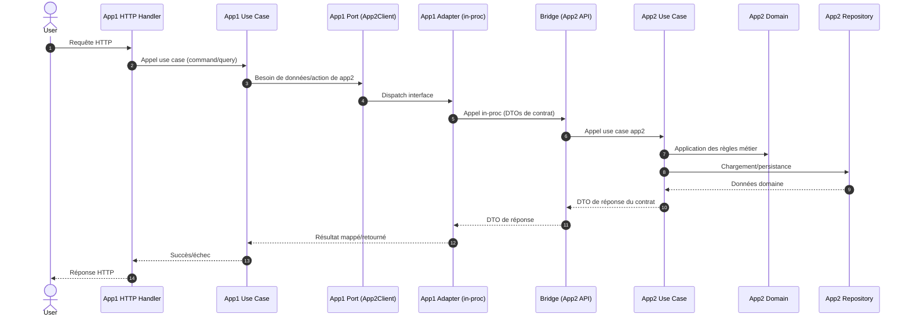
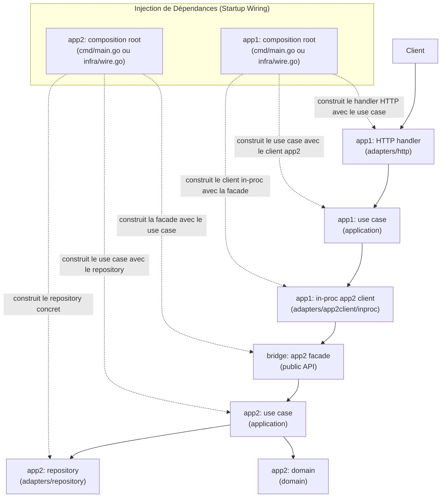

[This article is available in English](/en/innovative-go-modular-monolith-architecture/).

Le choix entre monolithe et microservices est souvent présenté comme un dilemme où il faut « choisir son poison ». Les monolithes sont faciles à démarrer mais se transforment souvent en « gros sac de nœuds ». Les microservices offrent une isolation mais introduisent un coup opérationnelle massif dès le début.

Dans cet article, nous allons explorer une voie médiane détaillée dans notre dernier livre blanc sur l'architecture : **[Le Monolithe Modulaire Go avec Workspaces et modules Bridge](https://github.com/pivaldi/go-modular-monolith-white-paper).**

## Le Problème : L'érosion des frontières

Dans les monolithes Go traditionnels, les frontières sont maintenues par convention. Bien que les packages `internal/` apportent une certaine aide, rien n'empêche strictement un `serviceA` de créer une dépendance sur un `serviceB`, transformant tout refactoring futur en cauchemar.

À l'inverse, une distribution prématurée divisée en microservices, avant d'en avoir réellement besoin, introduit de la latence réseau, une complexité de transactions distribuées et une surcharge de déploiement qui peut briser la vélocité d'une petite équipe.

## La Solution : Go Workspaces + Modules Bridge

Ce modèle repose sur trois piliers fondamentaux pour fournir des **frontières solides** avec une **distribution flexible**.

### 1. Go Workspaces (`go.work`)
Au lieu d'un seul fichier `go.mod` massif, nous traitons chaque service comme un module Go indépendant au sein d'un dépôt unique. Le workspace Go coordonne ces modules, leur permettant de coexister dans un monorepo tout en permettant au compilateur d'empêcher les imports non autorisés entre eux.

### 2. Le pattern "Bridge Module"
C'est la « recette secrète ». Au lieu que les services s'appellent directement, ils communiquent via un **Module Bridge**.

Un module Bridge :
* **Définit l'API publique** en utilisant des interfaces Go.
* **Fournit un Client/Serveur "In-Process"** (en mémoire) pour une communication à latence zéro.
* **Agit comme une "couture" (seam)** où l'on peut basculer plus tard basculer sur un transport réseau grâce à [Connect](https://connectrpc.com/) sans changer une seule ligne de logique métier.

### 3. Architecture Hexagonale (Ports et Adaptateurs)
Au sein de chaque service, on maintien une hiérarchie stricte :
* **Couche Domaine :** Logique métier pure, zéro dépendance.
* **Couche Application :** Cas d'utilisation (*use cases*) et "Ports" (interfaces).
* **Couche Adaptateurs :** Implémentations de ces ports (BDD, services de mail, ou Clients Bridge).

## Flux technique : requête → app1 → app2 (in-proc) → réponse

Le diagramme suivant illustre le **cycle de vie d'une requête au runtime** du **Monolithe Modulaire**. Il démontre comment une requête traverse les frontières de service au sein d'un seul processus tout en respectant strictement les coutures architecturales.



## Câblage des composants et flux d'exécution

Le diagramme suivant illustre la relation entre le **câblage au démarrage** (*Dependency Injection*) en flèches pointillées et les **appels au runtime** en flèches pleines. Il montre comment les composants concrets sont construits et comment ils interagissent à travers les frontières de services sans violer l'isolation interne.



Dans ce modèle, la magie du "In-process" se produit car `app1` reçoit par injection un client qui pointe directement vers le bridge de `app2`, le tout dans le même espace mémoire.

Voici un pseudo-code simplifié du câblage pour les deux services.

1. **App2: Le Fournisseur (Provider)**  
   App2 doit d'abord initialiser sa logique interne puis "exporter" son API via le Bridge.
```go
// services/app2/cmd/main.go
func main() {
// 1. Construction du Repository concret (Adapter)
repo := postgres.NewRepository(dbConn)

// 2. Construction du Use Case (Application) avec le Repository
useCase := application.NewUseCase(repo)

// 3. Construction de la Facade Bridge (InprocServer)
// Ce composant est le SEUL autorisé à importer app2/internal
app2Facade := app2bridge.NewInprocServer(useCase)

// 4. Enregistrement ou mise à disposition de cette facade pour les autres services
// Dans un monolithe, c'est souvent stocké dans un registre ou passé directement
globalRegistry.RegisterApp2(app2Facade)
}
```

2. **App1: Le Consommateur (W1)**  
   App1 est construit en injectant le client bridge de `app2`. Notez que `App1` ne connaît que le package bridge, jamais le code interne de `app2/internal`.
```go
// services/app1/cmd/main.go
func main() {
// 1. Récupération de la facade construite par W2
app2Facade := globalRegistry.GetApp2()

// 2. Construction du Client In-process (Adapter)
// Ceci implémente l'interface de Port attendue par app1
app2Client := app2adapter.NewInprocClient(app2Facade)

// 3. Construction du Use Case avec le client injecté
useCase := application.NewUseCase(app2Client)

// 4. Construction du Handler HTTP (Inbound Adapter)
handler := http.NewHandler(useCase)

// 5. Démarrage du serveur
serve(handler)

}
```

Pour un exemple plus précis, se référer au [livre blanc](https://github.com/pivaldi/go-modular-monolith-white-paper)…

## Comparaison rapide

| Fonctionnalité | Monolithe Module Unique | **Monolithe Modulaire (Bridge)** | Microservices |
| :--- | :--- | :--- | :--- |
| **Frontières** | Faibles (Conventions) | **Fortes (Compilateur)** | Les plus fortes (Physiques) |
| **Performance** | Excellente | **Excellente (In-process)** | Bonne (Surcharge réseau) |
| **Complexité** | Basse | **Moyenne** | Haute |
| **Scalabilité** | Tout ou rien | **Flexible** | Indépendante |

## Pourquoi "Bridge" plutôt que "Shared" ?

Un piège courant en Go est le [Shared Kernel](https://ddd-practitioners.com/home/glossary/bounded-context/bounded-context-relationship/shared-kernel/), où la logique commune se trouve dans un dossier `pkg/` ou `util/` ; cela conduit à un couplage étroit.

Le pattern Bridge évite cela en s'assurant que le bridge ne contient **que des interfaces et des DTOs**. Aucune logique métier n'est autorisée. Si l'on commence à mettre de la validation ou des calculs dans un bridge, on recrée un monolithe de type "shared-kernel".

## Le chemin d'évolution

**La beauté de cette architecture réside dans son processus de migration. Vous n'avez pas à décider de votre stratégie de déploiement finale au premier jour :**

1.  **Démarrage In-Process :** Déployez un binaire unique. Les services communiquent via des appels de fonctions à travers le Bridge.
2.  **Ajout de Contrats :** Introduisez Protobuf/Connect lorsque vous avez besoin de schémas formels.
3.  **Distribution :** Lorsque le `Service A` a besoin de scaler indépendamment, swappez son implémentation bridge de `InprocClient` vers `ConnectClient`. 

Voici un pseudo-code du **mécanisme de bascule** (ce n'est plus une migration, c'est une simple bascule) définie par configuration et qui démontre la simplicité de sa mise en œuvre :

```go
// services/authsvc/cmd/authsvc/main.go
package main

import (
 "net/http"
 "time"

 "[github.com/example/service-manager/bridge/authorsvc](https://github.com/example/service-manager/bridge/authorsvc)"
 "[github.com/example/service-manager/services/authsvc/internal/adapters/outbound/authorclient/inproc](https://github.com/example/service-manager/services/authsvc/internal/adapters/outbound/authorclient/inproc)"
 "[github.com/example/service-manager/services/authsvc/internal/adapters/outbound/authorclient/connect](https://github.com/example/service-manager/services/authsvc/internal/adapters/outbound/authorclient/connect)"
 "[github.com/example/service-manager/services/authsvc/internal/application/ports](https://github.com/example/service-manager/services/authsvc/internal/application/ports)"
 "[github.com/example/service-manager/services/authsvc/internal/infra](https://github.com/example/service-manager/services/authsvc/internal/infra)"
)

func main() {
 cfg := infra.LoadConfig()

 // SWAP POINT : Choix de l'adaptateur selon la configuration
 var authorClient ports.AuthorClient

 if cfg.UseInProcessBridge {
     // ===== OPTION 1 : In-Process =====
     // Récupère l'InprocServer d'AuthorService depuis authorsvc
     // En pratique, c'est un singleton partagé entre les services du même processus
     authorServer := getAuthorServiceInprocServer()

     // Encapsulation dans un client bridge
     authorBridge := authorsvc.NewInprocClient(authorServer)

     // Encapsulation dans un adaptateur de port
     authorClient = inproc.NewClient(authorBridge)
     // Performance : <1μs, zéro sérialisation
 } else {
     // ===== OPTION 2 : Réseau =====
     // Crée un client HTTP vers le service distant
     authorClient = connect.NewClient(
         cfg.AuthorServiceURL, // ex: "https://author-service:8080"
         &http.Client{
             Timeout: 5 * time.Second,
         },
     )
 }

 // Le reste du câblage est IDENTIQUE - l'application ne voit pas la différence
 deps := infra.InitializeDependencies(cfg, authorClient)

 // Démarrage du serveur...
}

```

## Faire respecter les règles

Une architecture n'est efficace que si elle est respectée. Nous recommandons un outil personnalisé — `arch-test` — qui s'exécute dans votre pipeline CI pour garantir que :

* Les couches Domaine n'importent pas `net/http`.
* Les services ne piochent pas dans les dossiers `internal/` des autres.
* Les modules Bridge restent exempts de dépendances.

Pour plus de détails, référez-vous au [livre blanc](https://github.com/pivaldi/go-modular-monolith-white-paper)…

## Conclusion

Le [Monolithe Modulaire avec Go Workspaces](https://github.com/pivaldi/go-modular-monolith-white-paper) est conçu pour les équipes de 5 à 20 développeurs qui ont besoin d'aller vite tout en gardant leurs options ouvertes. **Il offre l'expérience du "monorepo" avec la discipline des "microservices".**

### Lectures complémentaires

* [Documentation Go Workspace](https://go.dev/doc/tutorial/workspaces)
* [Connect RPC pour Go](https://connectrpc.com/)
* [Domain-Driven Design par Eric Evans](https://www.amazon.com/Domain-Driven-Design-Tackling-Complexity-Software/dp/0321125215)
