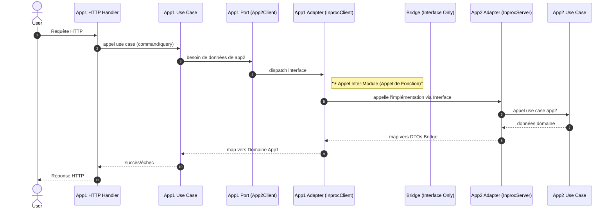

[This article is available in English](/en/innovative-go-modular-monolith-architecture/).

Le choix entre monolithe et microservices est souvent présenté comme un dilemme où il faut « choisir son poison ». Les monolithes sont faciles à démarrer mais se transforment souvent en « gros sac de nœuds ». Les microservices offrent une isolation mais introduisent un coût opérationnel massif dès le début.

Dans cet article, nous allons explorer une voie médiane détaillée dans notre dernier livre blanc sur l'architecture : **Le Monolithe Modulaire Go avec Workspaces et modules Bridge "Purs".**

## Le Problème : L'érosion des frontières & l'Enfer des Dépendances

Dans les monolithes Go traditionnels, les frontières sont maintenues par convention. Bien que les packages `internal/` apportent une certaine aide, rien n'empêche strictement un `serviceA` de créer une dépendance sur un `serviceB`, transformant tout refactoring futur en cauchemar.

Mais il existe un problème encore plus insidieux : **l'Enfer des Dépendances**.
Dans un monolithe standard (un seul `go.mod`), chaque service doit partager *exactement la même version* de chaque bibliothèque.
*   Si le **Service A** a besoin de `aws-sdk-go` v1...
*   Et que le **Service B** a besoin de `aws-sdk-go` v2...
*   **Vous êtes bloqué.** Toute la plateforme est retenue par la dette technique d'un seul service.

## La Solution : Go Workspaces + Modules Bridge Purs

Ce modèle repose sur trois piliers fondamentaux pour fournir des **frontières solides**, des **graphes de dépendances indépendants**, et une **distribution flexible**.

### 1. Go Workspaces (`go.work`)
Au lieu d'un seul fichier `go.mod` massif, on traite chaque service comme un **module Go indépendant** au sein d'un dépôt unique. Le workspace Go coordonne ces modules, leur permettant de coexister dans un monorepo tout en permettant au compilateur d'empêcher les imports non autorisés entre eux.

**Cruciale, cela vous donne des Graphes de Dépendances Indépendants.** Le Service A et le Service B peuvent utiliser différentes versions de la même bibliothèque sans conflit.

### 2. Le pattern "Module Bridge Pur"
C'est la « recette secrète ». Au lieu que les services s'appellent directement, ils communiquent via un **Module Bridge**.

Un module Bridge est **strictement un contrat**. Pour éviter le couplage, on impose (via CI) qu'un bridge contienne **ZÉRO logique** et **ZÉRO dépendances**.

*   **Définit l'API publique** en utilisant des interfaces Go et des DTOs.
*   **Agit comme une couture (seam)** où l'on peut plus tard basculer sur un transport réseau (comme Connect/gRPC) sans changer une seule ligne de logique métier.
*   **Contient le Client Wrapper** (`InprocClient`) que les consommateurs utilisent.

### 3. Architecture Hexagonale (Ports et Adaptateurs)
Au sein de chaque service, on maintient une hiérarchie stricte. L'"Implémentation" du bridge vit **à l'intérieur** du service, pas dans le bridge lui-même.

*   **Couche Domaine :** Logique métier pure.
*   **Couche Application :** Cas d'utilisation et "Ports".
*   **Couche Adaptateurs :** Implémentations. C'est là que vit l'`InprocServer` (par ex., `services/app2/internal/adapters/inbound/bridge/`).

## Flux technique : requête → App1 → App2 (In-Proc) → réponse

Le diagramme suivant illustre le **cycle de vie d'une requête au runtime**. Il démontre comment une requête traverse les frontières de service au sein d'un seul processus tout en respectant strictement les coutures architecturales.



## Câblage des composants et flux d'exécution

Dans ce modèle, la magie du "In-process" se produit car App1 reçoit par injection un client qui pointe vers l'implémentation d'App2, **mais App1 ne voit que l'interface**.

### App2 : Le Fournisseur
App2 initialise sa logique interne et crée l'`InprocServer` (un adaptateur). Cet adaptateur implémente l'interface `bridge.AuthorService`.

```go
// services/app2/cmd/main.go
func main() {
    // 1. Construction des couches internes (Repository, UseCase)
    useCase := application.NewUseCase(repo)

    // 2. Construction de l'Adaptateur Bridge (InprocServer)
    // Il vit dans les adaptateurs INTERNES, PAS dans le module bridge.
    // Il implémente l'Interface Bridge publique.
    app2Server := app2adapter.NewInprocServer(useCase)
}
```

### App1 : Le Consommateur
App1 est construit en injectant le client. Notez qu'App1 ne connaît que le package bridge (interface), jamais le code `app2/internal`.

```go
// cmd/monolith/main.go (Composition Root)
func main() {
    // ... setup app2Server ...

    // 1. Encapsuler le Server dans le Client
    // Le client vit dans le Bridge et accepte l'Interface
    app2Client := app2bridge.NewInprocClient(app2Server)

    // 2. Injection dans App1
    // App1 dépend de son propre Port, que app2Client implémente
    app1UseCase := app1.NewUseCase(app2Client)
}
```

## Pourquoi "Bridge" plutôt que "Shared" ?

Un piège courant en Go est le **Shared Kernel**, où la logique commune est déposée dans un dossier `pkg/` ou `util/`. Cela conduit à un couplage étroit : changez une règle de validation dans le kernel partagé, et vous cassez 5 services.

Le pattern **Bridge Pur** évite cela en imposant des règles strictes :

1.  **Pas de Logique :** Les bridges contiennent *seulement* des interfaces, des DTOs, et des Erreurs.
2.  **Pas de Dépendances :** Les bridges ont des fichiers `go.mod` avec **zéro** déclarations `require`.
3.  **Pas d'Imports Internes :** Les bridges ne peuvent pas importer de packages `internal/`.

Si vous vous retrouvez à mettre de la validation ou des calculs dans un bridge, vous recréez un monolithe de type shared-kernel. Notre outil `arch-test` interdit explicitement cela.

## Plaidoyer architectural : Pourquoi pas simplement `services/api` ?

Vous pourriez vous demander : *"Pourquoi ne pas simplement mettre l'API dans le dépôt du service (par ex., `services/authorsvc/api`) ? Pourquoi un répertoire `bridge/` séparé ?"*

**La Réponse : Pour échapper à l'Enfer des Dépendances.**

Si `api` est à l'intérieur de `authorsvc` :
*   Tout consommateur important `authorsvc/api` nécessite implicitement le module `authorsvc` **entier**.
*   Vous héritez de toutes les dépendances du fournisseur (Drivers de base de données, AWS SDKs).
*   Vous créez un **Graphe de Dépendances Partagé**.

En déplaçant l'API vers `bridge/authorsvc` (un module séparé) :
*   Le Bridge a **zéro** dépendances.
*   Les consommateurs importent le bridge et n'héritent de **rien**.
*   Vous obtenez des **Graphes de Dépendances Indépendants**, permettant aux services d'évoluer leurs bibliothèques à leur propre rythme.

## Le chemin d'évolution

La beauté de cette architecture réside dans son chemin de migration : vous n'avez pas à décider de la stratégie de déploiement finale au premier jour.

1.  **Démarrage In-Process :** Déployez un binaire unique. Les services communiquent via des appels de fonctions (< 1µs de latence).
2.  **Ajout de Contrats :** Introduisez Protobuf/Connect lorsque vous avez besoin de schémas formels.
3.  **Distribution :** Quand le **Service A** a besoin de scaler indépendamment, basculez simplement son adaptateur dans `main.go`.

**Mécanisme de bascule (basé sur la configuration) :**

```go
if config.UseNetwork {
    // Option A : gRPC/Connect (Distribué)
    client = connect.NewClient("http://author-service")
} else {
    // Option B : In-Process (Monolithe)
    // Zéro sérialisation, accès mémoire direct
    client = bridge.NewInprocClient(authorServer)
}
```

## Conclusion

Le **Monolithe Modulaire Go avec Workspaces** est conçu pour les équipes de 5 à 20 développeurs qui ont besoin d'aller vite mais veulent garder leurs options ouvertes.

Il offre l'**"expérience monorepo"** avec la **"discipline microservices"**, protégeant à la fois contre l'érosion des frontières et les conflits de dépendances.

### Lectures complémentaires
*   [Dépôt GitHub & Livre Blanc](https://github.com/pivaldi/go-modular-monolith-white-paper)
*   [Documentation Go Workspaces](https://go.dev/doc/tutorial/workspaces)
*   [Connect RPC pour Go](https://connectrpc.com/)
