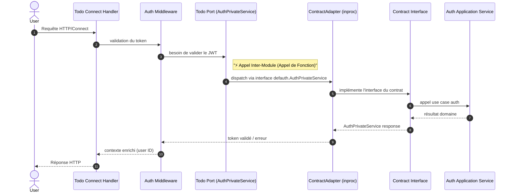

[This article is available in English](/en/innovative-go-modular-monolith-architecture/).

Le choix entre monolithe et microservices est souvent présenté comme un dilemme où il faut « choisir son poison ». Les monolithes sont faciles à démarrer mais se transforment souvent en « gros sac de nœuds ». Les microservices offrent une isolation mais introduisent un coût opérationnel massif dès le début.

Dans cet article, nous allons explorer une voie médiane détaillée dans notre dernier livre blanc sur l'architecture : **Le Monolithe Modulaire Go avec Workspaces et définitions de contrats "Pures".**

## Le Problème : L'érosion des frontières & l'Enfer des Dépendances

Dans les monolithes Go traditionnels, les frontières sont maintenues par convention. Bien que les packages `internal/` apportent une certaine aide, rien n'empêche strictement un `serviceA` de créer une dépendance sur un `serviceB`, transformant tout refactoring futur en cauchemar.

Mais il existe un problème encore plus insidieux : **l'Enfer des Dépendances**.
Dans un monolithe standard (un seul `go.mod`), chaque service doit partager *exactement la même version* de chaque bibliothèque.
*   Si le **Service A** a besoin de `aws-sdk-go` v1...
*   Et que le **Service B** a besoin de `aws-sdk-go` v2...
*   **Vous êtes bloqué.** Toute la plateforme est retenue par la dette technique d'un seul service.

## La Solution : Go Workspaces + Définitions de Contrats Pures

Ce modèle repose sur trois piliers fondamentaux pour fournir des **frontières solides**, des **graphes de dépendances indépendants**, et une **distribution flexible**.

### 1. Go Workspaces (`go.work`)
Au lieu d'un seul fichier `go.mod` massif, on traite chaque module comme un **module Go indépendant** au sein d'un dépôt unique. Le workspace Go coordonne ces modules, leur permettant de coexister dans un monorepo tout en permettant au compilateur d'empêcher les imports non autorisés entre eux.

**Cruciale, cela vous donne des Graphes de Dépendances Indépendants.** Le module A et le module B peuvent utiliser différentes versions de la même bibliothèque sans conflit.

### 2. Le pattern "Définition de Contrat Pure"
C'est la « recette secrète ». Au lieu que les modules s'appellent directement, ils communiquent via une **Définition de Contrat** — un module séparé, à dépendances nulles.

Une définition de contrat est **strictement un contrat**. Pour éviter tout couplage, on impose (via CI) qu'une définition de contrat contienne **ZÉRO logique** et soit **générée automatiquement depuis des fichiers `.proto`** à l'aide du plugin `protoc-gen-go-contracts`.

Chaque domaine génère automatiquement :
*   **L'interface de service** — le contrat Go que les consommateurs utilisent.
*   **Les constantes d'événements** — `TopicXxx` constants + `Topics []string` pour l'abonnement.
*   **Les codes d'erreur du domaine** — constantes typées alignées sur l'enum proto.
*   **Le client HTTP** — `NewPrivateHTTPClient` / `NewPublicHTTPClient` pour le transport réseau.

```go
// contracts/go/application/auth/auth_private_service_contract_gen.go
// Code généré par protoc-gen-go-contracts. NE PAS MODIFIER.
type AuthPrivateService interface {
    ValidateToken(ctx context.Context, req *authv1.ValidateTokenRequest) (*authv1.ValidateTokenResponse, error)
}
```

### 3. Architecture Hexagonale (Ports et Adaptateurs)
Au sein de chaque module, on maintient une hiérarchie stricte. L'implémentation concrète vit **à l'intérieur** du module, exposée via un `ContractAdapter` dans la couche des adaptateurs entrants.

*   **Couche Domaine :** Logique métier pure, zéro dépendance externe.
*   **Couche Application :** Cas d'utilisation et Ports (interfaces).
*   **Couche Adaptateurs :** Implémentations. C'est là que vit le `ContractAdapter` (par ex., `modules/auth/internal/adapters/inbound/inproc/`).

## Flux technique : requête → Todo → Auth (In-Proc) → réponse

Le diagramme suivant illustre le **cycle de vie d'une requête au runtime**. Il démontre comment le module Todo valide un token JWT auprès du module Auth au sein d'un seul processus, en respectant strictement les coutures architecturales.


```mermaid
sequenceDiagram
    autonumber
    actor User
    participant H as Todo Connect Handler
    participant M as Auth Middleware
    participant P  as Todo Port (AuthPrivateService)
    participant I  as ContractAdapter (inproc)
    participant C  as Contract Interface
    participant S  as Auth Application Service

    User->>H: Requête HTTP/Connect
    H->>M: validation du token
    M->>P: besoin de valider le JWT

    note right of P: "⚡ Appel Inter-Module (Appel de Fonction)"

    P->>I: dispatch via interface defauth.AuthPrivateService
    I->>C: implémente l'interface du contrat
    C->>S: appel use case auth
    S-->>C: résultat domaine
    C-->>I: AuthPrivateService response
    I-->>M: token validé / erreur
    M-->>H: contexte enrichi (user ID)
    H-->>User: Réponse HTTP
```

## Câblage des composants et flux d'exécution

Chaque module expose son `ContractAdapter` via un accesseur sur `*Module`. Le consommateur ne voit que l'interface — jamais le type concret.

### Le Fournisseur : exposer un contrat

```go
// modules/auth/auth.go
func (m *Module) PrivateService() defauth.AuthPrivateService {
    return inproc.NewContractAdapter(m.service)
}
```

L'adaptateur in-process implémente l'interface générée :

```go
// modules/auth/internal/adapters/inbound/inproc/contract_adapter.go
type ContractAdapter struct{ svc application.AuthService }

var _ defauth.AuthPrivateService = (*ContractAdapter)(nil)
```

### Le Consommateur : la racine de composition

La racine de composition (`cmd/mmw/main.go`) est le **seul endroit** où les modules sont instanciés et câblés ensemble. Les dépendances inter-modules sont injectées via des interfaces de contrat, jamais via des pointeurs vers les types concrets des modules.

```go
// cmd/mmw/main.go
func initModules(logger *slog.Logger, dbPool *pgxpool.Pool, ...) ([]pfcore.Module, error) {
    // 1. Auth — aucune dépendance inter-module
    authModule, _ := auth.New(auth.Infrastructure{
        DBPool:   dbPool,
        EventBus: eventBus,
        Logger:   logger.With("module", auth.ModuleName),
    })

    // 2. Todo — dépend du service privé d'Auth pour la validation JWT
    todoModule, _ := todo.New(todo.Infrastructure{
        DBPool:  dbPool,
        EventBus: eventBus,
        Logger:  logger.With("module", todo.ModuleName),
        AuthSvc: authModule.PrivateService(), // retourne defauth.AuthPrivateService
    })

    // 3. Notifications — s'abonne aux événements de tous les modules
    notifModule, _ := notifications.New(notifications.Infrastructure{
        Subscriber: rawBus,
        Topics:     append(tododef.Topics, authdef.Topics...),
    })

    return []pfcore.Module{authModule, todoModule, notifModule}, nil
}
```

### Le Platform Runner

Les modules ne sont pas lancés manuellement. La bibliothèque `mmw-platform` les orchestre avec un `errgroup` en **destin partagé** : si un module échoue (perte de DB, panique non récupérée), le contexte partagé est annulé et tous les autres modules s'arrêtent proprement.

```go
// cmd/mmw/main.go
modules, _ := initModules(logger, dbPool, rawBus, eventBus)
platform.New(logger, modules).Run(ctx)
```

Chaque module implémente l'interface `core.Module` — une contrainte vérifiée à la compilation :

```go
var _ pfcore.Module = (*Module)(nil)

func (m *Module) Start(ctx context.Context) error {
    g, gCtx := errgroup.WithContext(ctx)
    g.Go(func() error { return m.server.Start(gCtx) })    // serveur Connect RPC
    g.Go(func() error { m.relay.Start(gCtx); return nil }) // relay outbox → Watermill
    g.Go(func() error { return m.router.Run(gCtx) })       // routeur d'événements
    return g.Wait()
}
```

## mmw : le framework qui colle tout ensemble

Écrire un monolithe modulaire implique une quantité de plomberie technique récurrente : configurer un serveur HTTP compatible Connect/gRPC, chaîner les middlewares, gérer les signaux OS, implémenter l'outbox, abstraire les transactions PostgreSQL... Le framework [mmw](https://github.com/piprim/mmw) (`github.com/piprim/mmw`) résout ce problème une fois pour toutes.

Il se compose de deux parties distinctes aux cycles de vie différents.

### La plateforme runtime (`pkg/platform`)

C'est une dépendance dans le `go.mod` de chaque module. Elle fournit tout ce dont un module a besoin pour participer au monolithe sans réinventer la roue :

| Composant | Ce qu'il fournit |
|-----------|-----------------|
| **Serveur HTTP** | Chaîne de middlewares préconfigurée (Logger → Recovery → CORS → BearerAuth → Mux), support h2c pour Connect RPC, endpoint `/debug/monit` pour les health checks |
| **Middleware BearerAuth** | Validation de token via une closure `TokenValidator`, injection du `userID` dans le contexte de la requête |
| **Outbox relay** | Polling PostgreSQL toutes les 2s, publication Watermill, `FOR UPDATE SKIP LOCKED` pour la sécurité multi-répliques |
| **Unit of Work** | Abstraction `*pgxpool.Pool` / `pgx.Tx` derrière une interface `DBExecutor` uniforme |
| **Config loader** | Chargement TOML en couches (`default.toml` → `<APP_ENV>.toml` → variables d'environnement) |
| **Connect interceptors** | Logging des erreurs avec stack trace `eris` intact, sans exposer les détails au client |
| **Auth context** | `authctx.WithUserID` / `authctx.UserID` pour propager l'identité à travers les handlers |

### Le CLI (`mmw-cli`)

Le CLI est lui purement un **accélérateur de développement** — il n'est jamais embarqué dans le binaire de production.

```bash
mmw new module        # scaffold interactif : génère modules/<name>/, contracts/, go.work, mise.toml
mmw new contract      # génère uniquement les fichiers de définition de contrat
mmw check arch        # valide les frontières architecturales (voir section suivante)
mmw test coverage     # affiche un tableau de couverture de tests par package
```

La commande `mmw new module` est particulièrement notable : elle lance un formulaire interactif qui génère l'intégralité de la structure d'un nouveau module (domaine, application, adaptateurs, migrations, proto, contrats) et met à jour `go.work` et `mise.toml` automatiquement. Ajouter un nouveau module à l'architecture prend quelques secondes.

## L'application des règles architecturales

Les frontières de cette architecture sont garanties à **deux niveaux distincts**.

### Niveau 1 : Le compilateur Go

Les imports cross-module vers des packages `internal/` sont **structurellement impossibles**. Chaque module fonctionnel a son propre `go.mod` ; le compilateur Go refuse physiquement qu'un module liste un autre module fonctionnel comme dépendance indirecte via `internal/`. Ce n'est pas une convention — c'est une propriété du langage.

```
✗ IMPOSSIBLE — erreur de compilation garantie :
modules/todo/go.mod ne référence pas modules/auth,
donc modules/todo ne peut jamais importer modules/auth/internal/...
```

### Niveau 2 : `mmw check arch`

Ce que le compilateur ne peut pas vérifier — les violations de couches *à l'intérieur* d'un même module — est validé par `mmw check arch` (ou `mise run arch:check`) à chaque CI :

| Validator | Règle vérifiée |
|-----------|----------------|
| `DomainPurityValidator` | `internal/domain/` n'importe pas `adapters/`, `infra/`, ou `application/` |
| `ApplicationPurityValidator` | `internal/application/` n'importe pas `adapters/` ou `infra/` |
| `ContractPurityValidator` | `contracts/go/application/` n'importe pas de code applicatif ou infra |
| `LibDependencyValidator` | `libs/` et `mmw/` n'importent pas de modules fonctionnels |

En cas de violation, le message d'erreur CI pointe directement vers le fichier et l'import fautif :

```
✗ Architecture validation failed

✗ todo    Validating service architecture boundaries
  modules/todo/internal/domain/todo.go
    imports modules/todo/internal/adapters/postgres (domain → adapter violation)

Fix: Move this dependency behind a port interface in the application layer.
```

## La testabilité comme conséquence directe

L'architecture hexagonale n'est pas qu'une question d'organisation du code : elle détermine directement la **vitesse et la fiabilité de votre suite de tests**.

```
         /\      Tests système — 1 suite au niveau monolithe
        /  \     (binaire réel, Postgres via testcontainers, flux complets)
       /____\
      /      \   Tests d'intégration — par module, adaptateurs uniquement
     /________\
    /          \ Tests applicatifs — ports mockés, logique d'orchestration
   /____________\
  /              \ Tests unitaires — domaine pur, zéro infrastructure
 /________________\
```

Les tests de domaine s'exécutent en **< 1ms** sans aucune dépendance externe :

```go
func TestTodo_Complete(t *testing.T) {
    title, _ := domain.NewTitle("Buy milk")
    todo, _ := domain.NewTodo(title, domain.EmptyDescription, nil, uuid.New())

    err := todo.Complete()

    require.NoError(t, err)
    assert.Equal(t, domain.StatusCompleted, todo.Status())
    assert.Len(t, todo.Events(), 2) // TodoCreated + TodoCompleted
}
```

Les tests de la couche application mockent **uniquement les ports** — les frontières architecturales — jamais les implémentations concrètes :

```go
func TestCreateTodoCommand_Execute(t *testing.T) {
    // On mocke les PORTS (interfaces de la couche application)
    // jamais PostgresRepository ou WatermillDispatcher directement
    todoRepo      := mocks.NewTodoRepository(t)
    eventDispatcher := mocks.NewEventDispatcher(t)
    uow           := mocks.NewUnitOfWork(t)

    // ... expectations ...

    // On teste le SERVICE RÉEL — la logique métier, pas le câblage
    svc := application.NewTodoApplicationService(todoRepo, uow, eventDispatcher)
    resp, err := svc.CreateTodo(ctx, &todov1.CreateTodoRequest{Title: "Buy milk", UserId: uuid.NewString()})

    require.NoError(t, err)
    assert.NotEmpty(t, resp.GetTodo().GetId())
}
```

Cette pyramide est possible parce que les règles de dépendance sont respectées : si `domain/` n'importe rien d'externe, ses tests ne peuvent pas en avoir besoin non plus. C'est une propriété émergente de l'architecture, pas une discipline à maintenir manuellement.

## Pourquoi "Définition de Contrat" plutôt que "Shared Kernel" ?

Un piège courant en Go est le **Shared Kernel**, où la logique commune est déposée dans un dossier `pkg/` ou `util/`. Cela conduit à un couplage étroit : changez une règle de validation dans le kernel partagé, et vous cassez 5 modules.

Le pattern **Définition de Contrat Pure** évite cela en imposant des règles strictes :

1.  **Générée, jamais écrite à la main :** Les définitions de contrats sont produites par `protoc-gen-go-contracts` depuis les fichiers `.proto`. Elles contiennent *seulement* des interfaces, des DTOs proto, des codes d'erreur et des constantes d'événements.
2.  **Zéro dépendances métier :** Le module `mmw-contracts` ne dépend que de `connectrpc/connect` et `google.golang.org/protobuf` — jamais d'un module fonctionnel.
3.  **Impossibilité structurelle de cycle :** Un module de contrat ne peut pas importer un module fonctionnel. Les cycles sont physiquement impossibles.

```
✓ VALIDE :
modules/todo → contracts/go/application/auth → (connect + protobuf uniquement)

✗ IMPOSSIBLE (erreur de compilation) :
contracts/go/application/auth → modules/auth
```

Si vous vous retrouvez à mettre de la validation ou des calculs dans une définition de contrat, vous recréez un monolithe de type shared-kernel.

## Le chemin d'évolution

La beauté de cette architecture réside dans son chemin de migration : vous n'avez pas à décider de la stratégie de déploiement finale au premier jour.

1.  **Démarrage In-Process :** Déployez un binaire unique. Les modules communiquent via des appels de fonctions (< 1µs de latence), orchestrés par le platform runner.
2.  **Ajout de Contrats :** Introduisez Protobuf/Connect lorsque vous avez besoin de schémas formels — les définitions de contrats génèrent automatiquement les clients HTTP en plus des clients in-process.
3.  **Distribution :** Quand le **Module Auth** a besoin de scaler indépendamment, basculez simplement l'adaptateur dans `main.go`.

**Mécanisme de bascule (basé sur la configuration) :**

```go
// Avant (monolithe — in-process)
todoModule, _ := todo.New(todo.Infrastructure{
    AuthSvc: authModule.PrivateService(), // appel de fonction direct
})

// Après (distribué — Connect over HTTP)
todoModule, _ := todo.New(todo.Infrastructure{
    AuthSvc: defauth.NewPrivateHTTPClient(
        authv1connect.NewAuthPrivateServiceClient(&http.Client{}, "https://auth.internal"),
    ),
})
```

L'interface `defauth.AuthPrivateService` est identique dans les deux cas. Le module Todo ne sait pas quel transport est utilisé — et **aucune ligne de logique métier ne change**.

## Conclusion

Le **Monolithe Modulaire Go avec Workspaces** est conçu pour les équipes de 5 à 20 développeurs qui ont besoin d'aller vite mais veulent garder leurs options ouvertes.

Il offre l'**"expérience monorepo"** avec la **"discipline microservices"**, protégeant à la fois contre l'érosion des frontières et les conflits de dépendances. La génération automatique des contrats depuis Protobuf garantit que les interfaces inter-modules restent un artifact de première classe — versionné, typé, et jamais oublié dans un tiroir.

### Lectures complémentaires
*   [Dépôt GitHub & Livre Blanc](https://github.com/pivaldi/go-modular-monolith-white-paper)
*   Le framework [mmw](https://github.com/piprim/mmw)
*   [Documentation Go Workspaces](https://go.dev/doc/tutorial/workspaces)
*   [Connect RPC pour Go](https://connectrpc.com/)
*   [Buf — Protobuf toolchain](https://buf.build/)
