Ce document a été écrit **dans le cadre** de la refonte complète de l'intranet d'une PME d'environ 200 personnes mais donne lieu à repenser l'intégralité de l'infrastructure logicelle que nous développons pour cette entreprise.  
L'intranet dont il est question est constitué d'un CRM (le CPro) développé en interne depuis 15 ans en *PHP* pour le back-end et Javascript (framework [Dojo](https://dojotoolkit.org/)) pour le front-end:
- 2131 fichiers *PHP* hors librairies externes, pour un total de 153 681 lignes de code (hors commentaires et lignes vides).
- 424 fichiers *Javascript* hors librairies externes, pour un total de 130 163 lignes de code (hors commentaires et lignes vides).
- 17 777 commits *git* toutes branches confondues.

L'objectif est de présenter **un cadre d'architecture logicielle à la fois modulaire et rigoureux avec des outils d'automatisation et de vérification solides ainsi que des briques logicielles (plus spécialisées que des librairies) réutilisables pour tous les projets tout en garantissant un environnement de développement qui reste simple et automatisé.**


## 1. Contexte & enjeux


### Pourquoi maintenant ?

Depuis plusieurs années, le cœur de l'activité repose sur un CRM (`CPro`) métier qui fonctionne bien, éprouvée, et indispensable au quotidien.  
Mais la dette technique a pris de l'ampleur : la logique métier a évolué et s'est dispersée dans des centaines de fichiers sans structure uniforme.  
Modifier une fonctionnalité, c'est risquer d'en casser une autre ailleurs, ajouter un nouveau comportement devient un véritable casse tête.

Voilà à quoi ressemble une application métier après des années de développement :


Et vu de l'intérieur :


En parallèle, l'équipe a livré plusieurs services en Go au fil des années.  
Bien que chacun ait été mieux conçu que le précédent aucun n'est pleinement satisfaisant et à chaque fois, le même travail recommence :
- configurer le serveur web ;
- gérer les logs ;
- brancher la base de données ;
- inventer un système de configuration.

Beaucoup de temps et d'énergie dépensé sur de la plomberie, pas sur de la valeur métier.

### L'enjeu

Cette proposition de refonte n'est pas juste « réécrire le CRM interne en Go » ; c'est l'occasion de se doter d'un **socle technique** commun, une **plateforme de développement**, dont tous nos projets futurs bénéficieront, pas seulement le CRM.

Le résultat attendu : une équipe qui passe 100 % de son temps sur ce qui compte, les fonctionnalités métier, et zéro temps à réinventer l'infrastructure à chaque nouveau projet.

## 2. Analogie avec  l'hôtel d'entreprises


Imaginons un **hôtel d'entreprises**. Il accueille plusieurs sociétés, chacune dans ses propres locaux, toutes partagent la même infrastructure fournie par l'hôtel : l'électricité, l'eau, le réseau internet, la sécurité, le ménage, la réception.

Chaque société locataire n'a pas à s'occuper de l'acheminement de l'électricité ni de l'évacuation des eaux, elle s'occupe juste son business.

**MMW** fonctionne exactement comme cet hôtel :

| Ce que fournit la plateforme MMW | Équivalent hôtel |
|----------------------------------|-----------------|
| Connexion base de données & transactions | Réseau électrique |
| Serveur HTTP avec Middleware CORS/Auth etc intégrés, healthchecks, logs | Réception & sécurité |
| Bus d'événements entre modules | Interphone et Téléphonie |
| Configuration centralisée, gestion des erreurs | Intendance |
| Migrations de base de données | Travaux & aménagement |
| [Une interface Web interactive](https://github.com/fullstorydev/grpcui) pour tester l'api GRPC | Réfectoire et Espaces verts |

Chaque **module** (Auth, CPro, Documents, Congés…) est une "entreprise locataire" : il se branche sur la plateforme et se concentre uniquement sur sa logique métier.

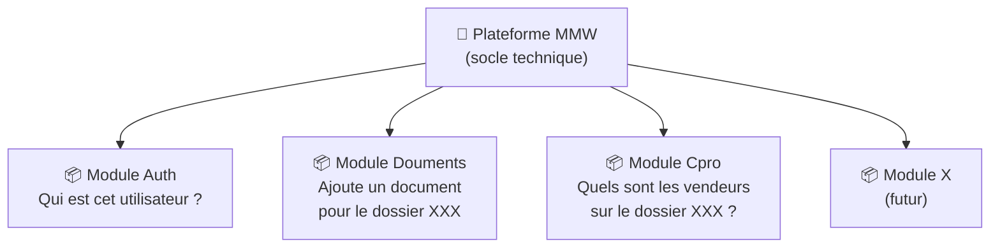

Les modules ne se connaissent pas directement ; quand ils ont besoin de communiquer, ils passent par
des **contrats** définis à l'avance (ou par des **événements** pour les processus asynchrones).

Voici un exemple de contrat `auth`:
1. je suis capable de dire si un token donné est valide
2. je suis capable de renvoyer l'utilisateur à partir d'un token

Comme le module `CPro` a besoin de savoir si un utilisateur est authentifié, il déclare avoir besoin du contrat `auth`.  
C'est au moment du démarrage du module `Cpro` que l'orchestrateur (la plateforme par défaut mais ça
peut être un test ou le `main.go`) va injecter un module qui déclare satisfaire ce contrat (injection de dépendance).

### Pour les devs

Un contrat c'est une interface de ce genre:
```go
type AuthPrivateService interface {
	ValidateToken(ctx context.Context, req *authv1.ValidateTokenRequest) (*authv1.ValidateTokenResponse, error)
}
```

avec `authv1.ValidateTokenResponse` qui est généré depuis un fichier `.proto`:
```go
type ValidateTokenResponse struct {
	state         protoimpl.MessageState `protogen:"open.v1"`
	UserId        string                 `protobuf:"bytes,1,opt,name=user_id,json=userId,proto3" json:"user_id,omitempty"`
	IsValid       bool                   `protobuf:"varint,2,opt,name=is_valid,json=isValid,proto3" json:"is_valid,omitempty"`
	unknownFields protoimpl.UnknownFields
	sizeCache     protoimpl.SizeCache
}
```

Le `.proto` ressemble à ça:
```protobuf
// AuthPrivateService exposes endpoints reachable only by internal services.
service AuthPrivateService {
  // ValidateToken checks if a token is valid and returns the user's identity.
  rpc ValidateToken(ValidateTokenRequest) returns (ValidateTokenResponse);
}

message ValidateTokenRequest {
  string token = 1;
}

message ValidateTokenResponse {
  string user_id = 1;
  bool is_valid = 2;
}
```

Le `.proto` génère à la fois les contrats Go et Typescript réseaux et les contracts Go "in-process" grace à un plugin Protobuf développé pour l'occasion dans *MMW*.
Les appels réseaux sont portés par [Connect](https://connectrpc.com/) qui crée à la fois des API HTTP compatibles avec les navigateurs et gRPC (le protocol gRPC c'est du *HTTP* classique avec le body encodé par Protobuf).

Le but annoncé de [Buf Technologies](https://buf.build/) : « déprécier REST/JSON en faveur du développement basé sur des schémas utilisant Protobuf ».

## 3. Tour des architectures


`MMW` n'est ni un monolithe classique ni un ensemble de microservices, c'est un peu le meilleur des deux,
adapté à la taille et aux moyens d'une équipe de 5 à 20 développeurs.

### 3.1 Monolithe classique

Tout dans une seule application, une seule base de code, un seul serveur HTTP ; c'est le CRM actuel.

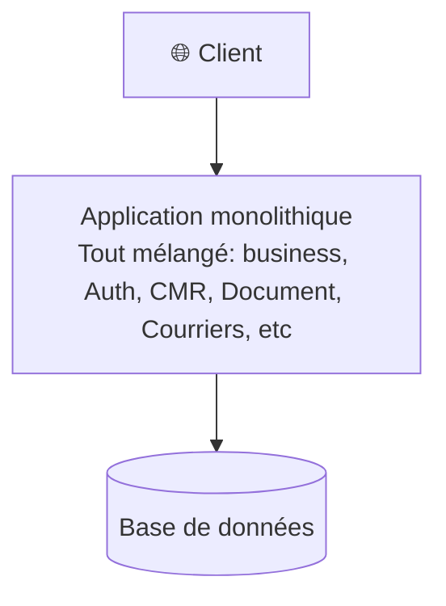

| ✅ Avantages | ❌ Inconvénients |
|-------------|----------------|
| Simple à démarrer | Tout est couplé, **les codes métiers** se mélangent entre eux et parfois/souvent aussi au code technique |
| Facile à déployer | De plus en plus difficile à modifier sans effet de bord ou sans risquer de tout casser |
| — | Tests difficiles |

### 3.2 Monolithe modulaire classique

Code organisé en modules dans le même processus mais sans isolation forte entre les modules ; l'isolation se fait par des règles plus ou moins bien respectées et par des programmes qui vérifient si certaines règles sont respectées.

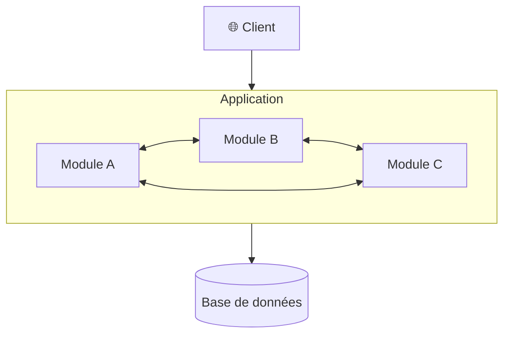

| ✅ Avantages | ❌ Inconvénients |
|-------------|----------------|
| Meilleure organisation | Les frontières s'érodent avec le temps et les linters sont facilement contournables |
| Un seul déploiement | Les modules finissent par dépendre les uns des autres (couplage) |
| — | Pas d'isolation réelle |

### 3.3 Microservices

Chaque domaine est un service indépendant déployé séparément ; cas du [Mailing](/media/mmw-software-architecture/graph-cmailing.svg) et du [Site](/media/mmw-software-architecture/graph-csitev4.svg) entre autres.

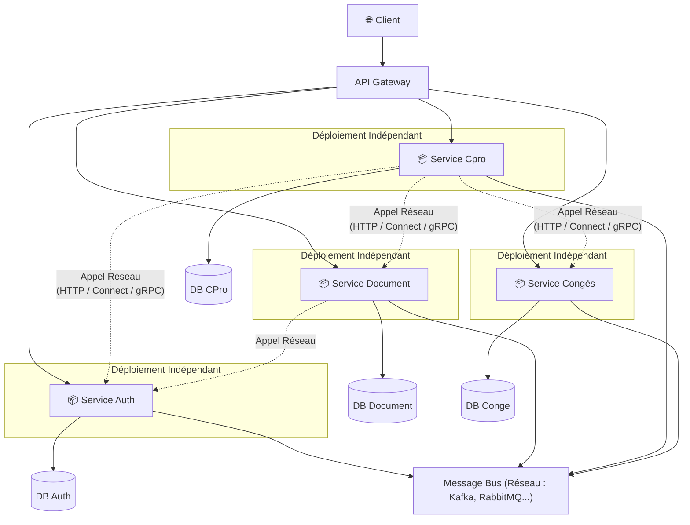

| ✅ Avantages                       | ❌ Inconvénients                             |
|------------------------------------|----------------------------------------------|
| Isolation maximale                 | Complexité opérationnelle massive            |
| Scalabilité indépendante           | Transactions distribuées difficiles          |
| Technologies hétérogènes possibles | Latence réseau entre services                |
| —                                  | Coût disproportionné pour une équipe moyenne |

### 3.4 Monolithe Modulaire Workspace (MMW)

Modules fortement isolés **dans un seul processus**.  
Le développement de l'ensemble des services (modules) se fait dans un **Go Workspace** ; le meilleur des deux mondes.

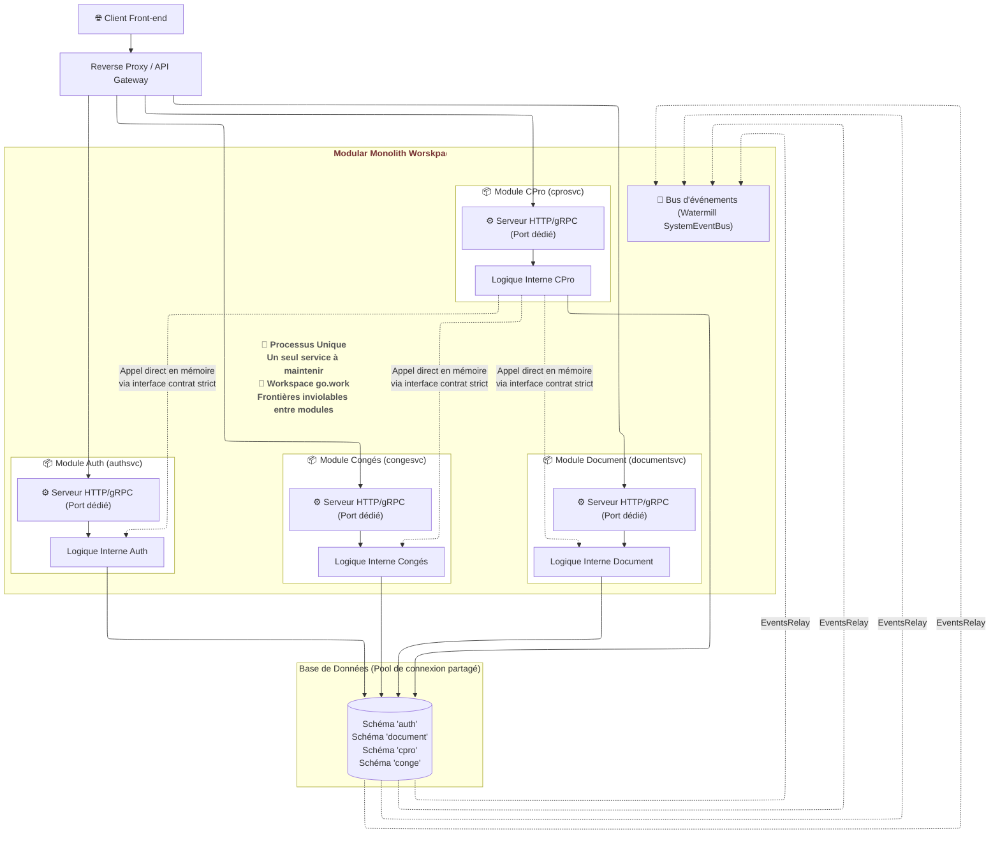

| ✅ Avantages | ❌ Inconvénients |
|-------------|----------------|
| Isolation forte entre modules | Scalabilité par module impossible (initialement) |
| Simplicité du monolithe (1 déploiement) | — |
| Communication interne sans réseau | — |
| Extractible en microservice si besoin | — |


#### Intérêt et limite du Workspace Go

Un Workspace Go définit un espace de développement qui résout un problème simple mais courant de mise à jour des dépendances.

Imaginons que l'on développe simultanément deux applications Go `APP1` et `APP2` chacune avec sont propre `go.mod` mais avec `APP1` qui dépend de `APP2`.  
Sans Workspace, Le cycle de développement peut devenir rapidement pénible :

Développement de APP2 → Git commit+push → dans APP1: `go get -u APP2`

À chaque modification de APP2, il faut refaire le processus.  
Pour contourner ce problème, il est possible de spécifier dans le `go.mod` de `APP1` une directive du genre `replace ovya.fr/app2 => ../app2`.

Ça résout le problème mais cela en apporte d'autres:
- Il ne faut pas oublier de supprimer le `replace` dans `go.mod` lors de la publication définitive de la lib et le remettre lors de nouveaux développement.
- Imaginons que `APP3` ait besoin de `APP1` et `APP2`. Il faut ajouter deux nouvelles directives `replace` dans la `go.mod` de `APP3` pour que le développement reste fluide.  
  Le jour où l'on déploie le projet, il faut se souvenir de tous les `replace` dans chacun des modules, ça peut vite devenir un casse tête…

Le Workspace permet de résoudre tous ces problèmes très simplement. Il suffit de créer à la racine du projet Go `APP3` un fichier `go.work` qui définit l'emplacement de chaque `APPx`:
```go
use (
	.
	./app1
	./app2
)
```

Le `go.mod` de `APP3` contiendra toujours les dépendances à `APP1` et `APP2`, le `go.mod` de `APP1` contiendra toujours la dépendance à `APP2` mais toutes les applications utiliseront les versions présentent sur le disque tant que le `go.work` est présent.

En général le `go.work` n'est pas versionné mais dans une plateforme de développement son versionnement fait sens.

**ATTENTION:**  
La commande `go work sync` synchronise les versions des dépendances externes communes dans les `go.mod` de chaque module du Workspace, mais **elle ne met pas à jour les versions des modules locaux `APP1`, `APP2` et `APP3` entre eux** !  
Pour ce faire, il faut descendre dans chaque application et faire le `go get -u github.com/xxx/appx` à la main, ce qui reste particulièrement pénible.

Heureusement la plateforme `MMW` fournit la commande `mmw workspace sync` qui permet de mettre à jour tous les `go.mod` de toutes les applications récursivement à la version Git en cours de chaque application.

## 4. Les principes fondateurs

Trois principes structurent toute l'architecture. Ensemble, ils font que le code reste sain, testable et évolutif sur le long terme.

### 4.1 Domain-Driven Design (DDD)


> **Le code parle le même langage que le métier.**

Dans une application classique, la logique métier se noie dans des contrôleurs qui mélangent validation, SQL, règles de gestion et réponses HTTP. Au bout de quelques années, plus personne ne sait où vivent les règles.

Avec DDD, un `User`, une `Todo`, une `Session` sont des objets qui *ont du comportement*. Les règles métier vivent dans le domaine : si "on ne peut pas assigner une tâche à un utilisateur supprimé", cette contrainte est dans le code de l'objet `Todo`, pas dans un `IF` au fond d'un contrôleur.

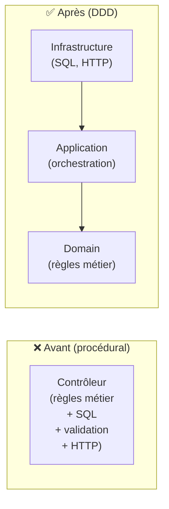

### 4.2 Clean Architecture (Architecture Hexagonale)


> **Le métier ne connaît pas la base de données, l'Unit of Work, les bus d'évènements etc.**

Le code qui décrit ce que fait l'entreprise est totalement indépendant de PostgreSQL, de ConnectRPC, de la configuration. On peut changer de base de données ou de protocole réseau sans toucher à une seule ligne de logique métier. Les dépendances vont toujours **vers l'intérieur**.

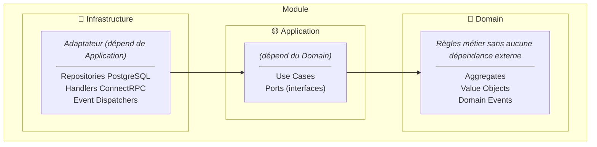


### 4.3 Event-Driven & Transactional Outbox


> **Les modules ne s'appellent pas directement pour les actions secondaires.**

Ce canal de communication est réservé aux actions qui ne font pas partie du cœur du métier — des effets de bord qui ne doivent pas bloquer l'opération principale si quelque chose se passe mal.

**Exemple :** quand un utilisateur s'inscrit, l'envoi de l'email de bienvenue ne doit pas faire échouer l'inscription si le service mail est indisponible. On publie un événement `UserRegistered`, le module Notifications l'écoute et envoie l'email de façon asynchrone — sans jamais bloquer l'utilisateur.

**Exemple concret du projet :** quand Auth supprime un utilisateur (`UserDeleted`), le module Todo supprime ses tâches de façon autonome, sans qu'Auth ait à le savoir ou à l'appeler directement.

L'**outbox** garantit qu'un événement ne peut jamais être perdu : l'événement est écrit en base de données dans la *même* transaction que l'opération métier. Même si le système tombe juste après le `COMMIT`, l'événement sera relu et republié au redémarrage.

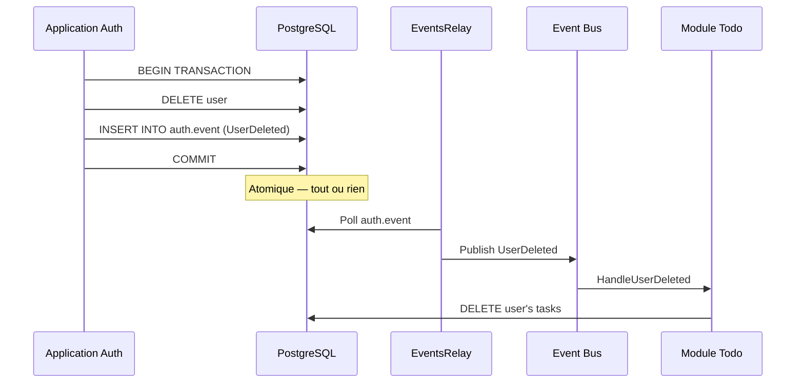

## 5. Zoom sur les composants clés

Chaque composant a une responsabilité unique et claire. Ensemble ils forment un système cohérent.

### 5.1 Structure d'un module


Chaque module suit le même squelette, sans exception. Le point d'entrée (`auth.go`) est la seule couche visible de l'extérieur — il câble les dépendances et démarre le module. Tout le reste est dans `internal/`.

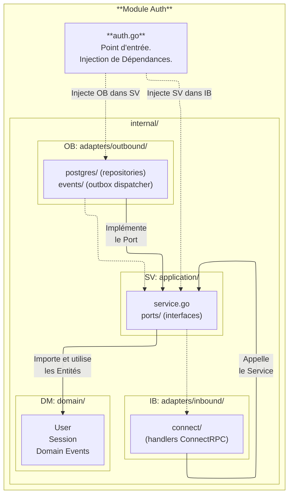

Le câblage complet du module Auth tient en une vingtaine de lignes dans `auth.go` :

```go
// modules/auth/auth.go
func New(infra Infrastructure) (*Module, error) {
    uow        := ogluow.New(infra.DBPool)
    userRepo   := postgres.NewUserRepository(uow)
    sessionRepo:= postgres.NewSessionRepository(uow)
    dispatcher := outboxevents.NewOutboxDispatcher(uow)

    authService := application.NewAuthService(userRepo, sessionRepo, uow, dispatcher, cfg.JWT.Secret)
    authHandler := connect.NewAuthHandler(authService)
    // ...
}
```

Chaque dépendance est injectée explicitement. Aucun registre global, aucun singleton.

#### Cycle de vie complet d'un module

Un module doit juste implémenter cette interface:
```go
// mmwcore.Module is the contract every module implements.
type Module interface {
	Start(ctx context.Context) error
}
```

Voici à quoi peut ressembler un module (extrait du module `todo`):
```go
type Module struct {
	relay   *pfoutbox.EventsRelay   // m.relay.Start(gCtx)  ← outbox relay (DB → busEvent)
	server  *pfserver.HTTPServer    // m.server.Start(gCtx) ← HTTP server
	router  *message.Router         // m.router.Run(gCtx)   ← Watermill router (busEvent → handlers)
	logger  *slog.Logger            // The native Go logger is enough
	service application.TodoService // This is an internal/application interface of the Todo application ! Can be replaced by any implementation.
}

type Infrastructure struct {
	DBPool     *pgxpool.Pool              // Connection to the database (the app does not use it but builds a uow with it)
	EventBus   pfevents.SystemEventBus    // It's a contract not an implementation
	Subscriber message.Subscriber         // It's a contract not an implementation
	AuthSvc    defauth.AuthPrivateService // It's a contract not an implementation
	Logger     *slog.Logger               // Native Go logger which is more than sufficient
}

// New wires all the dependencies of the Todo module and returns a ready-to-start Module.
func New(infra Infrastructure) (*Module, error) {
	// Load the config.
	cfg, err := config.Load(context.Background(), "")
	// Handle error

	// The UnitOfWork is the single source of truth for database access: both the repository
	// and the event dispatcher receive the same UoW so that writes to todo rows and writes
	// to the outbox table share the same transaction.
	uow := pfuow.New(infra.DBPool)
	// Build the todo repository
	todoRepo := postgres.NewPostgresTodoRepository(uow)
	// Build the outbox dispatcher
	eventDispatcher := events.NewPostgresOutboxDispatcher(uow)

	// Wires them into the TodoApplicationService.
	todoService := application.NewTodoApplicationService(todoRepo, uow, eventDispatcher)


	// newEventRouter creates the Watermill message router and registers all inbound event
	// handlers for the Todo module.
	//
	// Currently the only subscription is "auth.user.deleted.v1": when a user account is
	// deleted the auth module publishes that event, and this handler removes all of the
	// user's tasks to keep the database clean.
	router, err := newEventRouter(infra)
	// Handle error

	// newHTTPServer mounts the Connect RPC handler on an HTTP mux and wraps it with
	// platform middleware, then returns a pre-configured HTTPServer ready to be started.
	//
	// Auth middleware is applied to every route: all Todo RPCs require a valid JWT.
	// The service's Health method is exposed at GET /debug/monit so the platform runner
	// can probe database connectivity.
	// gRPC server reflection is enabled so grpcui can discover the service schema without
	// a compiled proto descriptor.
	httpServer := newHTTPServer(cfg, infra, todoService)

	return &Module{
		// Outbox relay: polls todo.event every 2 s and forwards rows to the SystemEventBus.
		relay:   pfoutbox.NewEnventsRelay(infra.DBPool, infra.EventBus, infra.Logger, relayTableName),
		server:  httpServer,
		router:  router,
		logger:  infra.Logger,
		service: todoService,
	}, nil
}

// Start implements the module contract with a blocking process.
func (m *Module) Start(ctx context.Context) error {
	m.logger.Info("starting the app")

	// Package errgroup provides synchronization, error propagation, and Context
	// cancellation for groups of goroutines working on subtasks of a common task.
	g, gCtx := errgroup.WithContext(ctx)

	// Start the HTTP server
	g.Go(func() error {
		return m.server.Start(gCtx)
	})

	// Start the Outbox relay
	if m.relay != nil {
		g.Go(func() error {
			m.relay.Start(gCtx)

			return nil
		})
	}

	// Start the Watermill message router triggering Todo module handlers for inbound event handlers.
	g.Go(func() error {
		return m.router.Run(gCtx)
	})

	// Wait until the context is cancled or a goroutine returns an error or panics.
	err := g.Wait()

	return eris.Wrapf(err, "%s failure", ModuleName)
}
```

Voici comment les modules sont démarrés dans le monolithe (`cmd/mmw/main.go` à la racine du monolithe):

```go
func main() {
	// signal.NotifyContext cancels ctx on SIGINT / SIGTERM, which propagates a
	// graceful-shutdown signal to every running module via platform.Run.
	ctx, cancel := signal.NotifyContext(context.Background(), os.Interrupt, syscall.SIGTERM)
	var dbPool *pgxpool.Pool

	defer func() {
		if dbPool != nil {
			dbPool.Close()
		}
		cancel()
	}()

	// initObservability loads the application config and creates the structured logger.
	// If config.ServerDebugEnabled is true, it also starts a pprof server on localhost:6060 in the background.
	// Both resources are derived from config, so they belong together.
	config, logger, err := initObservability(ctx)
	// Handle error

	dbPool, err = getDatabasePoolConnexion(ctx, logger, config.MainDatabase.URL())
	// Handle error

	// Creates the in-process Watermill GoChannel and wraps it in the
	// platform SystemEventBus interface.
	// rawBus is the concrete GoChannel used directly by modules that need a
	// message.Subscriber (e.g. the todo module's event router, the notifications
	// module). eventBus is the publishing interface passed to every module so they
	// can emit domain events without depending on the Watermill type.
	rawBus := getRawbus(logger)
	eventBus := pfevents.NewWatermillBus(rawBus)
	defer rawBus.Close()

	// initModules wires and returns all application modules in dependency order.
	modules, err := initModules(logger, dbPool, rawBus, eventBus)
	if err != nil {
		return
	}

	// platform.Run launches every module in its own goroutine via errgroup and
	// blocks until the context is cancelled or one module fails.
	logger.Info("Platform startup…")
	if err = platform.New(logger, modules).Run(ctx); err != nil {
		// Handle error
	}

// initModules wires and returns all application modules in dependency order.
//
// Ordering matters: auth must be initialised before todo because todo's Connect
// handler requires an AuthPrivateService to validate JWT tokens. Notifications
// subscribes to topics from both auth and todo, so it is initialised last.
func initModules(
	logger *slog.Logger,
	dbPool *pgxpool.Pool,
	rawBus *gochannel.GoChannel,
	eventBus pfevents.SystemEventBus,
) ([]pfcore.Module, error) {
	// 1. Auth — no inter-module dependencies.
	authModule, err := auth.New(auth.Infrastructure{
		DBPool:   dbPool,
		EventBus: eventBus,
		Logger:   logger.With("module", auth.ModuleName),
	})
	// Handle error

	// 2. Todo — depends on auth's private service to validate bearer tokens.
	todoModule, err := todo.New(todo.Infrastructure{
		DBPool:     dbPool,
		EventBus:   eventBus,
		Subscriber: rawBus,
		Logger:     logger.With("module", todo.ModuleName),
		AuthSvc:    authModule.PrivateService(),
	})
	// Handle error

	// 3. Notifications — subscribes to domain events from both auth and todo.
	//    The topic list is built by merging the two modules' exported topic slices.
	notifModule, err := notifications.New(notifications.Infrastructure{
		Subscriber:  rawBus,
		Logger:      logger.With("module", notifications.ModuleName),
		Topics:      append(tododef.Topics, authdef.Topics...),
		WithNotifer: true,
	})
	// Handle error

	return []pfcore.Module{todoModule, authModule, notifModule}, nil
}
```

On peut voir les graphes des dépendances
- graphe des dépendances du module Todo  
  .
- graphe des dépendances du module Auth  
  .
- graphe des dépendances du monolith en entier  
  .


### 5.2 Contrats Protobuf


Les règles strictes des comtrats Proto sont les suivantes :

- **Les Contrats Protobuf sont la source unique de vérité de toutes les applications/services de l'entreprise.**  
- **Les modules ne partagent jamais leurs types ou leurs fonctions internes.**  
- **Tout ce qui traverse une frontière de module passe par un contrat défini en Protobuf.**  
- **Même les applications Angular s'appuient sur ces définitions.**

```
.proto (source unique)
    → buf generate
        → contracts/network/go/   (structs Go + interface serveur ConnectRPC)  → HTTP handler des modules Go
        → contracts/ts/   (types TS + descripteur service ConnectRPC)  → Angular (createClient)
```

**Étape 1 — La définition `.proto` : les routes et les types en un seul endroit**

Le fichier `.proto` est la seule source de vérité pour l'API du module. Il déclare les routes (méthodes RPC) et les structures de données (messages). Le développeur frontend n'a jamais à écrire une URL, un type de requête ou un type de réponse à la main.

```proto
// contracts/proto/todo/v1/todo.proto
service TodoService {
  rpc CreateTodo(CreateTodoRequest) returns (CreateTodoResponse);
  rpc GetTodo   (GetTodoRequest)    returns (GetTodoResponse);
  rpc UpdateTodo(UpdateTodoRequest) returns (UpdateTodoResponse);
  rpc ListTodos (ListTodosRequest)  returns (ListTodosResponse);
  rpc DeleteTodo(DeleteTodoRequest) returns (DeleteTodoResponse);
}

message CreateTodoRequest {
  string title       = 1;
  string description = 2;
  Priority priority  = 3;
}

message Todo {
  string     id          = 1;
  string     title       = 2;
  TaskStatus status      = 3;
  Priority   priority    = 4;
}

enum Priority   { UNSPECIFIED = 0; LOW = 1; MEDIUM = 2; HIGH = 3; URGENT = 4; }
enum TaskStatus { PENDING = 1; IN_PROGRESS = 2; COMPLETED = 3; CANCELLED = 4; }
```

**Étape 2 — `mise buf:generate` : génération simultanée Go et TypeScript**

Une seule commande lit `buf.gen.yaml` et génère les deux cibles en parallèle :

```txt
  contracts/
  ├── proto/                              ← Source of truth (Protobuf IDL)
  │   ├── auth/v1/auth.proto
  │   ├── todo/v1/todo.proto
  │   ├── common/v1/errors.proto
  │   └── options/v1/options.proto
  │
  ├── go/
  │   ├── network/                        ← Generated by buf / protoc (wire layer)
  │   │   ├── common/v1/
  │   │   │   └── errors.pb.go            ← DomainError proto message
  │   │   ├── options/v1/
  │   │   │   └── options.pb.go           ← Custom proto options
  │   │   ├── auth/v1/
  │   │   │   ├── auth.pb.go              ← Go structs (RegisterRequest, LoginRequest, User…)
  │   │   │   └── authv1connect/
  │   │   │       └── auth.connect.go     ← interfaces AuthPublicServiceHandler,
  │   │   │                                  AuthPrivateServiceHandler + Connect clients
  │   │   └── todo/v1/
  │   │       ├── todo.pb.go              ← Go structs (Todo, CreateTodoRequest, Priority…)
  │   │       └── todov1connect/
  │   │           └── todo.connect.go     ← interface TodoServiceHandler + Connect client
  │   │
  │   └── application/                    ← Generated by protoc-gen-go-contracts (app layer)
  │       ├── auth/
  │       │   ├── auth_public_service_contract_gen.go   ← interface AuthPublicService
  │       │   │                                            + NoopAuthPublicService
  │       │   ├── auth_private_service_contract_gen.go  ← interface AuthPrivateService
  │       │   │                                            + NoopAuthPrivateService
  │       │   ├── errors_gen.go           ← error code consts (ErrorCodeInvalidCredentials…)
  │       │   ├── events_gen.go           ← Topics []string, event type aliases
  │       │   │                              (UserRegisteredEvent, UserDeletedEvent…)
  │       │   ├── connect_client.go       ← PublicHTTPClient / PrivateHTTPClient
  │       │   │                              wrapping Connect-generated clients
  │       │   └── types.go                ← User convenience alias (authv1.User)
  │       └── todo/
  │           ├── todo_service_contract_gen.go  ← interface TodoService
  │           │                                    + NoopTodoService
  │           ├── errors_gen.go           ← error code consts (ErrorCodeNotFound…)
  │           └── events_gen.go           ← Topics []string, event type aliases
  │                                          (UserTaskCreatedEvent, UserTaskDeletedEvent…)
  │
  └── ts/                                 ← Generated by buf (front-end / BFF layer)
      ├── common/v1/
      │   └── errors_pb.ts                ← DomainError TS type + schema
      ├── options/v1/
      │   └── options_pb.ts               ← Custom proto options
      ├── auth/v1/
      │   ├── auth_pb.ts                  ← TS types (RegisterRequest, User…)
      │   └── auth_connect.ts             ← AuthPublicService / AuthPrivateService
      │                                      descriptors (used by createClient)
      └── todo/v1/
          ├── todo_pb.ts                  ← TS types, enums, schemas (Todo, Priority…)
          └── todo_connect.ts             ← TodoService descriptor (used by createClient)
```

La distinction clé entre les couches :
- **go/network/** est la couche réseau brute (structures proto-générées + interfaces Connect) qui concerne la sérialisation/désérialisation des données sur le réseau.
- **go/application/** est la couche de contrat d'application (interfaces orientées domaine, codes d'erreur, sujets d'événements) générée par un plugin personnalisé protoc-gen-go-contracts dans `MMW`.

Seul **go/application/** est importé par le code des modules, les types **go/network/** circulent uniquement via les adaptateurs.

**Étape 3 — Côté serveur Go : implémenter l'interface générée**

Le module Todo n'écrit pas son handler *HTTP* à la main. Il implémente l'interface `TodoServiceHandler` générée :

```go
// go/network/todo/v1/todov1connect/todo.connect.go (généré — ne pas modifier)
type TodoServiceHandler interface {
    CreateTodo(context.Context, *connect.Request[todov1.CreateTodoRequest]) (*connect.Response[todov1.CreateTodoResponse], error)
    GetTodo   (context.Context, *connect.Request[todov1.GetTodoRequest])    (*connect.Response[todov1.GetTodoResponse], error)
    ListTodos (context.Context, *connect.Request[todov1.ListTodosRequest])  (*connect.Response[todov1.ListTodosResponse], error)
    // ...
}
```

```go
// modules/todo/internal/adapters/inbound/connect/todo_handler.go
type TodoHandler struct{ service application.TodoService }

func (h *TodoHandler) CreateTodo(
    ctx context.Context,
    req *connect.Request[todov1.CreateTodoRequest],
) (*connect.Response[todov1.CreateTodoResponse], error) {
    todo, err := h.service.Create(ctx, req.Msg.Title, req.Msg.Description)
    if err != nil {
        return nil, connectErrorFrom(err)  // voir §5.2
    }

    return connect.NewResponse(&todov1.CreateTodoResponse{Todo: todo}), nil
}
```

Le module s'enregistre sur le mux *HTTP* via le path généré — aucune *URL* n'est à écrire :

```go
// modules/todo/todo.go
path, handler := todov1connect.NewTodoServiceHandler(todoHandler)
// path == "/todo.v1.TodoService/"  ← dérivé du nom de package proto
mux.Handle(path, handler)
```

Les types Go sont exposés via des **alias** dans `contracts/go/application/` pour préserver l'interface `proto.Message` et éviter toute redéfinition :

```go
// contracts/go/application/auth/contract.go
import authv1 "github.com/pivaldi/mmw-contracts/gen/go/auth/v1"

type User = authv1.User  // alias — pas une redéfinition
```

**Étape 4 — Côté client TypeScript : `createClient` depuis les fichiers générés**

Le frontend ne connaît pas les URLs, pas les formats JSON, pas les types de requêtes.  
Il importe les fichiers générés et crée un client typé en trois lignes sans avoir à définir les objets en entrée et en sortie :

```typescript
// src/app/services/todo.service.ts
import { createClient }              from '@connectrpc/connect';
import { createConnectTransport }   from '@connectrpc/connect-web';
import { TodoService }              from '@contracts/todo/v1/todo_pb';
// TodoService est le descripteur généré par buf — il contient les routes et les types

const transport = createConnectTransport({ baseUrl: environment.apiUrl });
const client    = createClient(TodoService, transport);
// client est maintenant un objet avec une méthode typée par RPC :
// client.createTodo(…)…, client.getTodo(…)…, client.listTodos(…)…
```

Chaque appel est une promesse fortement typée — l'IDE connaît le type de la requête et de la réponse :

```typescript
import {
  Todo,
  ListTodosRequest,
  ListTodosResponse,
  CreateTodoRequest,
  UpdateTodoRequest,
} from '@contracts/todo/v1/todo_pb';

@Injectable({ providedIn: 'root' })
export class TodoService {
  // Les types CreateTodoRequest et Todo viennent de todo_pb.ts (généré)
  createTodo(req: CreateTodoRequest): Observable<Todo> {
    return from(client.createTodo(req)).pipe(map(res => res.todo!));
  }

  listTodos(req?: ListTodosRequest): Observable<ListTodosResponse> {
    return from(client.listTodos(req ?? {}));
  }

  completeTodo(id: string): Observable<Todo> {
    return from(client.completeTodo({ id })).pipe(map(res => res.todo!));
  }
}
```

Les **intercepteurs Connect** permettent d'injecter le token d'authentification et de gérer les erreurs réseau de façon centralisée, sans polluer chaque appel :

```typescript
const transport = createConnectTransport({
  baseUrl: environment.apiUrl,
  interceptors: [
    (next) => async (req) => {
      // Injecter le token sur chaque requête sortante
      const token = localStorage.getItem('auth_token');
      if (token) req.header.set('Authorization', `Bearer ${token}`);

      try {
        return await next(req);
      } catch (err) {
        // Rediriger vers /login si le serveur répond 401
        if (err instanceof ConnectError && err.code === Code.Unauthenticated) {
          localStorage.removeItem('auth_token');
          window.location.href = '/login';
        }
        throw err;
      }
    },
  ],
});
```

**Ce que cela garantit**

Si un champ change dans le `.proto` ou qu'une méthode est renommée, la compilation échoue des deux côtés, Go **et** TypeScript, avant que le code ne tourne. L'équipe frontend détecte immédiatement toute rupture de contrat, sans attendre l'exécution ni consulter une documentation externe.

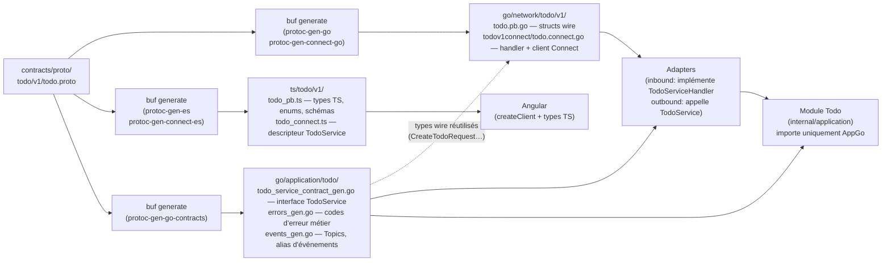

**Il en va de même pour la gestion des erreurs du domaine au niveau du client TypeScript.**


Les erreurs traversent trois couches sans jamais dévier d'une couche à l'autre avant d'arriver au client TypeScript.

```
Sentinel domain → DomainErrorFor (application) → connectErrorFrom (adapter) → Client TypeScript
```

**Couche 1 — Sentinelles dans le domaine**

Le domaine ne connaît ni `ConnectRPC` ni les contrats *protobuf*. Il déclare de simples variables d'erreur :

```go
// modules/todo/internal/domain/errors.go
var ErrInvalidTitle = errors.New("invalid title")
var ErrTodoNotFound = errors.New("todo not found")
```

**Couche 2 — `DomainErrorFor` dans la couche application**

Avant de retourner, le service appelle `DomainErrorFor` qui traduit chaque sentinelle en `*platform.DomainError`. Ce type est fourni par `platform` — c'est le **type frontière** partagé entre la couche application et les adaptateurs entrants de tous les modules.

```go
// libs/platform/errors.go
type DomainError struct {
    Code    ErrorCode // valeur numérique issue de l'enum proto
    Message string
}
```

Les codes numériques viennent de l'enum `TodoErrorCode` défini en protobuf et exposés comme constantes dans `contracts/go/application/todo`. **Le client TypeScript utilise le même enum généré depuis le même `.proto`**.

**Couche 3 — `connectErrorFrom` dans l'adaptateur Connect**

L'adaptateur de conversion de type (type-switch) de `*platform.DomainError`, consulte une table `domainConnectCodeMap` pour obtenir le statut Connect (`InvalidArgument`, `NotFound`, `FailedPrecondition`…), puis attache un détail proto `commonv1.DomainError{code, message}` :

```go
// TypeScript côté client
const details = err.findDetails(DomainError);
// details[0].code === TodoErrorCode.TODO_ERROR_CODE_INVALID_TITLE
```

Les erreurs inconnues (infrastructure, inattendu) deviennent `CodeInternal` sans exposer d'information interne.

### 5.3 Unit of Work — transactions et propagation de contexte


Le `UnitOfWork` garantit le **"tout ou rien"** pour un ensemble d'opérations base de données. Si la sauvegarde de l'agrégat réussit mais que l'écriture de l'événement échoue, tout est annulé.

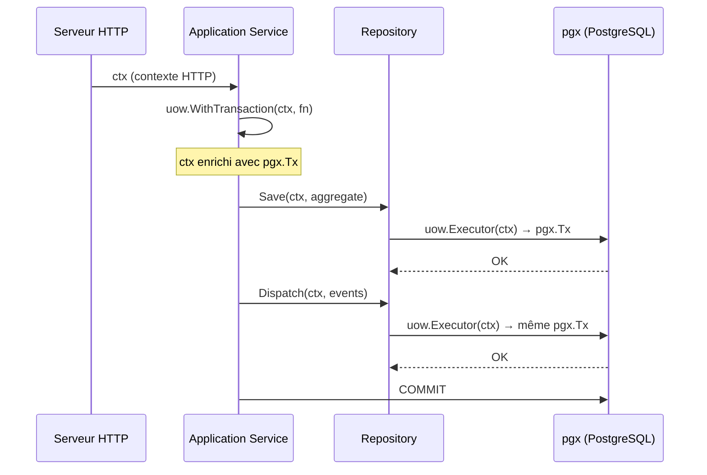

Les repositories ne reçoivent jamais le pool de connexion directement — ils accèdent à un `*UnitOfWork` et appellent `uow.Executor(ctx)`. La transaction active est extraite du contexte de façon transparente :

```go
// modules/auth/internal/adapters/outbound/persistence/postgres/user_repository.go
type UserRepository struct {
    uow *oglpguow.UnitOfWork
}

func (r *UserRepository) Save(ctx context.Context, u *user.User) error {
    exec := r.uow.Executor(ctx)  // retourne pgx.Tx si une transaction est active, sinon le pool
    _, err := exec.Exec(ctx,
        `INSERT INTO auth.users (id, login, password_hash, created_at, updated_at)
         VALUES (@id, @login, @password_hash, @created_at, @updated_at)`,
        pgx.NamedArgs(ogldb.StructArgs(u.Snapshot())),
    )
    return eris.Wrap(err, "save user")
}
```

Le `context.Context` sert à deux choses simultanément :

1. **Propager la transaction** — tous les repositories utilisent le même `pgx.Tx` sans se le passer explicitement entre eux.
2. **Annulation automatique** — si le client HTTP se déconnecte, si un timeout expire, ou si le processus reçoit `SIGTERM`, le contexte parent est annulé. Cette annulation se propage à tous les contextes dérivés, y compris la requête SQL en cours côté PostgreSQL. Pas de connexion zombie, zéro ligne de code supplémentaire.

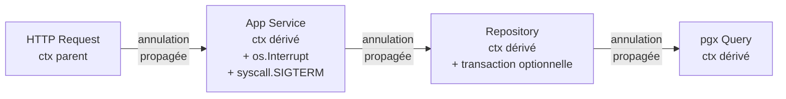

### 5.4 Outbox Pattern — événements garantis

L'événement est écrit dans une table `*.event` **dans la même transaction** que la donnée métier. Un relai (`EventsRelay`) tourne en arrière-plan, lit cette table et publie sur le bus Watermill.

Deux garanties :
- **Atomicité :** si la donnée est sauvegardée, l'événement est sauvegardé. Les deux ou aucun.
- **Durabilité :** si le relai tombe, il reprend là où il s'était arrêté au redémarrage. Aucun événement n'est perdu.

```go
// modules/auth/internal/adapters/outbound/events/outbox_dispatcher.go
func (d *OutboxDispatcher) Dispatch(ctx context.Context, events []user.DomainEvent) error {
    batch := &pgx.Batch{}
    const query = `INSERT INTO auth.event (event_type, payload, occurred_at) VALUES ($1, $2::jsonb, $3)`

    for _, evt := range events {
        payload, err := marshalEvent(evt)
        // ...
        batch.Queue(query, evt.EventType(), string(payload), evt.OccurredAt())
    }

    exec := d.uow.Executor(ctx)  // même transaction que le Save() de l'agrégat
    br := exec.SendBatch(ctx, batch)
    defer br.Close()
    // ...
}
```

### 5.5 Outbox + EventBus — Monolithe vs déploiement séparé


L'outbox pattern est une préoccupation **côté producteur uniquement**. La même garantie d'at-least-once s'applique quel que soit le bus sous-jacent — seule l'implémentation injectée dans `main.go` change.

#### Monolithe (gochannel en mémoire)

Dans le monolithe, `rawBus` est un `gochannel` qui joue **deux rôles simultanément** :
- il est le `message.Publisher` sous-jacent de `WatermillBus` (alias `systemBus`) que l'`EventsRelay` utilise
- il est le `message.Subscriber` injecté directement dans le router du module Todo

```
main.go
  rawBus    := gochannel.New()             ← implémente Publisher + Subscriber
  systemBus := WatermillBus(rawBus)        ← implémente SystemEventBus (wraps rawBus)

  auth.New(EventBus: systemBus)            ← relay publie via SystemEventBus
  todo.New(Subscriber: rawBus)             ← router souscrit via message.Subscriber
```

```
Module Auth (producteur)                     Module Todo (consommateur)
─────────────────────────────────────────    ──────────────────────────────────────
domain op (DeleteUser)
  └─ BEGIN TRANSACTION
       DELETE auth.users
       INSERT auth.event          ← outbox
     COMMIT                       ← atomique

EventsRelay (goroutine)
  └─ poll auth.event
       systemBus.Publish()        ← SystemEventBus interface
         └─ WatermillBus → rawBus.Publish() ─→  rawBus.Subscribe()
                                                  └─ router.Run
                                                       └─ HandleUserDeleted
                                                            └─ DeleteUserTasksCommand
```

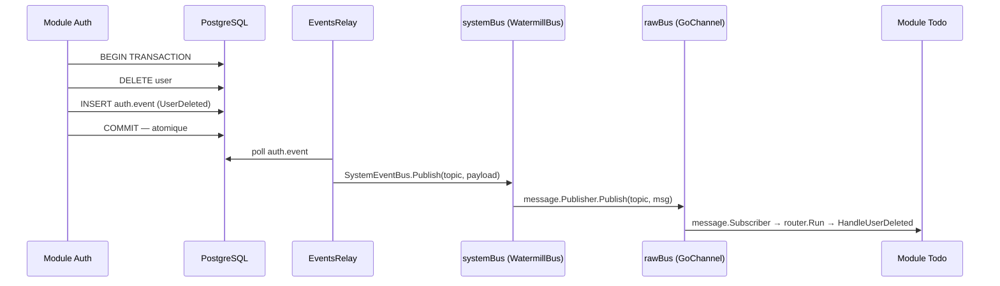

Si le processus tombe après le `COMMIT` mais avant le `Publish`, l'`EventsRelay` reprend au redémarrage depuis la dernière ligne non traitée de `auth.event` : zéro événement perdu.

#### Déploiement séparé (Kafka / RabbitMQ)

Seules deux lignes changent dans `main.go` — aucun module ne change :

```
main.go
  kafkaPub  := kafka.NewPublisher(...)     ← implémente message.Publisher
  kafkaSub  := kafka.NewSubscriber(...)    ← implémente message.Subscriber
  systemBus := WatermillBus(kafkaPub)      ← même interface SystemEventBus

  auth.New(EventBus: systemBus)            ← relay publie vers Kafka (inchangé côté module)
  todo.New(Subscriber: kafkaSub)           ← router souscrit depuis Kafka (inchangé côté module)
```

```
Module Auth (producteur)                     Module Todo (consommateur)
─────────────────────────────────────────    ──────────────────────────────────────
domain op (DeleteUser)
  └─ BEGIN TRANSACTION
       DELETE auth.users
       INSERT auth.event          ← outbox (identique)
     COMMIT

EventsRelay (goroutine)
  └─ poll auth.event
       systemBus.Publish()        ← même interface SystemEventBus
         └─ WatermillBus → kafkaPub.Publish() ─→  kafkaSub.Subscribe()
                                                    └─ router.Run
                                                         └─ HandleUserDeleted
```

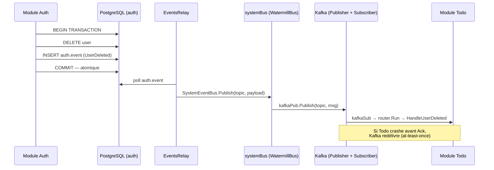

Le consommateur (Todo) n'écrit rien en base pour gérer la durabilité — c'est Kafka qui garantit la redélivrance via les offsets de consumer group. Un message non acquitté (`msg.Ack()` non appelé) est automatiquement redélivré.

#### Ce qui change entre les deux déploiements

| | Monolithe | Déploiement séparé |
|---|---|---|
| `systemBus` injecté dans Auth | `WatermillBus(rawBus)` | `WatermillBus(kafkaPub)` |
| `infra.Subscriber` injecté dans Todo | `rawBus` (gochannel) | `kafkaSub` (Kafka) |
| Outbox côté Auth | ✅ identique | ✅ identique |
| Code Auth, code Todo | ✅ inchangé | ✅ inchangé |

L'outbox résout le problème du **producteur** : "comment écrire la donnée ET l'événement de façon atomique avant de les confier au broker ?". Le broker résout le problème du **consommateur** : "comment garantir qu'un message est traité même si le consommateur tombe ?".

### 5.6 Communication intra-processus (InProc)


Pour les appels **synchrones** entre modules (ex : le module Todo valide un JWT auprès du module Auth), les modules communiquent via une **interface de contrat strict** — sans réseau, sans sérialisation.

Le contrat expose uniquement ce dont le consommateur a besoin. Le module Todo déclare dépendre de `AuthPrivateService` (uniquement `ValidateToken`) — il ne peut pas appeler `Register` ou `Login` par construction.

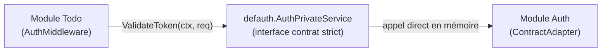

```go
// contracts/go/application/auth/auth_private_service_contract_gen.go  (généré)
type AuthPrivateService interface {
    ValidateToken(ctx context.Context, req *authv1.ValidateTokenRequest) (*authv1.ValidateTokenResponse, error)
}

// modules/todo/todo.go
type Infrastructure struct {
    AuthSvc defauth.AuthPrivateService  // seule ValidateToken est accessible
    // ...
}

// cmd/mmw/main.go
todoModule, err := todo.New(todo.Infrastructure{
    AuthSvc: authModule.PrivateService(), // retourne *inproc.ContractAdapter directement
    // ...
})
```

`authModule.PrivateService()` retourne directement le `ContractAdapter` — aucun wrapper intermédiaire. Si demain le module Auth devient un microservice, seul `main.go` change : `authModule.PrivateService()` est remplacé par `authdef.NewPrivateHTTPClient(...)`. Le code du module Todo ne change pas d'une ligne.

## 6. Stratégie de tests


L'architecture hexagonale n'est pas qu'une organisation du code — elle rend les tests naturels. Chaque couche a une frontière claire, ce qui détermine exactement comment et à quel coût la tester.

### La pyramide

```
         /\      Tests système — une seule suite au niveau du monolithe
        /  \     (binaire in-process, postgres via Docker,
       /    \     authentification réelle, scénarios cross-modules)
      /______\
     /        \   Tests de contrat — par module, rapides, sans infra
    /__________\
   /            \  Tests d'intégration — par module, Docker,
  /______________\  adaptateurs uniquement (//go:build integration)
 /                \
/__________________\ Tests unitaires & applicatifs — par module, tout en mémoire
```

Plus on monte, plus les tests sont lents, coûteux à maintenir et rares. La base doit être large et rapide — c'est là que la confiance se construit.

### Niveau 1 — Tests unitaires & applicatifs

**Ce qu'ils testent :** le domaine (`domain/`) et la couche application (`application/`) — les règles métier, les cas nominaux, les cas d'erreur.

**Pourquoi c'est facile :** l'architecture hexagonale interdit toute dépendance vers l'infrastructure dans le domaine et l'application. Il n'y a pas de base de données à simuler, pas de serveur HTTP à démarrer — tout est câblé avec des fakes en mémoire.

```go
// modules/todo/internal/testhelpers/fakes.go
// InMemoryTodoRepo, PassthroughUoW, NoopEventDispatcher
// → câblent un vrai TodoApplicationService sans aucune infrastructure

func NewTestService(t *testing.T) (application.TodoService, *InMemoryTodoRepo) {
    repo := NewInMemoryTodoRepo()
    svc  := application.NewTodoApplicationService(repo, PassthroughUoW{}, NoopEventDispatcher{})
    return svc, repo
}
```

Les handlers Connect sont aussi testés à ce niveau : `newTestHandler(t)` câble un vrai service applicatif via les fakes — le domaine s'exécute réellement, pas un mock. Un bug dans le mapping proto ↔ domaine est détecté ici, pas en production.

**Exécution :** `go test ./...` — aucun Docker, aucun réseau. Quelques millisecondes par suite.

### Niveau 2 — Tests d'intégration

**Note: c'est tests sont sciemment supprimés dans l'architecture `MMW` car il sont redondant avec les tests systèmes présents directement dans le monolithe.** 

**Ce qu'ils testent :** les adaptateurs outbound — les repositories PostgreSQL, l'outbox dispatcher — contre une vraie base de données.

**Séparation par build tag :**

```go
//go:build integration

// libs/mmw/pkg/platform/pg/uow/uow_integration_test.go
```

La règle est stricte : seul le code qui touche réellement l'infrastructure porte ce tag. Le reste du projet ne sait pas que Docker existe.

```bash
go test ./...                           # unitaires + applicatifs uniquement
go test -tags integration ./...         # ajoute les tests d'adaptateurs
go test -tags integration -short ./...  # intégration sans Docker (CI léger)
```

### Niveau 3 — Tests de contrat

**Ce qu'ils testent :** l'adaptateur inproc (`inproc.Adapter`) qui expose le module aux autres modules du monolithe. Ce que le compilateur ne peut pas vérifier : les valeurs correctes des enums proto, la traduction des erreurs domaine en codes de retour, la cohérence du mapping proto ↔ domaine sur l'ensemble des opérations.

**Sans build tag** — ces tests sont aussi rapides que les tests unitaires. Ils tournent avec `go test ./...`.

```go
// modules/todo/test/contract/contract_test.go

func TestContract_StatusMapping(t *testing.T) {
    // Vérifie que les 4 valeurs de TaskStatus traversent l'adaptateur sans perte
    // PENDING, IN_PROGRESS, COMPLETED, CANCELLED → chacune testée
}

func TestContract_ErrorPropagation(t *testing.T) {
    // Vérifie que domain.ErrTodoNotFound sort bien comme ErrorCodeNotFound
    // à travers la chaîne : domain → DomainErrorFor → inproc.Adapter
}
```

L'assertion à la compilation `var _ deftodo.TodoService = (*inproc.Adapter)(nil)` garantit la signature. Les tests de contrat garantissent le comportement.

### Niveau 4 — Tests système

**Ce qu'ils testent :** le monolithe entier — modules auth + todo câblés en mémoire exactement comme dans `main.go`, contre une vraie base PostgreSQL, avec des vrais tokens JWT.

**Pas de stubs** : le test s'enregistre via l'API HTTP d'Auth, reçoit un vrai JWT, puis l'utilise pour toutes les opérations Todo. Si le middleware JWT est cassé, le test système le détecte — pas un test unitaire avec un token inventé.

```go
//go:build system

// test/system/todo_flow_test.go
func TestMain(m *testing.M) {
    // 1. Démarre postgres via testcontainers
    // 2. Exécute auth.Migrate() et todo.Migrate()
    // 3. Câble les modules : auth.New(...) + todo.New(...)
    // 4. Enveloppe chaque module dans httptest.NewServer
    // 5. Lance les tests
}

func TestSystem_TodoCRUDFlow(t *testing.T) {
    // register → login → createTodo → getTodo → updateTodo
    //         → completeTodo → reopenTodo → deleteTodo
}

func TestSystem_TodoScopedToUser(t *testing.T) {
    // Deux utilisateurs : chacun ne voit que ses propres todos
}
```

**Exécution :**
```bash
go test -tags system -v -timeout 180s ./test/system/...
```

### Pourquoi pas de tests E2E par module ?

Dans un monolithe modulaire, **tester un module seul avec un pseudo JWT créerait un doublon des tests système**, avec une couche de mock à maintenir.  
La frontière naturelle du système est le binaire complet — c'est là que les vrais tests de bout en bout ont leur place.  
Chaque module gagne en confiance via ses contrats (niveau 3) et par les tests système partagés (niveau 4).

### Lancer les tests

```bash
# Tous les tests rapides (unitaires + applicatifs + contrats)
mise run test

# Tests d'intégration (requiert Docker)
mise run test:integration

# Tests de contrat uniquement
mise run test:contract

# Tests système (requiert Docker)
mise run test:system

# Tout
mise run test:all
```

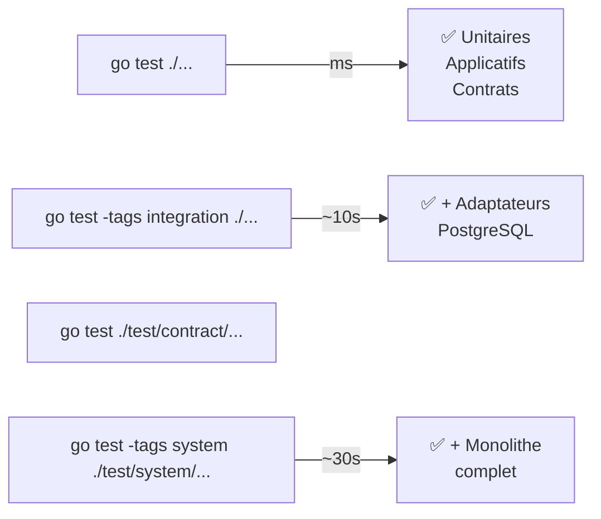

## 7. Uniformisation : tout futur projet devient un module


MMW n'est pas juste une architecture pour le *CostesPro* — c'est le **socle technique standard** de l'entreprise. Tout nouveau projet démarre comme un module, se branche sur la plateforme MMW, et bénéficie immédiatement de tout ce qu'elle fournit.

### Pour la direction

Une nouvelle fonctionnalité métier ne repart plus de zéro. L'équipe passe 100 % de son temps sur la valeur métier, pas sur la plomberie. Le temps de démarrage d'un nouveau projet est drastiquement réduit.

### Pour les devs

Un nouveau module suit toujours le même squelette. Mêmes conventions, mêmes patterns, même vocabulaire d'un projet à l'autre. L'intégration d'un nouveau développeur est accéléré, les revues de code sont plus efficaces ; **tout le monde parle le même langage**.

### Ce que la plateforme fournit "gratuitement" à chaque module


[Le plateforme MMW est entièrement documentée](https://github.com/piprim/mmw) avec des exemples tirés des modules Todo, Auth et Notifications.

- La librairie `pkg/platform`
  - **Serveur HTTP** : healthchecks, routes debug pprof
  - **Connect RPC** : intercepteurs d'erreurs (logging, recovery) pour les handlers HTTP/2
  - **HTTP Middlewares** : CORS, logging structuré, panic recovery, et authentification Bearer via `BearerAuthMiddleware` — le module fournit uniquement un `TokenValidator` (closure sur son `AuthPrivateService`), la plateforme gère l’extraction du token, la propagation du `userID` dans le contexte (`pfauthctx`), et les réponses 401
  - **Logs structurés** : `slog`, JSON en prod / couleur en dev, sans configuration
  - **Configuration générique** : TOML + surcharge par variables d'environnement
  - **DomainError** : type d'erreur métier typé + `ErrorCode` — mapping automatique vers les codes Connect RPC dans les adaptateurs
  - **Unit of Work** : transactions PostgreSQL sans fuites de session (`pgx`)
  - **StructArgs** : conversion struct → `pgx.NamedArgs` pour les requêtes nommées
  - **Outbox Relay** : publication d'événements garantie (au-moins-une-fois) via table outbox
  - **Bus d'événements** : Watermill in-memory — même API que pour un bus distribué
  - **Système de migrations DB** : Goose patché, embarqué dans le binaire du module
  - **SafeGo** : goroutines sans fuite — panic capturée, loguée, propagée proprement
  - **Platform Runner** : coordination `errgroup` de tous les serveurs et workers du processus
  - **Interface Module** (`pfcore.Module`) : contrat standard pour brancher un module sur le runner
  - **Génération des contrats** : Protobuf → Go + TypeScript via `buf`

- La librairie `pkg/archtest` — Validation architecturale automatisée
  - **Contract Purity** : le package `contracts/` n'importe jamais un module
  - **Lib Independence** : les `libs/` n'importent ni module ni `mmw`
  - **Module Isolation** : les modules ne s'importent pas directement entre eux
  - **Module Interface** : un module n'expose que son interface contractuelle définie
  - **Domain Purity** : `internal/domain/` n'importe jamais `contracts/`
  - **Application Purity** : `internal/application/` n'importe jamais `contracts/`

- La librairie `pkg/scaffold` — Génération automatique de module
  - **`GenerateModule`** : squelette complet du module (21 fichiers) — domaine, application, infra, connect, cmd, tests, mise.toml, arch-go, go.mod, …
  - **`GenerateContract`** : squelette `contracts/go/application/<name>/` + proto + buf.gen
  - **`UpdateGoWork`** : enregistrement idempotent du nouveau module dans `go.work`
  - **`UpdateMiseToml`** : ajout automatique des tâches `mise` de base dans le `mise.toml` du nouveau module

- Interface de Ligne de Commandes : *CLI* `mmw`
  - **`mmw new module`** : assistant interactif qui demande le nom du module, exposition ou non à Connect RPC, génération ou non des contrats inproc, accès ou non à une base de données
  - **`mmw new contract`** : génère la définition de contrat associée (dans le cas où on ne l'aurait pas générée au début)
  - **`mmw check arch`** : valide les frontières architecturales de tous les modules
  - **`mmw test coverage`** :  génère une synthèse de couverture de test agrégé et multi-modules

**Migrations centralisées :** chaque module déclare ses migrations en quelques lignes de code — le socle s'occupe de l'exécution, du versionnement et du rollback (Up/Down). Pas d'outil externe à configurer, pas de script à maintenir séparément.

### Chemin d'évolution

Si un module atteint une taille critique ou nécessite une scalabilité indépendante, il peut être extrait en microservice autonome. Le contrat Protobuf est déjà défini. L'adaptateur réseau remplace l'adaptateur inproc — le code métier du module ne change pas.

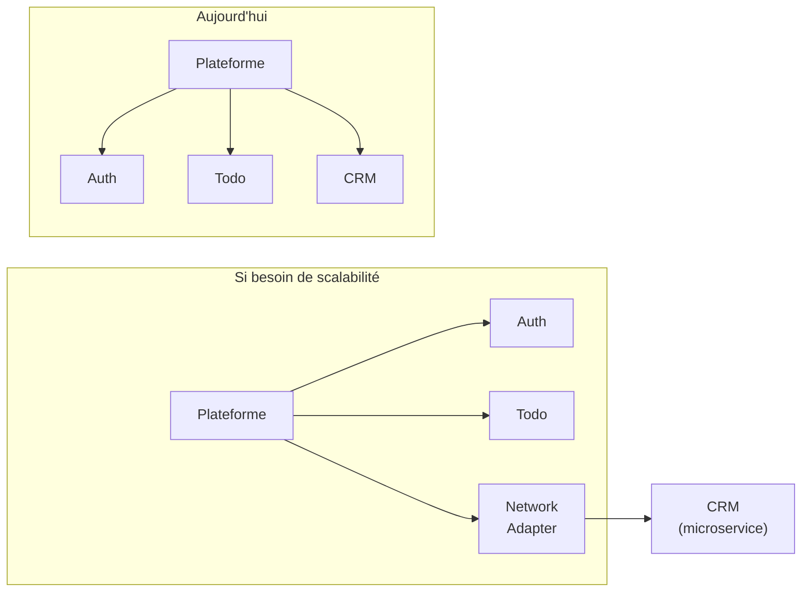

## 8. Stratégie de migration du CRM


### Pas de réécriture d'un coup

Le monolithe modulaire permet une migration **domaine par domaine**. Chaque domaine actuellement dans le CPro devient un module indépendant (CRM ≠ Gestion Documents ≠ Gestion des courriers ≠ Création/Suivi de dossiers, etc), développé et livré l'un après l'autre. À aucun moment il n'est nécessaire de tout arrêter pour tout basculer.

### Strangler Fig Pattern

L'ancien système PHP et les nouveaux modules Go coexistent pendant toute la transition. Un routeur redirige progressivement le trafic vers les modules Go au fur et à mesure qu'ils sont prêts. L'ancien système "s'étrangle" naturellement jusqu'à sa mise hors service.

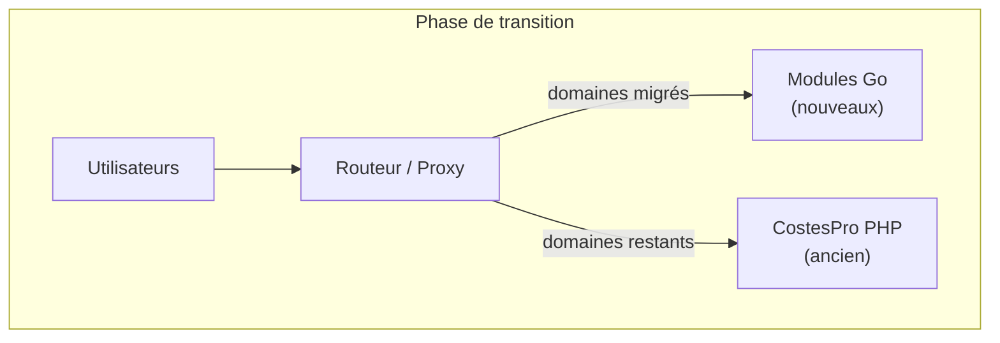

### Stratégie base de données

- Un schéma PostgreSQL dédié **`cpro`** est créé pour CostesPro. La structure existante est réécrite proprement : noms de tables normalisés, colonnes typées, contraintes d'intégrité.
- Pendant toute la durée de la migration, une **synchronisation bi-directionnelle** entre le schéma PHP existant et le nouveau schéma `cpro` garantit que les deux systèmes voient les mêmes données en temps réel.
- Les équipes peuvent basculer module par module sans couper le service ni forcer une migration simultanée de tous les utilisateurs.

### Priorité de migration


Deux approches possibles, non exclusives :
- **Par la douleur :** commencer par les domaines les plus difficiles à maintenir ou qui bloquent le plus l'évolution — l'impact est immédiat.
- **Par la simplicité :** commencer par un domaine moins complexe pour que l'équipe prenne en main l'architecture avant d'attaquer les modules les plus critiques.

### Les services Go existants

Les services Go actuels, qui ont chacun leur propre architecture, peuvent être progressivement adaptés en modules MMW : on remplace leur infrastructure ad hoc par le socle commun, sans tout réécrire.

## 9. Évolutions planifiées


La plateforme est conçue par couches livrables indépendantes.  
La couche 1 (scaffolding & standardisation) est opérationnelle.  
Les trois couches suivantes sont conçues et documentées, prêtes à être implémentées après discutions avec l'équipe.

### Couche 2 — Gestion des secrets

**Problème actuel :** les secrets (mots de passe DB, clés JWT…) sont écrits en clair dans `mise.toml` et commités dans git.

**Solution : SOPS + age.** Les secrets sont des fichiers TOML chiffrés commités dans git. La clé privée `age` ne vit que sur les serveurs de déploiement. Aucun serveur de secrets à opérer.

```
configs/
├── default.toml              # config non-sensible (en clair)
└── secrets/
    ├── development.enc.toml  # chiffré avec age (commité)
    └── production.enc.toml   # chiffré avec age (commité)
```

Le binaire déchiffre ses propres secrets au démarrage via `telemetry.LoadSecrets(ctx, env)` — aucun outil externe dans le processus de démarrage. Un hook pre-commit `gitleaks` empêche de commiter un secret en clair par accident.

---

### Couche 3 — Observabilité complète

**Stack cible :**

| Composant | Rôle | Statut |
|-----------|------|--------|
| Prometheus | Métriques | déjà en place |
| Grafana | Visualisation | déjà en place |
| **Loki** | Agrégation de logs | à déployer |
| **Tempo** | Traces distribuées | à déployer |
| **OTel Collector** | Réception + routage depuis l'app | à déployer |

L'intégration dans `pkg/platform` se résume à trois fichiers :

```
pkg/platform/telemetry/
├── provider.go   # initialise TracerProvider + MeterProvider OTel
├── middleware.go # auto-instrumente les handlers Connect (traces + métriques HTTP)
└── slog.go       # bridge slog → OTel logs (corrèle logs avec trace_id)
```

```go
// main.go — une seule ligne d'initialisation
shutdown, err := telemetry.Init(ctx, telemetry.Config{
    ServiceName:  "mmw",
    OTelEndpoint: cfg.OTelEndpoint,
})
defer shutdown(ctx)
```

Les modules héritent du provider via le `context` — **aucune modification dans les modules existants ou futurs**. Les queries SQL (`pgx`), les transactions (Unit of Work) et les batchs outbox apparaissent automatiquement comme spans fils de chaque requête.

**Ce qui devient visible sans rien changer dans les modules :**

| Signal | Outil | Contenu |
|--------|-------|---------|
| Traces | Tempo | Chaque requête Connect RPC, durée, statut, spans SQL |
| Métriques | Prometheus | Latence P50/P95/P99, taux d'erreur, requêtes en vol |
| Logs | Loki | Tous les `slog.*` avec `trace_id` pour corrélation |

---

### Couche 4 — Alerting & tickets automatiques

**Objectif :** transformer une alerte Grafana en ticket dans Plane (remplacement open-source d'auto-hébergement de Redmine).

**Flux :**

```
App Go (OTel)
    ↓ traces + métriques + logs
OTel Collector → Prometheus + Loki + Tempo
    ↓
Grafana Alerting  ← règles sur métriques et patterns de logs
    ↓ webhook HTTP
cmd/mmw-webhook/  ← ~100 lignes Go dans le repo
    ↓ API REST Plane
Ticket créé automatiquement dans Plane
```

`mmw-webhook` est un petit binaire HTTP dans le repo — pas de service externe. Il reçoit les notifications Grafana et crée des issues Plane via son API REST.

**Résultat :** une erreur applicative génère automatiquement un ticket, avec le lien vers la trace Tempo et les logs Loki correspondants. Le développeur clique, il voit exactement ce qui s'est passé.

## 10. Annexe


### Débogage des endpoints RPC

Chaque module expose la **réflexion gRPC** lorsque `debug-enabled = true` dans la config serveur. Cela permet d'utiliser [grpcui](https://github.com/fullstorydev/grpcui) (interface Web interactive pour gRPC) et `grpcurl` (en ligne de commande).

#### Activation

Dans le fichier de config de développement du module (`internal/infra/config/configs/development.toml`) :

```toml
[server]
debug-enabled = true
```

Ou via variable d'environnement :

```bash
export SERVER_DEBUG_ENABLED=true
```

#### Lancer grpcui

```bash
# Auth module (port 8091)
grpcui -plaintext localhost:8091

# Todo module (port 8090)
grpcui -plaintext localhost:8090
```

Ouvrir l'URL affichée dans le terminal (ex: `http://127.0.0.1:PORT/`) pour accéder à l'interface web.

#### Ce qui est exposé

| Endpoint | Protocole |
|----------|-----------|
| `/grpc.reflection.v1.ServerReflection/ServerReflectionInfo` | gRPC reflection v1 |
| `/grpc.reflection.v1alpha.ServerReflection/ServerReflectionInfo` | gRPC reflection v1alpha |

Ces routes ne sont montées **que si `DebugEnabled` est vrai** dans la config serveur — elles sont absentes en production.

### Serveur HTTP : healthchecks et routes de diagnostic

La plateforme monte automatiquement plusieurs routes de monitoring sur chaque module, sans aucune configuration.

#### Healthcheck

```
GET /debug/monit
```

Retourne un objet JSON dont la clé `health` vaut `42` si tout va bien, `0` en cas d'erreur. Chaque module enregistre ses propres sondes (ex : connectivité base de données) via `HealthFns` dans `HTTPServerInfra`.

```json
{ "database": "ok", "health": 42 }
```

Utilisable directement comme liveness/readiness probe Kubernetes ou cible de surveillance CrowdSec/Uptime.

#### Informations de build

Disponible uniquement si `debug-enabled = true` :

```
GET /debug/info
```

Retourne le `debug.BuildInfo` du binaire en cours (dépendances Go, version, flags de build).

#### Profiling pprof

Disponible uniquement si `debug-enabled = true` :

```
GET /debug/pprof/
GET /debug/pprof/cmdline
GET /debug/pprof/profile
GET /debug/pprof/symbol
GET /debug/pprof/trace
```

Routes standard `net/http/pprof` — accessibles avec `go tool pprof` ou `curl` pour diagnostiquer les fuites mémoire, les goroutines bloquées ou les hot paths CPU en développement.

> **En production** (`debug-enabled = false`) seul `/debug/monit` est monté. Les routes pprof et `/debug/info` sont absentes.


