## 1. Contexte & enjeux

### Pourquoi maintenant ?

Depuis 15 ans, le cœur de notre activité repose sur le **CostesPro**, une application *PHP* qui fonctionne bien, éprouvée, et indispensable au quotidien.  
Mais la dette technique a pris de l'ampleur : la logique métier s'est dispersée dans des centaines de fichiers (plus de 2000 hors librairies) sans structure uniforme.  
Modifier une fonctionnalité, c'est risquer d'en casser une autre ailleurs, ajouter un nouveau comportement devient un véritable casse tête.

Voilà à quoi ressemble le CostesPro actuellement vu de l'extérieur :


Et vu de l'intérieur :


En parallèle, l'équipe a livré plusieurs services en Go au fil des années.  
Bien que chacun ait été mieux conçu que le précédent aucun n'est pleinement satisfaisant et à chaque fois, le même travail recommençait : configurer le serveur web, gérer les logs, brancher la base de données, inventer un système de configuration ; du temps et de l'énergie dépensé sur de la plomberie, pas sur de la valeur métier.

### L'enjeu

Cette refonte n'est pas juste « réécrire le CostesPro en Go ». C'est l'occasion de se doter d'un **socle technique** commun — une **plateforme de développement** — dont tous nos projets futurs bénéficieront, pas seulement le CostesPro.

Le résultat attendu : une équipe qui passe 100 % de son temps sur ce qui compte — les fonctionnalités métier — et zéro temps à réinventer l'infrastructure à chaque nouveau projet.

## 2. Analogie avec  l'hôtel d'entreprises

Imaginons un **hôtel d'entreprises**. Il accueille plusieurs sociétés, chacune dans ses propres locaux. Toutes partagent la même infrastructure fournie par l'hôtel : l'électricité, l'eau, le réseau internet, la sécurité, le ménage, la réception.

Chaque société locataire n'a pas à s'occuper de l'acheminement de l'électricité ni de l'évacuation des eaux. Elle fait son business.

**MMW** — Modular Monolith Workspace — fonctionne exactement comme cet hôtel :

| Ce que fournit la plateforme MMW | Équivalent hôtel |
|----------------------------------|-----------------|
| Connexion base de données & transactions | Réseau électrique |
| Serveur HTTP, healthchecks, logs | Réception & sécurité |
| Bus d'événements entre modules | Système d'interphone interne |
| Configuration, gestion d'erreurs | Intendance |
| Migrations de base de données | Travaux & aménagement |

Chaque **module** (Auth, CPro, Documents, Congés…) est une "entreprise locataire" : il se branche sur la plateforme et se concentre uniquement sur sa logique métier.

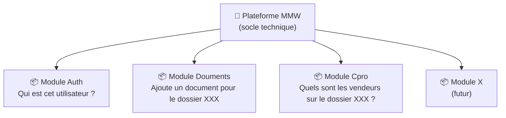

Les modules ne se connaissent pas directement ; quand ils ont besoin de communiquer, ils passent par
des **contrats** définis à l'avance (ou par des **événements** pour les processus asynchrones).  

Voici un exemple de contrat `auth`:
1. je suis capable de dire si un token donné est valide
2. je suis capable de renvoyer l'utilisateur à partir d'un token

Comme le module `CPro` a besoin de savoir si un utilisateur est authentifié, il déclare avoir besoin du contrat `auth`.  
C'est au moment du démarrage du module `Cpro` que l'orchestrateur (la plateforme par défaut mais ça
peut être un test ou le `main.go`) va injecter un module qui déclare satisfaire ce contrat (injection de dépendance).

## 3. Tour des architectures

MMW n'est ni un monolithe classique ni un ensemble de microservices — c'est le meilleur des deux,
adapté à la taille et aux moyens d'une équipe de 5 à 20 développeurs.

### 3.1 Monolithe classique

Tout dans une seule application, une seule base de code, un seul serveur HTTP ; c'est [le CostesPro actuel](/media/mmw-software-architecture/graph-cpro.svg).

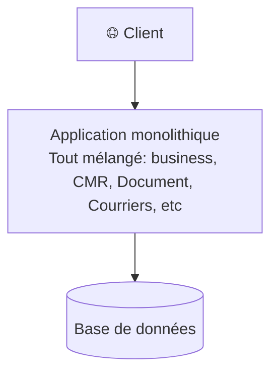

| ✅ Avantages | ❌ Inconvénients |
|-------------|----------------|
| Simple à démarrer | Tout est couplé, **les codes métiers** se mélangent entre eux et parfois aussi au code technique |
| Facile à déployer | De plus en plus difficile à modifier sans effet de bord ou sans risquer de tout casser |
| — | Tests difficiles |

### 3.2 Monolithe modulaire classique

Code organisé en modules dans le même processus mais sans isolation forte entre les modules.

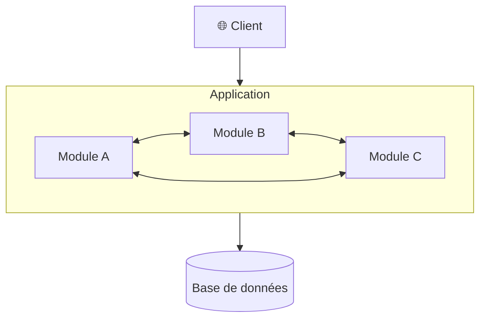

| ✅ Avantages | ❌ Inconvénients |
|-------------|----------------|
| Meilleure organisation | Les frontières s'érodent avec le temps |
| Un seul déploiement | Les modules finissent par dépendre les uns des autres (couplage) |
| — | Pas d'isolation réelle |

### 3.3 Microservices

Chaque domaine est un service indépendant déployé séparément ; cas de [CMailing](/media/mmw-software-architecture/graph-cmailing.svg), de [CSiteV3](/media/mmw-software-architecture/graph-csitev3.svg), [CSiteV4](/media/mmw-software-architecture/graph-csitev4.svg) de [MyRC](/media/mmw-software-architecture/graph-myrc.svg), de la `DataRoom` et de `Clog`.

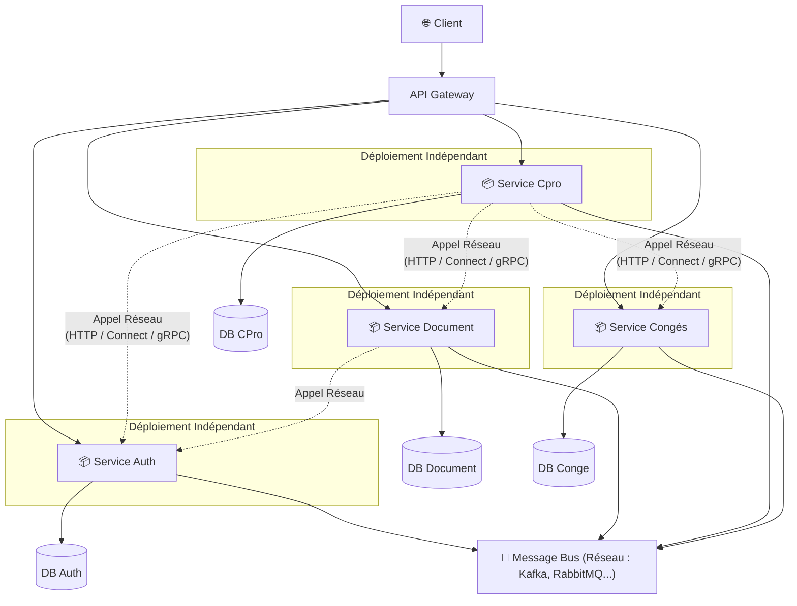

| ✅ Avantages                       | ❌ Inconvénients                             |
|------------------------------------|----------------------------------------------|
| Isolation maximale                 | Complexité opérationnelle massive            |
| Scalabilité indépendante           | Transactions distribuées difficiles          |
| Technologies hétérogènes possibles | Latence réseau entre services                |
| —                                  | Coût disproportionné pour une équipe moyenne |

### 3.4 Monolithe Modulaire Workspace (MMW)

Modules fortement isolés **dans un seul processus** grâce à la notion de **Go Workspace** ; le meilleur des deux mondes.


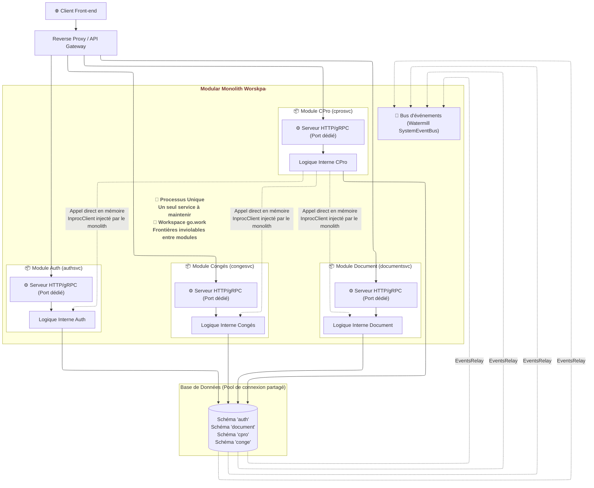


```txt
=========================================================================================
🌐 CLIENT FRONT-END / API GATEWAY
=========================================================================================
          |                              |                              |
      (Requêtes HTTP/Connect vers les différents ports ou chemins)
          |                              |                              |
          v                              v                              v
+---------------------------------------------------------------------------------------+
| 📦 MONOLITHE (Un seul processus Go - cmd/mmw/main.go et le work.go)                   |
| 🚀 PLATFORM RUNNER (errgroup) : Coordonne le démarrage et l'arrêt de tous les         |
|                                 serveurs HTTP et Relays en même temps.                |
|                                                                                       |
|   +---------------------+    +---------------------+    +---------------------+       |
|   |     Module AUTH     |    |     Module CPRO     |    |      Module DOC     |       |
|   |---------------------|    |---------------------|    |---------------------|       |
|   | 🟢 Serveur HTTP     |    | 🟢 Serveur HTTP     |    | 🟢 Serveur HTTP     |       |
|   |                     |    |                     |    |                     |       |
|   | 🧠 Logique (DDD)    |<---|-🔌 InprocClient     |    | 🧠 Logique (DDD)    |       |
|   |                     |    |    InprocClient -🔌-|--->|                     |       |
|   |                     |    | 🧠 Logique (DDD)    |    |                     |       |
|   |                     |    |                     |    |                     |       |
|   | 🔄 Outbox Relay     |    | 🔄 Outbox Relay     |    | 🔄 Outbox Relay     |       |
|   +---------+-----------+    +---------+-----------+    +---------+-----------+       |
|             |                          |                          |                   |
|             v                          v                          v                   |
|  ===================================================================================  |
|                      🚌 Bus d'Événements (Watermill SystemEventBus)                   |
|  ===================================================================================  |
|                                                                                       |
+-------------+--------------------------+--------------------------+-------------------+
              |                          |                          |
    (Connexions SQL distinctes mais issues du même pool pgxpool partagé)
              |                          |                          |
              v                          v                          v
+---------------------------------------------------------------------------------------+
| 🐘 BASE DE DONNÉES POSTGRESQL (Un seul serveur / Une seule DB)                        |
|                                                                                       |
|   [ Schéma 'auth' ]          [ Schéma 'cpro' ]          [ Schéma 'doc' ]              |
|   - auth.users               - cpro.dossiers            - doc.fichiers                |
|   - auth.event (outbox)      - cpro.event (outbox)      - doc.event (outbox)          |
+---------------------------------------------------------------------------------------+
```


| ✅ Avantages | ❌ Inconvénients |
|-------------|----------------|
| Isolation forte entre modules | Scalabilité par module impossible (initialement) |
| Simplicité du monolithe (1 déploiement) | — |
| Communication interne sans réseau | — |
| Extractible en microservice si besoin | — |

## 4. Les principes fondateurs

Trois principes structurent toute l'architecture. Ensemble, ils font que le code reste sain, testable et évolutif sur le long terme.

### 4.1 Domain-Driven Design (DDD)

> **Le code parle le même langage que le métier.**

Dans une application classique, la logique métier se noie dans des contrôleurs qui mélangent validation, SQL, règles de gestion et réponses HTTP. Au bout de quelques années, plus personne ne sait où vivent les règles.

Avec DDD, un `User`, une `Todo`, une `Session` sont des objets qui *ont du comportement*. Les règles métier vivent dans le domaine : si "on ne peut pas assigner une tâche à un utilisateur supprimé", cette contrainte est dans le code de l'objet `Todo`, pas dans un `IF` au fond d'un contrôleur.

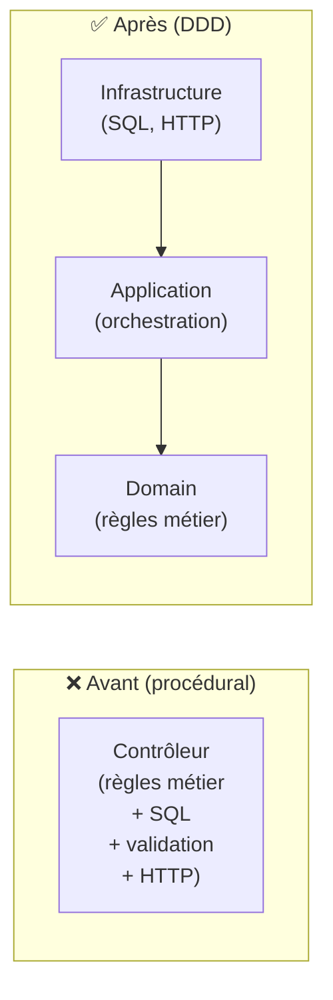

### 4.2 Clean Architecture (Architecture Hexagonale)

> **Le métier ne connaît pas la base de données.**

Le code qui décrit ce que fait l'entreprise est totalement indépendant de PostgreSQL, de ConnectRPC, de la configuration. On peut changer de base de données ou de protocole réseau sans toucher à une seule ligne de logique métier. Les dépendances vont toujours **vers l'intérieur**.

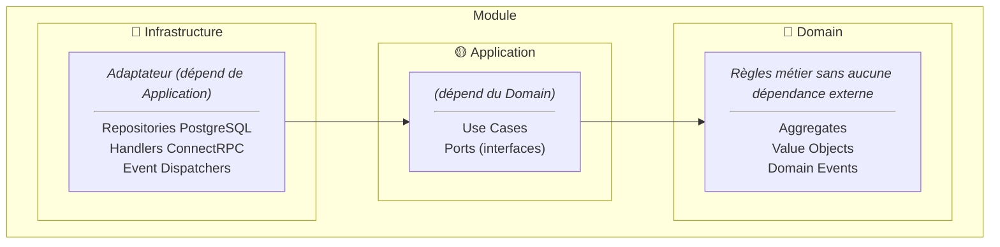


### 4.3 Event-Driven & Transactional Outbox

> **Les modules ne s'appellent pas directement pour les actions secondaires.**

Ce canal de communication est réservé aux actions qui ne font pas partie du cœur du métier — des effets de bord qui ne doivent pas bloquer l'opération principale si quelque chose se passe mal.

**Exemple :** quand un utilisateur s'inscrit, l'envoi de l'email de bienvenue ne doit pas faire échouer l'inscription si le service mail est indisponible. On publie un événement `UserRegistered`, le module Notifications l'écoute et envoie l'email de façon asynchrone — sans jamais bloquer l'utilisateur.

**Exemple concret du projet :** quand Auth supprime un utilisateur (`UserDeleted`), le module Todo supprime ses tâches de façon autonome, sans qu'Auth ait à le savoir ou à l'appeler directement.

L'**outbox** garantit qu'un événement ne peut jamais être perdu : l'événement est écrit en base de données dans la *même* transaction que l'opération métier. Même si le système tombe juste après le `COMMIT`, l'événement sera relu et republié au redémarrage.

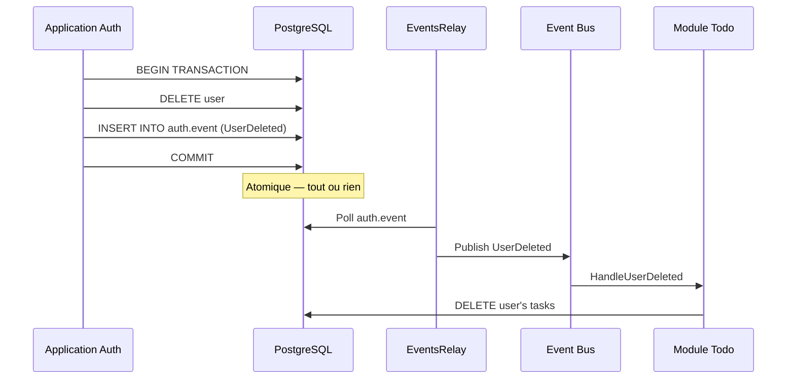

## 5. Zoom sur les composants clés

Chaque composant a une responsabilité unique et claire. Ensemble ils forment un système cohérent.

### 5.1 Structure d'un module

Chaque module suit le même squelette, sans exception. Le point d'entrée (`auth.go`) est la seule couche visible de l'extérieur — il câble les dépendances et démarre le module. Tout le reste est dans `internal/`.

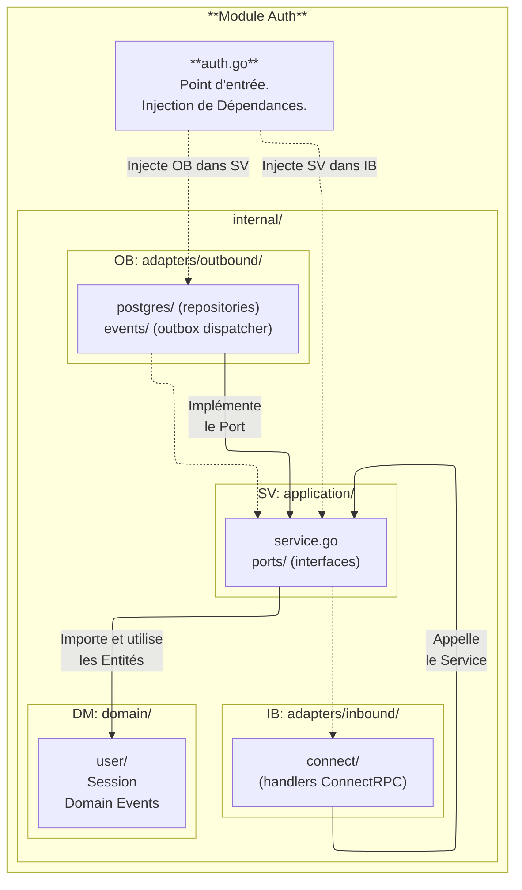

Le câblage complet du module Auth tient en une vingtaine de lignes dans `auth.go` :

```go
// modules/auth/auth.go
func New(infra Infrastructure) (*Module, error) {
    uow        := ogluow.New(infra.DBPool)
    userRepo   := postgres.NewUserRepository(uow)
    sessionRepo:= postgres.NewSessionRepository(uow)
    dispatcher := outboxevents.NewOutboxDispatcher(uow)

    authService := application.NewAuthService(userRepo, sessionRepo, uow, dispatcher, cfg.JWT.Secret)
    authHandler := connect.NewAuthHandler(authService)
    // ...
}
```

Chaque dépendance est injectée explicitement. Aucun registre global, aucun singleton.

### 5.2 Contrats Protobuf — source unique de vérité

Les modules ne partagent jamais leurs types internes. Tout ce qui traverse une frontière de module passe par un **contrat** défini en Protobuf.

La chaîne complète, du `.proto` au composant Angular :

```
.proto (source unique)
    → buf generate
        → gen/go/   (structs Go + interface serveur ConnectRPC)  → Module Go (handler)
        → gen/ts/   (types TS + descripteur service ConnectRPC)  → Angular (createClient)
```

**Étape 1 — La définition `.proto` : les routes et les types en un seul endroit**

Le fichier `.proto` est la seule source de vérité pour l'API du module. Il déclare les routes (méthodes RPC) et les structures de données (messages). Le développeur frontend n'a jamais à écrire une URL, un type de requête ou un type de réponse à la main.

```proto
// contracts/proto/todo/v1/todo.proto
service TodoService {
  rpc CreateTodo(CreateTodoRequest) returns (CreateTodoResponse);
  rpc GetTodo   (GetTodoRequest)    returns (GetTodoResponse);
  rpc UpdateTodo(UpdateTodoRequest) returns (UpdateTodoResponse);
  rpc ListTodos (ListTodosRequest)  returns (ListTodosResponse);
  rpc DeleteTodo(DeleteTodoRequest) returns (DeleteTodoResponse);
}

message CreateTodoRequest {
  string title       = 1;
  string description = 2;
  Priority priority  = 3;
}

message Todo {
  string     id          = 1;
  string     title       = 2;
  TaskStatus status      = 3;
  Priority   priority    = 4;
}

enum Priority   { UNSPECIFIED = 0; LOW = 1; MEDIUM = 2; HIGH = 3; URGENT = 4; }
enum TaskStatus { PENDING = 1; IN_PROGRESS = 2; COMPLETED = 3; CANCELLED = 4; }
```

**Étape 2 — `mise buf:generate` : génération simultanée Go et TypeScript**

Une seule commande lit `buf.gen.yaml` et génère les deux cibles en parallèle :

```yaml
# contracts/buf.gen.yaml
plugins:
  - remote: buf.build/protocolbuffers/go   # structs Go
    out: gen/go
  - remote: buf.build/connectrpc/go        # interface serveur + handler HTTP Go
    out: gen/go
  - remote: buf.build/bufbuild/es          # types TypeScript (Protobuf-ES)
    out: gen/ts
    opt: [target=ts, import_extension=none]
  - remote: buf.build/connectrpc/es        # descripteur service TypeScript
    out: gen/ts
    opt: [target=ts, import_extension=none]
```

Ce qui est généré pour le module Todo :

```
gen/go/todo/v1/
    todo.pb.go              ← structs Go (Todo, CreateTodoRequest, Priority…)
    todov1connect/
        todo.connect.go     ← interface TodoServiceHandler (serveur) + client Go

gen/ts/todo/v1/
    todo_pb.ts              ← types TS, enums, schémas (Todo, CreateTodoRequest, Priority…)
    todo_connect.ts         ← descripteur TodoService (utilisé par createClient)
```

**Étape 3 — Côté serveur Go : implémenter l'interface générée**

Le module Todo n'écrit pas son handler HTTP à la main. Il implémente l'interface `TodoServiceHandler` générée :

```go
// gen/go/todo/v1/todov1connect/todo.connect.go (généré — ne pas modifier)
type TodoServiceHandler interface {
    CreateTodo(context.Context, *connect.Request[todov1.CreateTodoRequest]) (*connect.Response[todov1.CreateTodoResponse], error)
    GetTodo   (context.Context, *connect.Request[todov1.GetTodoRequest])    (*connect.Response[todov1.GetTodoResponse], error)
    ListTodos (context.Context, *connect.Request[todov1.ListTodosRequest])  (*connect.Response[todov1.ListTodosResponse], error)
    // ...
}
```

```go
// modules/todo/internal/adapters/inbound/connect/todo_handler.go
type TodoHandler struct{ service application.TodoService }

func (h *TodoHandler) CreateTodo(
    ctx context.Context,
    req *connect.Request[todov1.CreateTodoRequest],
) (*connect.Response[todov1.CreateTodoResponse], error) {
    todo, err := h.service.Create(ctx, req.Msg.Title, req.Msg.Description)
    if err != nil {
        return nil, connectErrorFrom(err)  // voir §5.6
    }

    return connect.NewResponse(&todov1.CreateTodoResponse{Todo: todo}), nil
}
```

Le module s'enregistre sur le mux HTTP via le path généré — aucune URL à écrire :

```go
// modules/todo/todo.go
path, handler := todov1connect.NewTodoServiceHandler(todoHandler)
// path == "/todo.v1.TodoService/"  ← dérivé du nom de package proto
mux.Handle(path, handler)
```

Les types Go sont exposés via des **alias** dans `contracts/definitions/` pour préserver l'interface `proto.Message` et éviter toute redéfinition :

```go
// contracts/definitions/auth/contract.go
import authv1 "github.com/pivaldi/mmw-contracts/gen/go/auth/v1"

type User = authv1.User  // alias — pas une redéfinition
```

**Étape 4 — Côté client TypeScript : `createClient` depuis les fichiers générés**

Le frontend ne connaît pas les URLs, pas les formats JSON, pas les types de requêtes.  
Il importe les fichiers générés et crée un client typé en trois lignes sans avoir à définir les objets en entrée et en sortie :

```typescript
// src/app/services/todo.service.ts
import { createClient }              from '@connectrpc/connect';
import { createConnectTransport }   from '@connectrpc/connect-web';
import { TodoService }              from '@contracts/todo/v1/todo_pb';
// TodoService est le descripteur généré par buf — il contient les routes et les types

const transport = createConnectTransport({ baseUrl: environment.apiUrl });
const client    = createClient(TodoService, transport);
// client est maintenant un objet avec une méthode typée par RPC :
// client.createTodo(…)…, client.getTodo(…)…, client.listTodos(…)…
```

Chaque appel est une promesse fortement typée — l'IDE connaît le type de la requête et de la réponse :

```typescript
@Injectable({ providedIn: 'root' })
export class TodoService {
  // Les types CreateTodoRequest et Todo viennent de todo_pb.ts (généré)
  createTodo(req: CreateTodoRequest): Observable<Todo> {
    return from(client.createTodo(req)).pipe(map(res => res.todo!));
  }

  listTodos(req?: ListTodosRequest): Observable<ListTodosResponse> {
    return from(client.listTodos(req ?? {}));
  }

  completeTodo(id: string): Observable<Todo> {
    return from(client.completeTodo({ id })).pipe(map(res => res.todo!));
  }
}
```

Les **intercepteurs Connect** permettent d'injecter le token d'authentification et de gérer les erreurs réseau de façon centralisée, sans polluer chaque appel :

```typescript
const transport = createConnectTransport({
  baseUrl: environment.apiUrl,
  interceptors: [
    (next) => async (req) => {
      // Injecter le token sur chaque requête sortante
      const token = localStorage.getItem('auth_token');
      if (token) req.header.set('Authorization', `Bearer ${token}`);

      try {
        return await next(req);
      } catch (err) {
        // Rediriger vers /login si le serveur répond 401
        if (err instanceof ConnectError && err.code === Code.Unauthenticated) {
          localStorage.removeItem('auth_token');
          window.location.href = '/login';
        }
        throw err;
      }
    },
  ],
});
```

**Ce que cela garantit**

Si un champ change dans le `.proto` ou qu'une méthode est renommée, la compilation échoue des deux côtés, Go **et** TypeScript, avant que le code ne tourne. L'équipe frontend détecte immédiatement toute rupture de contrat, sans attendre l'exécution ni consulter une documentation externe.

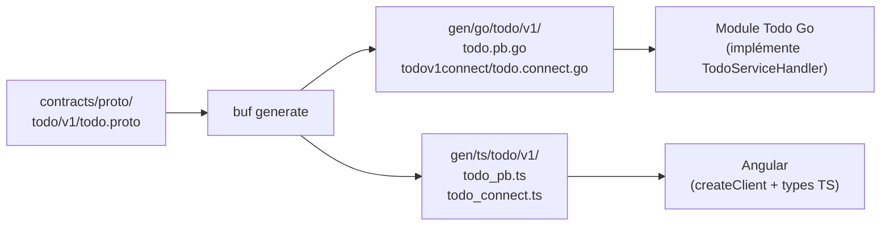

**Il en va de même pour la gestion des erreurs du domaine au niveau du client TypeScript.**

Les erreurs traversent trois couches sans jamais dévier d'une couche à l'autre avant d'arriver au client TypeScript.

```
Sentinel domain → DomainErrorFor (application) → connectErrorFrom (adapter) → Client TypeScript
```

**Couche 1 — Sentinelles dans le domaine**

Le domaine ne connaît ni ConnectRPC ni les contrats protobuf. Il déclare de simples variables d'erreur :

```go
// modules/todo/internal/domain/errors.go
var ErrInvalidTitle = errors.New("invalid title")
var ErrTodoNotFound = errors.New("todo not found")
```

**Couche 2 — `DomainErrorFor` dans la couche application**

Avant de retourner, le service appelle `DomainErrorFor` qui traduit chaque sentinelle en `*platform.DomainError`. Ce type est fourni par `platform` — c'est le **type frontière** partagé entre la couche application et les adaptateurs entrants de tous les modules.

```go
// libs/platform/errors.go
type DomainError struct {
    Code    ErrorCode // valeur numérique issue de l'enum proto
    Message string
}
```

Les codes numériques viennent de l'enum `TodoErrorCode` défini en protobuf et exposés comme constantes dans `contracts/definitions/todo`. **Le client TypeScript utilise le même enum généré depuis le même `.proto`**.

**Couche 3 — `connectErrorFrom` dans l'adaptateur Connect**

L'adaptateur de conversion de type (type-switch) de `*platform.DomainError`, consulte une table `domainConnectCodeMap` pour obtenir le statut Connect (`InvalidArgument`, `NotFound`, `FailedPrecondition`…), puis attache un détail proto `commonv1.DomainError{code, message}` :

```go
// TypeScript côté client
const details = err.findDetails(DomainError);
// details[0].code === TodoErrorCode.TODO_ERROR_CODE_INVALID_TITLE
```

Les erreurs inconnues (infrastructure, inattendu) deviennent `CodeInternal` sans exposer d'information interne.

### 5.3 Unit of Work — transactions et propagation de contexte

Le `UnitOfWork` garantit le **"tout ou rien"** pour un ensemble d'opérations base de données. Si la sauvegarde de l'agrégat réussit mais que l'écriture de l'événement échoue, tout est annulé.

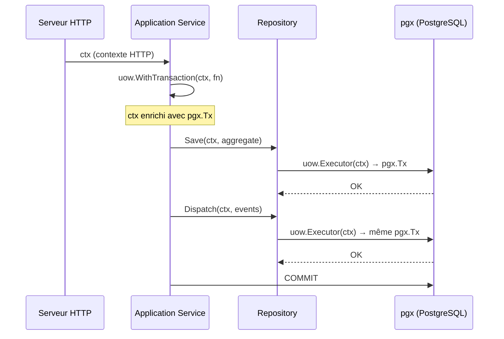

Les repositories ne reçoivent jamais le pool de connexion directement — ils accèdent à un `*UnitOfWork` et appellent `uow.Executor(ctx)`. La transaction active est extraite du contexte de façon transparente :

```go
// modules/auth/internal/adapters/outbound/persistence/postgres/user_repository.go
type UserRepository struct {
    uow *oglpguow.UnitOfWork
}

func (r *UserRepository) Save(ctx context.Context, u *user.User) error {
    exec := r.uow.Executor(ctx)  // retourne pgx.Tx si une transaction est active, sinon le pool
    _, err := exec.Exec(ctx,
        `INSERT INTO auth.users (id, login, password_hash, created_at, updated_at)
         VALUES (@id, @login, @password_hash, @created_at, @updated_at)`,
        pgx.NamedArgs(ogldb.StructArgs(u.Snapshot())),
    )
    return eris.Wrap(err, "save user")
}
```

Le `context.Context` sert à deux choses simultanément :

1. **Propager la transaction** — tous les repositories utilisent le même `pgx.Tx` sans se le passer explicitement entre eux.
2. **Annulation automatique** — si le client HTTP se déconnecte, si un timeout expire, ou si le processus reçoit `SIGTERM`, le contexte parent est annulé. Cette annulation se propage à tous les contextes dérivés, y compris la requête SQL en cours côté PostgreSQL. Pas de connexion zombie, zéro ligne de code supplémentaire.

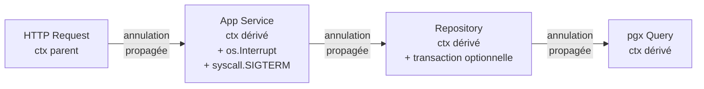

### 5.4 Outbox Pattern — événements garantis

L'événement est écrit dans une table `*.event` **dans la même transaction** que la donnée métier. Un relai (`EventsRelay`) tourne en arrière-plan, lit cette table et publie sur le bus Watermill.

Deux garanties :
- **Atomicité :** si la donnée est sauvegardée, l'événement est sauvegardé. Les deux ou aucun.
- **Durabilité :** si le relai tombe, il reprend là où il s'était arrêté au redémarrage. Aucun événement n'est perdu.

```go
// modules/auth/internal/adapters/outbound/events/outbox_dispatcher.go
func (d *OutboxDispatcher) Dispatch(ctx context.Context, events []user.DomainEvent) error {
    batch := &pgx.Batch{}
    const query = `INSERT INTO auth.event (event_type, payload, occurred_at) VALUES ($1, $2::jsonb, $3)`

    for _, evt := range events {
        payload, err := marshalEvent(evt)
        // ...
        batch.Queue(query, evt.EventType(), string(payload), evt.OccurredAt())
    }

    exec := d.uow.Executor(ctx)  // même transaction que le Save() de l'agrégat
    br := exec.SendBatch(ctx, batch)
    defer br.Close()
    // ...
}
```

### 5.5 Communication intra-processus (InProc)

Pour les appels **synchrones** entre modules (ex : le module Todo valide un JWT auprès du module Auth), les modules communiquent via une **interface contrat** — sans réseau, sans sérialisation.

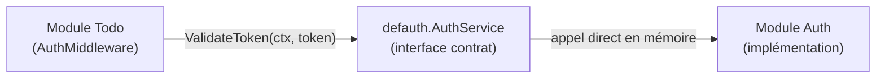

```go
// contracts/definitions/auth/contract.go
type AuthService interface {
    GetUser(ctx context.Context, id string) (*User, error)
    ValidateToken(ctx context.Context, token string) (uuid.UUID, error)
}

// InprocClient est un wrapper qui accepte n'importe quelle implémentation de `AuthService`.
type InprocClient struct{ server AuthService }

func (c *InprocClient) ValidateToken(ctx context.Context, token string) (uuid.UUID, error) {
    return c.server.ValidateToken(ctx, token)
}
```

Si demain le module Auth devient un vrai microservice, seul l'adaptateur change en remplaçant `InprocClient` par `NetworkClient`. Le code métier du module Todo ne change pas d'une ligne.

## 6. Uniformisation : tout futur projet devient un module

MMW n'est pas juste une architecture pour le *CostesPro* — c'est le **socle technique standard** de l'entreprise. Tout nouveau projet démarre comme un module, se branche sur la plateforme MMW, et bénéficie immédiatement de tout ce qu'elle fournit.

### Pour le DG

Une nouvelle fonctionnalité métier ne repart plus de zéro. L'équipe passe 100 % de son temps sur la valeur métier, pas sur la plomberie. Le temps de démarrage d'un nouveau projet est drastiquement réduit.

### Pour les devs

Un nouveau module suit toujours le même squelette. Mêmes conventions, mêmes patterns, même vocabulaire d'un projet à l'autre. L'intégration d'un nouveau développeur est accéléré, les revues de code sont plus efficaces — tout le monde parle le même langage.

### Ce que la plateforme fournit "gratuitement" à chaque module

- La librairie `pkg/platform`
  - **Serveur HTTP** : healthchecks, routes debug pprof
  - **Connect RPC** : intercepteurs d'erreurs (logging, recovery) pour les handlers HTTP/2
  - **HTTP Middlewares** : CORS, logging structuré, authentification, recovery panique
  - **Logs structurés** : `slog`, JSON en prod / couleur en dev, sans configuration
  - **Configuration générique** : TOML + surcharge par variables d'environnement
  - **DomainError** : type d'erreur métier typé + `ErrorCode` — mapping automatique vers les codes Connect RPC dans les adaptateurs
  - **Unit of Work** : transactions PostgreSQL sans fuites de session (`pgx`)
  - **StructArgs** : conversion struct → `pgx.NamedArgs` pour les requêtes nommées
  - **Outbox Relay** : publication d'événements garantie (au-moins-une-fois) via table outbox
  - **Bus d'événements** : Watermill in-memory — même API que pour un bus distribué
  - **Système de migrations DB** : Goose patché, embarqué dans le binaire du module
  - **SafeGo** : goroutines sans fuite — panic capturée, loguée, propagée proprement
  - **Platform Runner** : coordination `errgroup` de tous les serveurs et workers du processus
  - **Interface Module** (`pfcore.Module`) : contrat standard pour brancher un module sur le runner
  - **Génération des contrats** : Protobuf → Go + TypeScript via `buf`

- La librairie `pkg/archtest` — Validation architecturale automatisée
  - **Contract Purity** : le package `contracts/` n'importe jamais un module
  - **Lib Independence** : les `libs/` n'importent ni module ni `mmw`
  - **Module Isolation** : les modules ne s'importent pas directement entre eux
  - **Module Interface** : un module n'expose que son interface contractuelle définie
  - **Domain Purity** : `internal/domain/` n'importe jamais `contracts/`
  - **Application Purity** : `internal/application/` n'importe jamais `contracts/`

- La librairie `pkg/scaffold` — Génération de module
  - **`GenerateModule`** : squelette complet du module (21 fichiers) — domaine, application, infra, connect, cmd, tests, mise.toml, arch-go, go.mod, …
  - **`GenerateContract`** : squelette `contracts/definitions/<name>/` + proto + buf.gen
  - **`UpdateGoWork`** : enregistrement idempotent du nouveau module dans `go.work`
  - **`UpdateMiseToml`** : ajout automatique des tâches `test`, `test:integration`, `test:contract` dans le mise.toml racine

- Interface de Ligne de Commandes : *CLI* `mmw`
  - **`mmw new module`** : assistant interactif — nom, exposition Connect RPC, contrat inproc, accès base de données
  - **`mmw new contract`** : génère la définition de contrat associée
  - **`mmw check arch`** : valide les frontières architecturales de tous les modules
  - **Synthèse de couverture de test** : rapport de couverture agrégé multi-modules

**Migrations centralisées :** chaque module déclare ses migrations en quelques lignes de code — le socle s'occupe de l'exécution, du versionnement et du rollback (Up/Down). Pas d'outil externe à configurer, pas de script à maintenir séparément.

### Chemin d'évolution

Si un module atteint une taille critique ou nécessite une scalabilité indépendante, il peut être extrait en microservice autonome. Le contrat Protobuf est déjà défini. L'adaptateur réseau remplace l'adaptateur inproc — le code métier du module ne change pas.

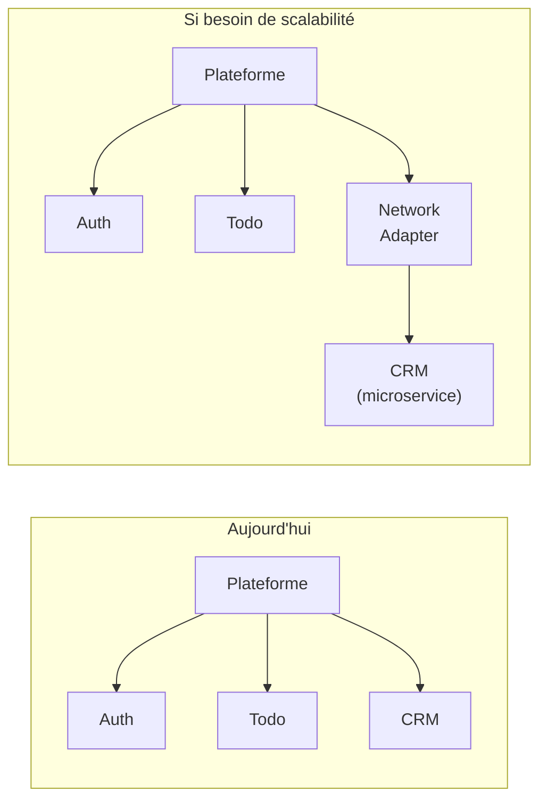

## 7. Stratégie de migration CostesPro

### Pas de réécriture d'un coup

Le monolithe modulaire permet une migration **domaine par domaine**. Chaque domaine métier du CRM (clients, devis, facturation, planning…) devient un module indépendant, développé et livré l'un après l'autre. À aucun moment il n'est nécessaire de tout arrêter pour tout basculer.

### Strangler Fig Pattern

L'ancien système PHP et les nouveaux modules Go coexistent pendant toute la transition. Un routeur redirige progressivement le trafic vers les modules Go au fur et à mesure qu'ils sont prêts. L'ancien système "s'étrangle" naturellement jusqu'à sa mise hors service.

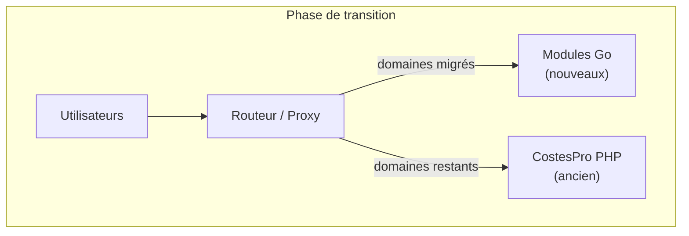

### Stratégie base de données

- Un schéma PostgreSQL dédié **`cpro`** est créé pour CostesPro. La structure existante est réécrite proprement : noms de tables normalisés, colonnes typées, contraintes d'intégrité.
- Pendant toute la durée de la migration, une **synchronisation bi-directionnelle** entre le schéma PHP existant et le nouveau schéma `cpro` garantit que les deux systèmes voient les mêmes données en temps réel.
- Les équipes peuvent basculer module par module sans couper le service ni forcer une migration simultanée de tous les utilisateurs.

### Priorité de migration

Deux approches possibles, non exclusives :
- **Par la douleur :** commencer par les domaines les plus difficiles à maintenir ou qui bloquent le plus l'évolution — l'impact est immédiat.
- **Par la simplicité :** commencer par un domaine moins complexe pour que l'équipe prenne en main l'architecture avant d'attaquer les modules les plus critiques.

### Les services Go existants

Les services Go actuels, qui ont chacun leur propre architecture, peuvent être progressivement adaptés en modules MMW : on remplace leur infrastructure ad hoc par le socle commun, sans réécrire la logique métier.

## 8. Stratégie de tests

L'architecture hexagonale n'est pas qu'une organisation du code — elle rend les tests naturels. Chaque couche a une frontière claire, ce qui détermine exactement comment et à quel coût la tester.

### La pyramide

```
         /\      Tests système — une seule suite au niveau du monolithe
        /  \     (binaire in-process, postgres via Docker,
       /    \     authentification réelle, scénarios cross-modules)
      /______\
     /        \   Tests de contrat — par module, rapides, sans infra
    /__________\
   /            \  Tests d'intégration — par module, Docker,
  /______________\  adaptateurs uniquement (//go:build integration)
 /                \
/__________________\ Tests unitaires & applicatifs — par module, tout en mémoire
```

Plus on monte, plus les tests sont lents, coûteux à maintenir et rares. La base doit être large et rapide — c'est là que la confiance se construit.

### Niveau 1 — Tests unitaires & applicatifs

**Ce qu'ils testent :** le domaine (`domain/`) et la couche application (`application/`) — les règles métier, les cas nominaux, les cas d'erreur.

**Pourquoi c'est facile :** l'architecture hexagonale interdit toute dépendance vers l'infrastructure dans le domaine et l'application. Il n'y a pas de base de données à simuler, pas de serveur HTTP à démarrer — tout est câblé avec des fakes en mémoire.

```go
// modules/todo/internal/testhelpers/fakes.go
// InMemoryTodoRepo, PassthroughUoW, NoopEventDispatcher
// → câblent un vrai TodoApplicationService sans aucune infrastructure

func NewTestService(t *testing.T) (application.TodoService, *InMemoryTodoRepo) {
    repo := NewInMemoryTodoRepo()
    svc  := application.NewTodoApplicationService(repo, PassthroughUoW{}, NoopEventDispatcher{})
    return svc, repo
}
```

Les handlers Connect sont aussi testés à ce niveau : `newTestHandler(t)` câble un vrai service applicatif via les fakes — le domaine s'exécute réellement, pas un mock. Un bug dans le mapping proto ↔ domaine est détecté ici, pas en production.

**Exécution :** `go test ./...` — aucun Docker, aucun réseau. Quelques millisecondes par suite.

### Niveau 2 — Tests d'intégration

**Ce qu'ils testent :** les adaptateurs outbound — les repositories PostgreSQL, l'outbox dispatcher — contre une vraie base de données.

**Séparation par build tag :**

```go
//go:build integration

// libs/mmw/pkg/platform/pg/uow/uow_integration_test.go
```

La règle est stricte : seul le code qui touche réellement l'infrastructure porte ce tag. Le reste du projet ne sait pas que Docker existe.

```bash
go test ./...                           # unitaires + applicatifs uniquement
go test -tags integration ./...         # ajoute les tests d'adaptateurs
go test -tags integration -short ./...  # intégration sans Docker (CI léger)
```

### Niveau 3 — Tests de contrat

**Ce qu'ils testent :** l'adaptateur inproc (`inproc.Adapter`) qui expose le module aux autres modules du monolithe. Ce que le compilateur ne peut pas vérifier : les valeurs correctes des enums proto, la traduction des erreurs domaine en codes de retour, la cohérence du mapping proto ↔ domaine sur l'ensemble des opérations.

**Sans build tag** — ces tests sont aussi rapides que les tests unitaires. Ils tournent avec `go test ./...`.

```go
// modules/todo/test/contract/contract_test.go

func TestContract_StatusMapping(t *testing.T) {
    // Vérifie que les 4 valeurs de TaskStatus traversent l'adaptateur sans perte
    // PENDING, IN_PROGRESS, COMPLETED, CANCELLED → chacune testée
}

func TestContract_ErrorPropagation(t *testing.T) {
    // Vérifie que domain.ErrTodoNotFound sort bien comme ErrorCodeNotFound
    // à travers la chaîne : domain → DomainErrorFor → inproc.Adapter
}
```

L'assertion à la compilation `var _ deftodo.TodoService = (*inproc.Adapter)(nil)` garantit la signature. Les tests de contrat garantissent le comportement.

### Niveau 4 — Tests système

**Ce qu'ils testent :** le monolithe entier — modules auth + todo câblés en mémoire exactement comme dans `main.go`, contre une vraie base PostgreSQL, avec des vrais tokens JWT.

**Pas de stubs** : le test s'enregistre via l'API HTTP d'Auth, reçoit un vrai JWT, puis l'utilise pour toutes les opérations Todo. Si le middleware JWT est cassé, le test système le détecte — pas un test unitaire avec un token inventé.

```go
//go:build system

// test/system/todo_flow_test.go
func TestMain(m *testing.M) {
    // 1. Démarre postgres via testcontainers
    // 2. Exécute auth.Migrate() et todo.Migrate()
    // 3. Câble les modules : auth.New(...) + todo.New(...)
    // 4. Enveloppe chaque module dans httptest.NewServer
    // 5. Lance les tests
}

func TestSystem_TodoCRUDFlow(t *testing.T) {
    // register → login → createTodo → getTodo → updateTodo
    //         → completeTodo → reopenTodo → deleteTodo
}

func TestSystem_TodoScopedToUser(t *testing.T) {
    // Deux utilisateurs : chacun ne voit que ses propres todos
}
```

**Exécution :**
```bash
go test -tags system -v -timeout 180s ./test/system/...
```

### Pourquoi pas de tests E2E par module ?

Dans un monolithe modulaire, tester un module seul avec un stub JWT créerait un doublon des tests système, avec une couche de mock à maintenir.  
La frontière naturelle du système est le binaire complet — c'est là que les vrais tests de bout en bout ont leur place.  
Chaque module gagne en confiance via ses contrats (niveau 3) et par les tests système partagés (niveau 4).

### Lancer les tests

```bash
# Tous les tests rapides (unitaires + applicatifs + contrats)
mise run test

# Tests d'intégration (requiert Docker)
mise run test:integration

# Tests de contrat uniquement
mise run test:contract

# Tests système (requiert Docker)
mise run test:system

# Tout
mise run test:all
```

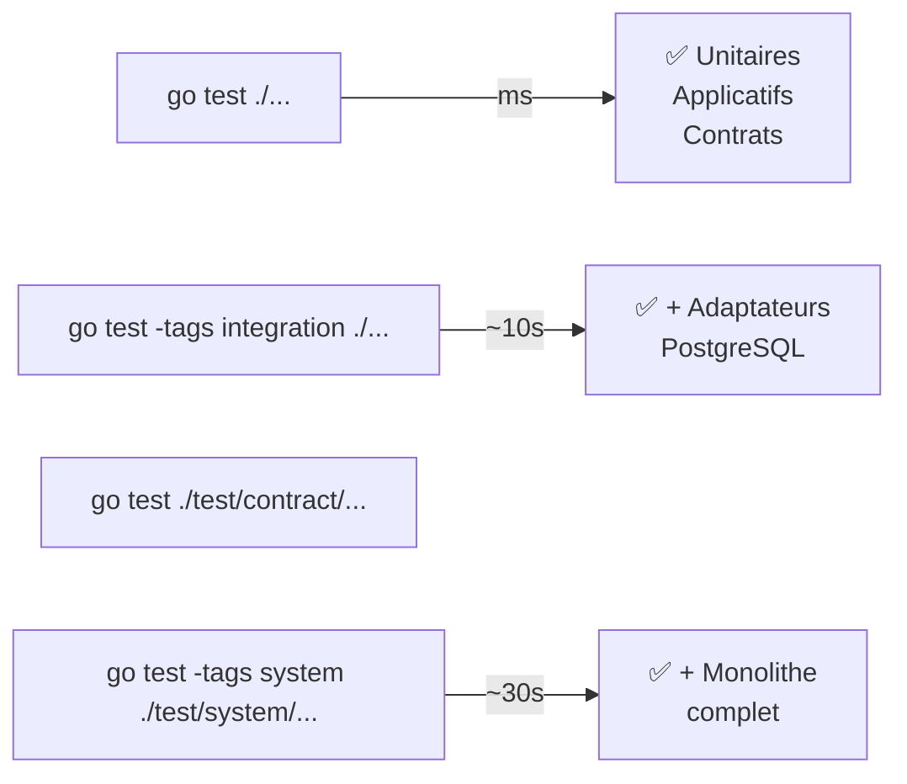

## 9. Évolutions planifiées

La plateforme est conçue par couches livrables indépendantes.  
La couche 1 (scaffolding & standardisation) est opérationnelle.  
Les trois couches suivantes sont conçues et documentées, prêtes à être implémentées après discutions avec l'équipe.8

### Couche 2 — Gestion des secrets

**Problème actuel :** les secrets (mots de passe DB, clés JWT…) sont écrits en clair dans `mise.toml` et commités dans git.

**Solution : SOPS + age.** Les secrets sont des fichiers TOML chiffrés commités dans git. La clé privée `age` ne vit que sur les serveurs de déploiement. Aucun serveur de secrets à opérer.

```
configs/
├── default.toml              # config non-sensible (en clair)
└── secrets/
    ├── development.enc.toml  # chiffré avec age (commité)
    └── production.enc.toml   # chiffré avec age (commité)
```

Le binaire déchiffre ses propres secrets au démarrage via `telemetry.LoadSecrets(ctx, env)` — aucun outil externe dans le processus de démarrage. Un hook pre-commit `gitleaks` empêche de commiter un secret en clair par accident.

---

### Couche 3 — Observabilité complète

**Stack cible :**

| Composant | Rôle | Statut |
|-----------|------|--------|
| Prometheus | Métriques | déjà en place |
| Grafana | Visualisation | déjà en place |
| **Loki** | Agrégation de logs | à déployer |
| **Tempo** | Traces distribuées | à déployer |
| **OTel Collector** | Réception + routage depuis l'app | à déployer |

L'intégration dans `pkg/platform` se résume à trois fichiers :

```
pkg/platform/telemetry/
├── provider.go   # initialise TracerProvider + MeterProvider OTel
├── middleware.go # auto-instrumente les handlers Connect (traces + métriques HTTP)
└── slog.go       # bridge slog → OTel logs (corrèle logs avec trace_id)
```

```go
// main.go — une seule ligne d'initialisation
shutdown, err := telemetry.Init(ctx, telemetry.Config{
    ServiceName:  "mmw",
    OTelEndpoint: cfg.OTelEndpoint,
})
defer shutdown(ctx)
```

Les modules héritent du provider via le `context` — **aucune modification dans les modules existants ou futurs**. Les queries SQL (`pgx`), les transactions (Unit of Work) et les batchs outbox apparaissent automatiquement comme spans fils de chaque requête.

**Ce qui devient visible sans rien changer dans les modules :**

| Signal | Outil | Contenu |
|--------|-------|---------|
| Traces | Tempo | Chaque requête Connect RPC, durée, statut, spans SQL |
| Métriques | Prometheus | Latence P50/P95/P99, taux d'erreur, requêtes en vol |
| Logs | Loki | Tous les `slog.*` avec `trace_id` pour corrélation |

---

### Couche 4 — Alerting & tickets automatiques

**Objectif :** transformer une alerte Grafana en ticket dans Plane (remplacement open-source d'auto-hébergement de Redmine).

**Flux :**

```
App Go (OTel)
    ↓ traces + métriques + logs
OTel Collector → Prometheus + Loki + Tempo
    ↓
Grafana Alerting  ← règles sur métriques et patterns de logs
    ↓ webhook HTTP
cmd/mmw-webhook/  ← ~100 lignes Go dans le repo
    ↓ API REST Plane
Ticket créé automatiquement dans Plane
```

`mmw-webhook` est un petit binaire HTTP dans le repo — pas de service externe. Il reçoit les notifications Grafana et crée des issues Plane via son API REST.

**Résultat :** une erreur applicative génère automatiquement un ticket, avec le lien vers la trace Tempo et les logs Loki correspondants. Le développeur clique, il voit exactement ce qui s'est passé.
