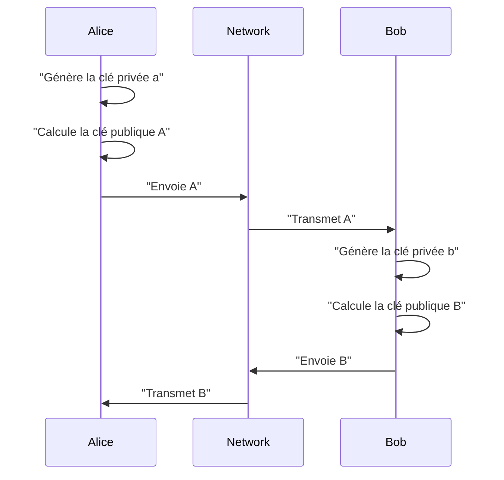
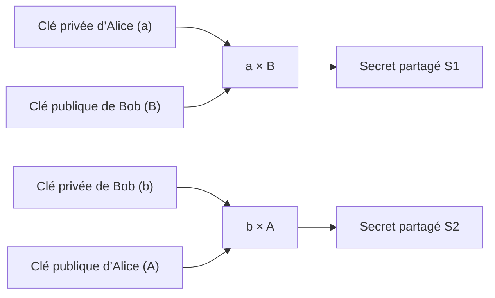
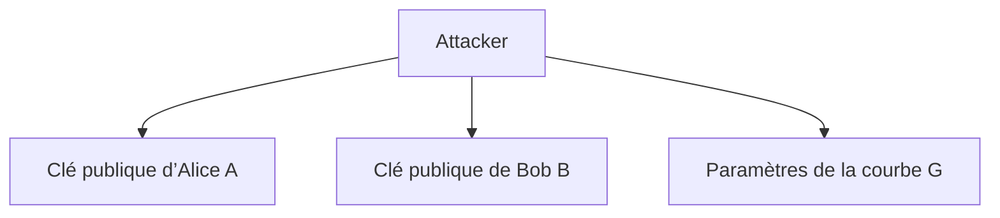
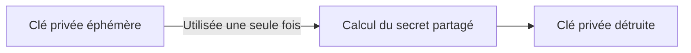
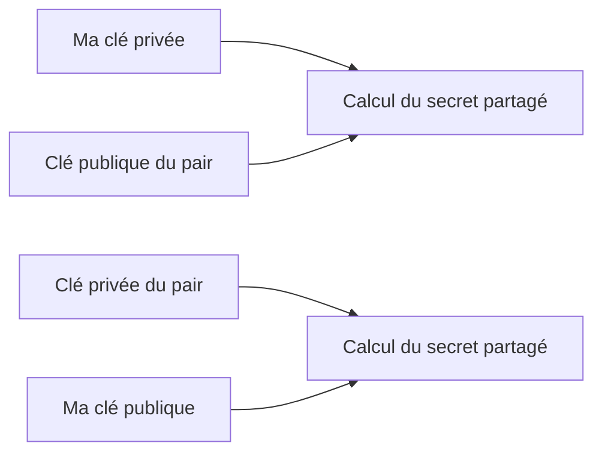
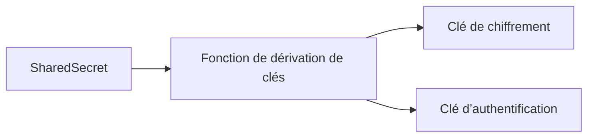
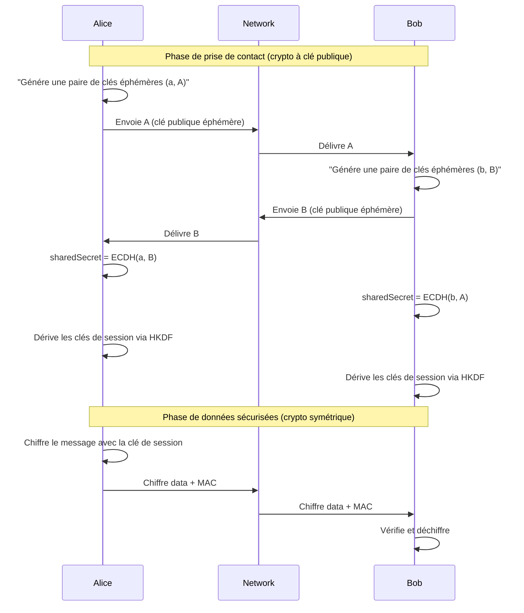

[This article is available in english](/en/the-basis-of-diffie-hellman-key-exchange).

La communication sécurisée moderne repose sur une idée d’une simplicité trompeuse : deux parties peuvent se mettre d’accord sur un secret partagé **sans jamais transmettre ce secret**, même lorsque toute la communication a lieu sur un réseau non sécurisé.

Cet article explique les fondements de **l’échange de clés Diffie–Hellman**, en mettant l’accent sur l’intuition plutôt que sur le formalisme cryptographique. Il s’adresse aux développeurs ayant une solide base informatique et découvrant la cryptographie.

## Le problème fondamental

Alice et Bob souhaitent communiquer de manière sécurisée.

Ils font face aux contraintes suivantes :

* Le réseau est non sécurisé
* Un attaquant peut observer tout le trafic
* Alice et Bob ne se sont jamais rencontrés
* Aucun secret partagé n’existe au préalable

Et pourtant, ils souhaitent dériver une **clé de session partagée**, connue d’eux seuls.

## Informations publiques vs informations privées

Diffie–Hellman repose sur une séparation stricte entre :

* **Clés privées** — secrètes, jamais partagées
* **Clés publiques** — dérivées des clés privées et sûres à partager

Une clé publique est mathématiquement liée à sa clé privée, mais inverser cette relation est computationnellement infaisable.

## Déroulement général de Diffie–Hellman

L’intuition clé est la suivante :

> Chaque partie combine **sa propre clé privée** avec la **clé publique de l’autre partie** pour calculer le même secret.

### Flux conceptuel des messages



À ce stade :

* Alice connaît `(a, B)`
* Bob connaît `(b, A)`
* Le réseau (et tout attaquant) connaît `(A, B)`

## Dériver le même secret de manière indépendante

Voici le cœur de Diffie–Hellman.



Mathématiquement, chacun calcule le secret partagé où `G` est un point de base public de la courbe :

* Alice calcule `S₁ = a · B = a · (b · G)`
* Bob calcule `S₂ = b · A = b · (a · G)`

Comme la multiplication sur courbe elliptique est associative : `a · (b · G) = b · (a · G)` donc **`S₁ == S₂`**

Aucun secret n’a été transmis.
Le secret partagé **émerge indépendamment** des deux côtés.

## Pourquoi un attaquant est bloqué

Un attaquant voit :



Mais il lui manque :

* La clé privée d’Alice `a`
* La clé privée de Bob `b`

Sans l’une de ces clés, calculer `a × B` ou `b × A` est computationnellement infaisable.

## Clés éphémères et confidentialité persistante

Les protocoles modernes utilisent **Diffie–Hellman éphémère** (souvent appelé ECDHE).



Propriétés :

* Une nouvelle paire de clés est générée par session
* Les clés privées sont effacées après la négociation
* Les sessions passées restent sécurisées même si des clés de long terme sont compromises ultérieurement

C’est ce que l’on appelle la **confidentialité persistante** (*forward secrecy*).

Ci-dessous se trouve un **exemple Go complet et exécutable** (écrit avec les **API modernes de la bibliothèque standard** : `crypto/ecdh` + `crypto/hkdf`) qui démontre l’utilisation de **clés éphémères** et explique la **confidentialité persistante** dans le code et les commentaires.

```go
package main

import (
	"bytes"
	"crypto/ecdh"
	"crypto/hkdf"
	"crypto/rand"
	"crypto/sha256"
	"encoding/hex"
	"fmt"
)

// Démontre ECDH éphémère + clés de session dérivées via HKDF ⇒ Confidentialité persistante.
//
// Principe de la confidentialité persistante (FS) :
// - Chaque session utilise de nouvelles clés privées ECDH *éphémères* (non stockées à long terme).
// - Même si les clés de long terme sont compromises plus tard, les clés de session passées
//   ne peuvent pas être recalculées car les clés privées éphémères ont disparu.
//
// Cette démonstration N’implémente PAS l’authentification (pas de signatures/certificats).
// Elle illustre uniquement le concept d’accord de clés et de confidentialité persistante.

func main() {
	curve := ecdh.X25519()

	// Supposons qu’il s’agisse de clés d’identité de long terme (utilisées pour l’authentification
	// dans les protocoles réels).
	// Elles NE sont PAS utilisées pour dériver la clé de session dans un design à confidentialité persistante.
	aliceLongTerm, _ := curve.GenerateKey(rand.Reader)
	bobLongTerm, _ := curve.GenerateKey(rand.Reader)
	_ = aliceLongTerm
	_ = bobLongTerm

	fmt.Println("=== Session #1 (ECDH éphémère, confidentialité persistante) ===")

	// 1) Chaque côté génère une paire de clés éphémères uniquement pour cette session.
	aliceEphPriv, aliceEphPubBytes := mustGenerateEphemeral(curve)
	bobEphPriv, bobEphPubBytes := mustGenerateEphemeral(curve)

	// 2) Ils échangent les clés *publiques* via le réseau non sécurisé.
	fmt.Println("Clé publique éphémère d’Alice :", shortHex(aliceEphPubBytes))
	fmt.Println("Clé publique éphémère de Bob   :", shortHex(bobEphPubBytes))

	// 3) Chaque côté calcule le secret partagé ECDH à l’aide de sa clé privée éphémère.
	aliceSeesBobPub := mustPublicKeyFromBytes(curve, bobEphPubBytes)
	bobSeesAlicePub := mustPublicKeyFromBytes(curve, aliceEphPubBytes)

	aliceShared := mustECDH(aliceEphPriv, aliceSeesBobPub)
	bobShared := mustECDH(bobEphPriv, bobSeesAlicePub)

	// 4) Dériver une clé de session symétrique à partir du secret partagé via crypto/hkdf.
	// Dans la stdlib Go (Go 1.24+), HKDF utilise :
	//    hkdf.Key(hash, secret, salt, info string, keyLength)
	//
	// Dans les protocoles réels, "salt" et "info" sont généralement dérivés ou incluent
	// le transcript de la négociation (clés publiques, version du protocole, suite cryptographique, etc.)
	salt := []byte("demo salt (normalement dérivé du transcript ou aléatoire)")
	info := "session-1: X25519 + HKDF-SHA256"
	keyLen := 32 // par ex. 32 octets pour une clé AEAD

	aliceSessionKey := mustHKDFKey(aliceShared, salt, info, keyLen)
	bobSessionKey := mustHKDFKey(bobShared, salt, info, keyLen)

	fmt.Println("Clé de session d’Alice :", shortHex(aliceSessionKey))
	fmt.Println("Clé de session de Bob   :", shortHex(bobSessionKey))
	fmt.Println("Les clés correspondent ?", bytes.Equal(aliceSessionKey, bobSessionKey))
	fmt.Println()

	// 5) Détruire les secrets éphémères après la négociation (crucial conceptuellement pour la FS).
	// Nous pouvons au moins mettre à zéro les slices que nous contrôlons directement.
	zeroBytes(aliceShared)
	zeroBytes(bobShared)
	aliceEphPriv = nil
	bobEphPriv = nil

	fmt.Println("=== Plus tard : compromission des clés de long terme ===")
	fmt.Println("L’attaquant a enregistré les clés publiques éphémères sur le réseau,")
	fmt.Println("et vole ensuite les clés d’identité de long terme.")
	fmt.Println("Mais il est toujours incapable de reconstruire la clé de la Session #1,")
	fmt.Println("car les clés privées éphémères de la Session #1 ont disparu.")
}

func mustGenerateEphemeral(curve ecdh.Curve) (*ecdh.PrivateKey, []byte) {
	priv, err := curve.GenerateKey(rand.Reader)
	if err != nil {
		panic(err)
	}
	return priv, priv.PublicKey().Bytes()
}

func mustPublicKeyFromBytes(curve ecdh.Curve, b []byte) *ecdh.PublicKey {
	pub, err := curve.NewPublicKey(b)
	if err != nil {
		panic(err)
	}
	return pub
}

func mustECDH(priv *ecdh.PrivateKey, pub *ecdh.PublicKey) []byte {
	secret, err := priv.ECDH(pub)
	if err != nil {
		panic(err)
	}
	return secret
}

func mustHKDFKey(secret, salt []byte, info string, keyLen int) []byte {
	key, err := hkdf.Key(sha256.New, secret, salt, info, keyLen)
	if err != nil {
		panic(err)
	}
	return key
}

func zeroBytes(b []byte) {
	for i := range b {
		b[i] = 0
	}
}

func shortHex(b []byte) string {
	s := hex.EncodeToString(b)
	if len(s) > 24 {
		return s[:24] + "…"
	}
	return s
}
```

[Exécuter sur Go Playground](https://go.dev/play/p/0kS6ELs19Jm).

Ce que ce code « démontre » concernant la confidentialité persistante :

* La clé de session dépend de **clés privées éphémères** qui n’existent que pendant la négociation.
* Une compromission ultérieure des **clés de long terme** ne permet pas de retrouver les clés de session passées, car ces clés de long terme **n’étaient pas la “recette”** de la clé de session — ce sont les clés éphémères qui l’étaient.

## Pourquoi les clés publiques doivent être échangées

Une question fréquente chez les débutants est :

> « Si les clés privées sont éphémères et détruites, pourquoi conserver ou envoyer les clés publiques ? »

Parce que les clés publiques sont des **entrées nécessaires** pour dériver le secret partagé.



Sans échange de clés publiques :

* Aucun des deux côtés ne peut calculer le secret partagé
* La communication sécurisée ne peut pas commencer

Les clés publiques **ne sont pas des secrets** — elles font partie de la négociation.

## Du secret partagé aux clés de session

La sortie de Diffie–Hellman n’est généralement pas utilisée directement.



Le slice d’octets retourné par `priv.ECDH(pub)` **n’est pas encore une clé de chiffrement sûre et ne doit pas être utilisé directement dans AES, ChaCha20, etc.**
Il doit d’abord passer par une fonction de dérivation de clés (KDF).

### Incorrect : utiliser directement la sortie ECDH

```go
sharedSecret, _ := priv.ECDH(peerPub)

// FAUX : utiliser la sortie brute ECDH comme clé de chiffrement
block, err := aes.NewCipher(sharedSecret)
if err != nil {
	panic(err)
}
```

Pourquoi est-ce incorrect ?

* **Mauvaise longueur**

  * AES attend 16, 24 ou 32 octets
  * La longueur de la sortie ECDH dépend de la courbe
* **Entropie non uniforme**

  * La sortie ECDH n’est pas garantie uniformément aléatoire
  * Certains bits peuvent être biaisés ou structurés
* **Absence de liaison contextuelle**

  * Réutilisation du même secret ECDH dans différents contextes → risques de réutilisation de clés
  * Aucune séparation de protocole
* **Absence de séparation des clés**
  Plusieurs clés sont souvent nécessaires (chiffrement, MAC, etc.)

### Correct : ECDH → HKDF → clés de session

```go
sharedSecret, _ := priv.ECDH(peerPub)

// Dérivation des clés via HKDF
sessionKey, err := hkdf.Key(
	sha256.New,
	sharedSecret,
	nil,                 // salt (souvent dérivé du transcript)
	"handshake v1",      // info / contexte
	32,                  // longueur de la clé
)
if err != nil {
	panic(err)
}

// Utilisation sûre
block, err := aes.NewCipher(sessionKey)
if err != nil {
	panic(err)
}
```

Explication visuelle en code :

```go
// Diffie–Hellman fournit de la matière cryptographique brute
sharedSecret := ECDH(priv, peerPub)

// HKDF transforme cette matière brute en clés sûres et liées au contexte
encryptionKey := HKDF(sharedSecret, "encryption")
authenticationKey := HKDF(sharedSecret, "authentication")
```

### Pourquoi une KDF est-elle obligatoire (intuition développeur) ?

Considérez la sortie Diffie–Hellman comme :

> Une matière première à forte entropie, pas un produit fini

HKDF :

* extrait une entropie uniforme
* l’étend à des longueurs exactes
* la lie au contexte du protocole
* permet la séparation des clés

Exemple Go minimal et complet :

```go
sharedSecret, _ := priv.ECDH(peerPub)

// Toujours dériver les clés
encKey, _ := hkdf.Key(sha256.New, sharedSecret, nil, "enc", 32)
macKey, _ := hkdf.Key(sha256.New, sharedSecret, nil, "mac", 32)

// Utiliser les clés dérivées, pas sharedSecret
_ = encKey
_ = macKey
```


**La sortie de Diffie–Hellman est de la matière cryptographique brute et doit être passée par une [fonction de dérivation de clés](https://en.wikipedia.org/wiki/Key_derivation_function) (telle que HKDF) afin de produire des clés de session uniformément aléatoires, liées au contexte et sûres pour le protocole.**


## Vue globale



> Diffie–Hellman enables two parties to independently derive the same secret over an insecure network by combining their own private key with the other party’s public key, without ever transmitting the secret itself.

## Une démo de messagerie en Go

[pivaldi/twoway-messaging-demo](https://github.com/pivaldi/twoway-messaging-demo?tab=readme-ov-file) est une démonstration de messagerie bidirectionnelle chiffrée et sécurisée à l'aide de la bibliothèque [openpcc/twoway](https://github.com/openpcc/twoway).


## Notes finales pour les développeurs

* Les clés publiques sont des **entrées**, pas des secrets
* La destruction des clés privées éphémères fournit la confidentialité persistante
* La dérivation de clés est obligatoire — ne jamais utiliser directement la sortie brute de DH
* Ce mécanisme est au cœur de TLS 1.3, SSH, Noise et de nombreux autres protocoles
